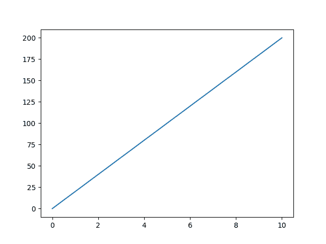
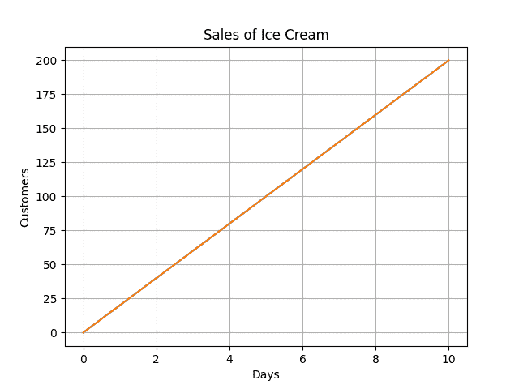
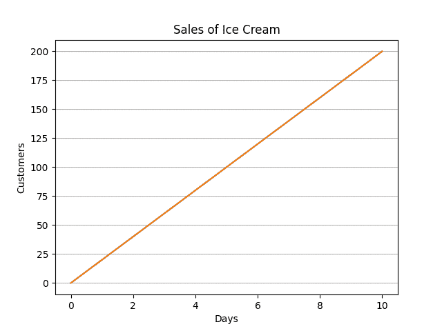
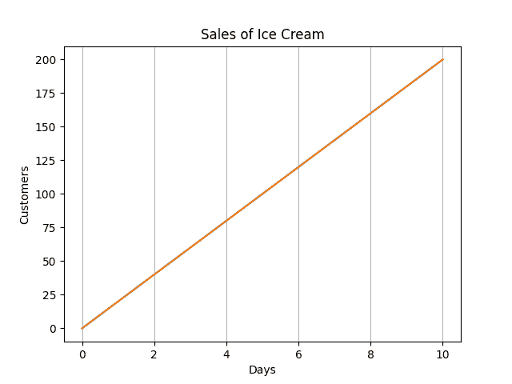
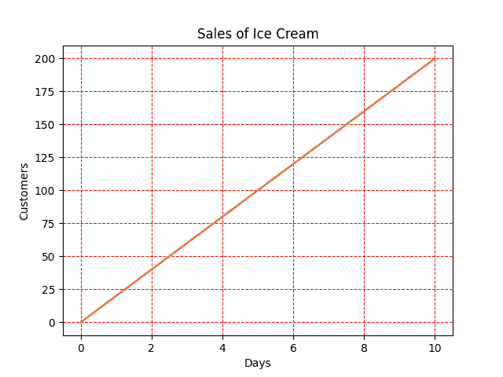

# 如何在 Matplotlib 中添加网格线？

> 原文：<https://www.askpython.com/python-modules/matplotlib/add-grid-lines>

在本文中，我们将学习如何在 Matplotlib 绘图中添加网格线。Matplotlib 是一个 python 绘图库，它为创建科学绘图和图形提供了一个交互式环境。让我们直接进入主题。

## 向 Matplot 库图添加网格线的步骤

现在让我们回顾一下将网格线添加到 [Matplotlib 图](https://www.askpython.com/python-modules/matplotlib/python-matplotlib)的步骤。

### 1.安装模块

Matplotlib–

```py
pip install matplotlib

```

**Pyplot** –

pyplot 子模块包含 Matplotlib 的大部分功能

注意:编译器通常没有显示图形的能力，但是在 Python 中，我们可以通过添加几行代码使它们兼容:

```py
import sys
import matplotlib
matplotlib.use('Agg')
# Matplotlib relies on a backend to render the plots and here ‘Agg’ is the default backend

import matplotlib.pyplot as pyt
# lines of code for plotting a graph

pyt.savefig(sys.stdout.buffer)
sys.stdout.flush()
# these two lines are used to avoid excess buffering and print the data without any delay and make sure the code works

```

示例:

```py
import sys
import matplotlib
matplotlib.use('Agg')
# Matplotlib relies on a backend to render the plots and here ‘Agg’ is the default backend

import matplotlib.pyplot as pyt
import numpy as np

x = np.array([0, 10])
y = np.array([0, 200])

pyt.plot(x, y)

pyt.show()

pyt.savefig(sys.stdout.buffer)
sys.stdout.flush()

```



Plot A Graph

### 2.向地块添加网格线

我们可以在 Pyplot 中使用 **grid()** 函数来添加网格线。

示例:

```py
x = np.array([0,10])
y = np.array([0,200])
pyt.title("Sales of Ice Cream")    
# to represent the title on the plot

pyt.xlabel("Days")                      # to label the x-axis
pyt.ylabel("Customers")            # to label the y-axis
pyt.plot(x, y)
pyt.grid()
pyt.show()

```



Plot

### 3.指定要显示的网格线

使用 grid()函数中的**轴**参数，我们可以指定显示哪些网格线。允许的值有:**‘x’，‘y’，**或‘两者’。但是缺省值是‘both ’,所以我们可以避免写它。

示例:

*   **仅显示 x 轴网格线:**

```py
pyt.grid(axis = ‘y’)

```



Plot Only X Axis

*   **仅显示 y 轴网格线:**

```py
pyt.grid(axis = ‘x’)

```



Plot Y Axis

### 4.设置网格的线条属性

我们可以用各种方式设置网格的属性，如颜色、样式等。

我们将样式定义为:color= 'specify_color '，linestyle='specify_linestyle '，linewidth= number，axis='specify_axis('x '，' y '或' both ')'

例如:

```py
pyt.grid(color = 'red', linestyle = '--', linewidth = 0.75, axis='both')

```



Grid Property Changed Plot

## 结论

教程到此为止！希望你已经很好地学习了如何在 Python 中绘制网格线，以及使用 matplotlib 库可能得到的网格线的各种属性。请继续关注 Python，获取更多关于 Python 的教程。