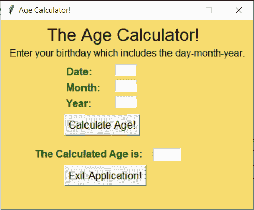
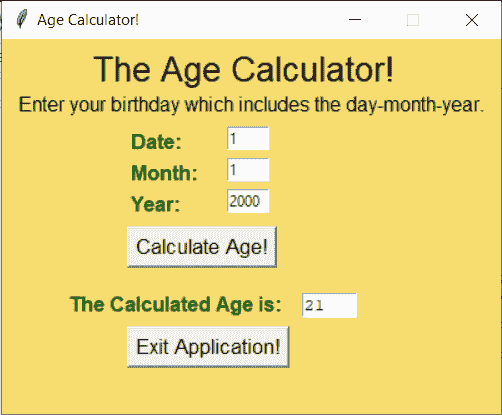

# Python Tkinter: GUI 年龄计算器

> 原文：<https://www.askpython.com/python-modules/tkinter/age-calculator>

你好，初学者！今天我们将使用 [Python Tkinter](https://www.askpython.com/python/tkinter-gui-widgets) 构建一个 GUI 应用程序——年龄计算器。

让我们开始吧！

应用程序的名称说明了应用程序将要做的一切，所以让我们开始构建应用程序。

## 设计年龄计算器界面

任何项目的第一步都是设计应用程序窗口。设计包括两个步骤，即:

1.  创建自定义窗口
2.  向窗口应用程序添加元素

### 创建自定义窗口

创建空的自定义窗口。我们必须导入`tkinter`模块并创建一个窗口对象。然后我们添加窗口应用程序的背景颜色和标题。

我们还将可调整大小的功能设置为 **False** 以确保尺寸保持不变。相同的代码如下所示。

```py
import tkinter as tk
window = tk.Tk()
window.geometry("400x300")
window.config(bg="#F7DC6F")
window.resizable(width=False,height=False)
window.title('Age Calculator!')

```

### 向窗口添加所有必需的元素

下一步包括在我们的应用程序中添加所有的标签、输入框、按钮和文本框。

#### 1.标签

我们将使用多个标签，每个标签将服务于不同的目的。我们有介绍信息的标签，询问用户出生日期的[输入框](https://www.askpython.com/python-modules/tkinter/tkinter-entry-widget)的标签。

#### 2.输入框

我们将使用三个输入框来输入用户的出生日期。一个是日期，一个是月份，最后一个是出生年份。

#### 3.小跟班

在我们的应用程序中，我们将使用两个[按钮](https://www.askpython.com/python-modules/tkinter/tkinter-buttons)，一个用于计算年龄，另一个用于退出应用程序。

#### 4.文本框

我们将只使用一个文本框来显示计算出的年龄。

整个设计代码如下所示。我们将根据自己的喜好定制元素。如果你愿意，你可以改变它。

```py
l1 = tk.Label(window,text="The Age Calculator!",font=("Arial", 20),fg="black",bg="#F7DC6F")
l2 = tk.Label(window,font=("Arial",12),text="Enter your birthday which includes the day-month-year.",fg="black",bg="#F7DC6F")

l_d=tk.Label(window,text="Date: ",font=('Arial',12,"bold"),fg="darkgreen",bg="#F7DC6F")
l_m=tk.Label(window,text="Month: ",font=('Arial',12,"bold"),fg="darkgreen",bg="#F7DC6F")
l_y=tk.Label(window,text="Year: ",font=('Arial',12,"bold"),fg="darkgreen",bg="#F7DC6F")
e1=tk.Entry(window,width=5)
e2=tk.Entry(window,width=5)
e3=tk.Entry(window,width=5)

b1=tk.Button(window,text="Calculate Age!",font=("Arial",13),command=get_age)

l3 = tk.Label(window,text="The Calculated Age is: ",font=('Arial',12,"bold"),fg="darkgreen",bg="#F7DC6F")
t1=tk.Text(window,width=5,height=0,state="disabled")

b2=tk.Button(window,text="Exit Application!",font=("Arial",13),command=exit)

```

### 将元素放置在屏幕上

为了在屏幕上放置元素，我们使用了`place`函数，该函数需要元素的 x 和 y 坐标来将项目放置在正确的位置。

放置元素的代码如下所示:

```py
l1.place(x=70,y=5)
l2.place(x=10,y=40)
l_d.place(x=100,y=70)
l_m.place(x=100,y=95)
l_y.place(x=100,y=120)
e1.place(x=180,y=70)
e2.place(x=180,y=95)
e3.place(x=180,y=120)
b1.place(x=100,y=150)
l3.place(x=50,y=200)
t1.place(x=240,y=203)
b2.place(x=100,y=230)

```

### Tkinter 中年龄计算器的界面

应用程序的最终设计看起来像下面显示的窗口。



Initial State Age Calculator

## 向按钮添加功能

### 1.计算年龄按钮

为了计算年龄，我们首先必须从三个输入框中获得三个输入(数据-月-年)。现在，下一步涉及计算出生日期和当前日期之间的差异。

为了获得当前日期，我们从`datetime`模块导入`date`函数。我们还创建了一个存储今天整个日期的对象。相同的代码如下所示:

```py
from datetime import date
today = date.today()

```

现在我们创建一个计算年龄的函数，并连接到计算年龄按钮。该函数获取三个条目，并找到年龄(当前和出生日期之间的差异)

在清除文本框中先前的信息后，计算的年龄将被插入到文本框中。相同的代码如下所示:

```py
def get_age():
    d= int(e1.get())
    m=int(e2.get())
    y=int(e3.get())
    age = today.year-y-((today.month, today.day)<(m,d))
    t1.config(state='normal')
    t1.delete('1.0', tk.END)
    t1.insert(tk.END,age)
    t1.config(state='disabled')

```

突出显示的行是计算年龄的代码的主要语句。

### 2.退出应用程序按钮

对于退出应用程序按钮，我们简单地创建一个破坏窗口的函数，然后将`commad`属性添加到按钮声明中。

退出函数的代码如下所示:

```py
def exit():
    window.destroy()

```

## Python 中年龄计算器的完整代码

下面提到了整个代码:

```py
from datetime import date
today = date.today()

def exit():
    window.destroy()
def get_age():
    d= int(e1.get())
    m=int(e2.get())
    y=int(e3.get())
    age =today.year-y-((today.month, today.day)<(m,d))
    t1.config(state='normal')
    t1.delete('1.0', tk.END)
    t1.insert(tk.END,age)
    t1.config(state='disabled')

import tkinter as tk
window = tk.Tk()
window.geometry("400x300")
window.config(bg="#F7DC6F")
window.resizable(width=False,height=False)
window.title('Age Calculator!')

l1 = tk.Label(window,text="The Age Calculator!",font=("Arial", 20),fg="black",bg="#F7DC6F")
l2 = tk.Label(window,font=("Arial",12),text="Enter your birthday which includes the day-month-year.",fg="black",bg="#F7DC6F")

l_d=tk.Label(window,text="Date: ",font=('Arial',12,"bold"),fg="darkgreen",bg="#F7DC6F")
l_m=tk.Label(window,text="Month: ",font=('Arial',12,"bold"),fg="darkgreen",bg="#F7DC6F")
l_y=tk.Label(window,text="Year: ",font=('Arial',12,"bold"),fg="darkgreen",bg="#F7DC6F")
e1=tk.Entry(window,width=5)
e2=tk.Entry(window,width=5)
e3=tk.Entry(window,width=5)

b1=tk.Button(window,text="Calculate Age!",font=("Arial",13),command=get_age)

l3 = tk.Label(window,text="The Calculated Age is: ",font=('Arial',12,"bold"),fg="darkgreen",bg="#F7DC6F")
t1=tk.Text(window,width=5,height=0,state="disabled")

b2=tk.Button(window,text="Exit Application!",font=("Arial",13),command=exit)

l1.place(x=70,y=5)
l2.place(x=10,y=40)
l_d.place(x=100,y=70)
l_m.place(x=100,y=95)
l_y.place(x=100,y=120)
e1.place(x=180,y=70)
e2.place(x=180,y=95)
e3.place(x=180,y=120)
b1.place(x=100,y=150)
l3.place(x=50,y=200)
t1.place(x=240,y=203)
b2.place(x=100,y=230)

window.mainloop()

```

**输出:**

现在我们已经完成了编码部分。让我们运行应用程序吧！它工作得很好，同样的情况可以在下面的输出中看到。


Output1 Age Calculator



Output2 Age Calculator

## 结论

恭喜你！今天你学会了如何建立你的年龄计算器！希望你玩得开心！

感谢您的阅读！