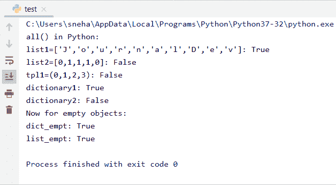

# Python 编程中的 all()方法

> 原文：<https://www.askpython.com/python/built-in-methods/all-method-in-python>

**Python** 附带了许多有趣的预定义方法。其中之一就是 Python 中的`all()`方法。这个方法被广泛用于检查一个**可迭代** Python 对象的所有元素是否都是**真值**。因此，让我们学习更多关于`all()`方法的知识，并看看如何在我们的代码中加入。

## Python 中 all()方法的工作原理

理论上，Python 中的 all()方法检查一个 **Python iterable 对象**的所有元素，如列表、字典、数组等。T4 是真的还是假的。如果所有的元素都是可迭代的(或者对象是空的)，那么它返回`True`，如果至少有一个元素不是，那么它返回`False`。

你有没有注意到我们使用了术语**【真实】**而不是**【真实】**？这是因为这两个术语有不同的含义。

在 Python 中，`all()`检查所有元素，看`bool(element)`是否为真。这样，我们可以推断，这里的真与真是不同的。

## all()函数用法和示例

现在让我们看一个例子，它可以说明 Python 中的`all()`方法的工作原理。

```py
#python all() example
print("all() in Python:")

#Defining different type of variables
list1=['J','o','u','r','n','a','l','D','e','v']
list2=[0,1,1,1,0]
dictionary1={1:"True",2:"False"}
dictionary2={0:"False",1:"True"}
tpl1=(0,1,2,3)

#Evaluating the variables with the all() method.
print("list1=['J','o','u','r','n','a','l','D','e','v']:",all(list1))
print("list2=[0,1,1,1,0]:",all(list2))
print("tpl1=(0,1,2,3):",all(tpl1))
print("dictionary1:",all(dictionary1))
print("dictionary2:",all(dictionary2))

# Testing all() method's evaluation of empty objects
print("Now for empty objects:")
dict_empt={}
list_empt=[]
print("dict_empt:",all(list_empt))
print("list_empt:",all(dict_empt))

```

**输出:**



all() Output

*   对于**列表 1** ，`all()`返回`True`，因为它的所有元素都是非 falsy，
*   然而，对于**列表 2** ，我们得到了`False`，因为它包含了计算结果为假的数字 0。
*   对于元组 **tpl1** ，该方法也返回`False`，因为第一个元素是 **0** ，其评估为**假**。
*   对于**字典 1** ，我们得到`True`作为输出，因为没有一个键是 **0** 或**假**。出于演示的目的，我们添加了计算结果为 TRUE 的“false”字符串，因为 FALSE 字符串不是布尔 False。
*   我们为**字典 2** 得到一个`False`，因为它的一个键是 0。
*   对于任何类型的**空**可迭代对象，无论是列表还是字典，`all()`方法返回`True`。

## 参考

*   [https://stack overflow . com/questions/35685768/how-the-all-function-in-python-work](https://stackoverflow.com/questions/35685768/how-does-the-all-function-in-python-work)
*   [https://docs.python.org/2/library/functions.html#all](https://docs.python.org/2/library/functions.html#all)