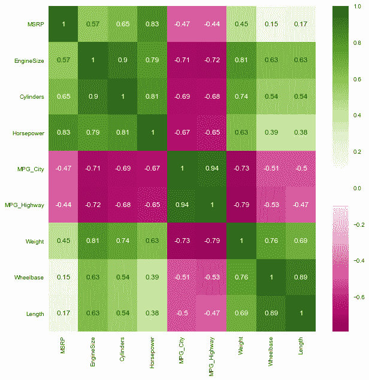

# 用 Python 分析 Cars.csv 文件——完整指南

> 原文：<https://www.askpython.com/python/examples/analyzing-cars-dataset-in-python>

在本教程中，让我们了解如何使用 Python 探索 cars.csv 数据集。我们将首先加载数据集，然后处理数据。我们还将可视化数据集，当最终数据集准备好时，同一数据集可用于开发各种模型。

* * *

## 在 Python 中分析 Cars.csv 数据集的步骤

我们将使用[熊猫](https://www.askpython.com/python-modules/pandas/python-pandas-module-tutorial)和[熊猫](https://www.askpython.com/python/numpy-linear-algebraic-functions)进行分析。我们还将使用 Seaborn 库进行可视化实验。让我们开始吧。

### 1.加载 Cars.csv 数据集

由于数据集已经是 CSV 格式，我们需要做的就是将数据格式化为 pandas 数据框。这是通过导入`pandas`库使用名为`read_csv`的 pandas 数据框架方法完成的。

通过将 CSV 文件的路径作为参数传递给函数来使用`read_csv`数据框方法。当我们使用`head`函数时，代码会产生一个组织整齐的 pandas 数据帧。

让我们从将所有必要的模块和库导入代码开始。

```py
import pandas as pd 
import numpy as np
import seaborn as sns 
import matplotlib.pyplot as plt
sns.set(color_codes=True)

```

现在数据在`pandas`模块的帮助下被加载。

```py
df = pd.read_csv("CARS.csv")
df.head()

```

该数据集的`428 rows`和`15 features`具有关于不同汽车品牌的数据，例如宝马、奔驰、奥迪等，并且具有关于这些汽车的多个特征，例如型号、类型、产地、传动系、建议零售价等。

* * *

### 2.移除不相关的特征

在后面的章节中，如果我们需要根据给我们的一些特征来计算汽车的价格。但并不是所有的特征都是确定汽车价格所必需的，我们的目标是从数据集中移除相同的不相关特征。

我们将要删除的功能包括传动系、型号、发票、类型和来源。所有这些特征都不是确定成本所必需的。您可以根据自己的喜好删除或保留功能。

```py
df = df.drop(['Model','DriveTrain','Invoice', 'Origin', 'Type'], axis=1)
df.head()

```

* * *

### 3.查找重复数据

在任何数据集中，都可能存在重复/冗余数据，为了删除这些数据，我们使用了`reference feature`(在本例中为 MSRP)。我之所以把 MSRP 作为参考，是因为两辆车的价格很少能 100%匹配。

为了消除重复，我们使用下面提到的代码。您可以观察到行数从 428 行减少到 410 行。

```py
print("Count before Removing Duplicates: ")
df.count()

```

输出如下所示。

```py
Count before Removing Duplicates: 
Make           428
MSRP           428
EngineSize     428
Cylinders      426
Horsepower     428
MPG_City       428
MPG_Highway    428
Weight         428
Wheelbase      428
Length         428
dtype: int64

```

```py
df = df.drop_duplicates(subset='MSRP', keep='first')

print("Count after Removing Duplicates: ")
df.count()

```

```py
Count after Removing Duplicates: 
Make           410
MSRP           410
EngineSize     410
Cylinders      408
Horsepower     410
MPG_City       410
MPG_Highway    410
Weight         410
Wheelbase      410
Length         410
dtype: int64

```

* * *

### 4.查找缺失值或空值

没有一个数据集是完美的，数据集中缺少值是很常见的事情。现在，有几种方法可以处理缺失值。

可以删除任一行，或者用该列中所有值的平均值填充空值。最好取列值的平均值，而不是删除整行，因为每一行对开发人员都很重要。

让我们首先看看我们的数据集中有多少空值。

```py
print(df.isnull().sum())

```

您可以观察到在`Cylinders`列中有两个空值，其余的都是清晰的。我们的目标是处理该列的 2 个空值。发现空值属于第`247 and 248`行，因此我们将用所有值的平均值来替换它。

```py
# Calculate mean of all the values of the column
val = df['Cylinders'].mean()
print("The mean of the column is: ",val)
val = round(val)
print("Rounded value of  the mean of the column is: ",val)

# Replace the null value with the mean of the column
df['Cylinders'][247] = val
df['Cylinders'][248] = val

```

* * *

### 5.将对象值转换为整数类型

如果您还没有观察到，MSRP 的值以`$`开始，但是我们需要值是整数类型。因此，我们需要确保从该列的所有值中删除美元符号。

```py
df['MSRP'] = [x.replace('$','') for x in df['MSRP']] 

df['MSRP'] = [x.replace(',','') for x in df['MSRP']]

df['MSRP']=pd.to_numeric(df['MSRP'],errors='coerce')

df.head()

```

* * *

### 6.可视化热图

热图是查找特征之间相关性的最佳方式之一。当绘制热图时，我们可以看到 MSRP 和马力之间有很强的相关性。

```py
plt.figure(figsize=(10,10))
plt.style.use("seaborn")
c= df.corr()
sns.heatmap(c,cmap='PiYG',annot=True)

```



Cars Csv File Heatmap

* * *

希望你理解这个概念，并在其他各种 CSV 文件中应用相同的内容。感谢您的阅读！