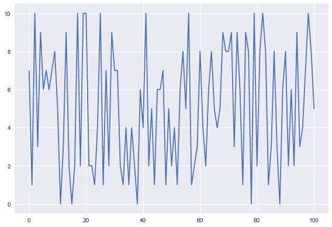
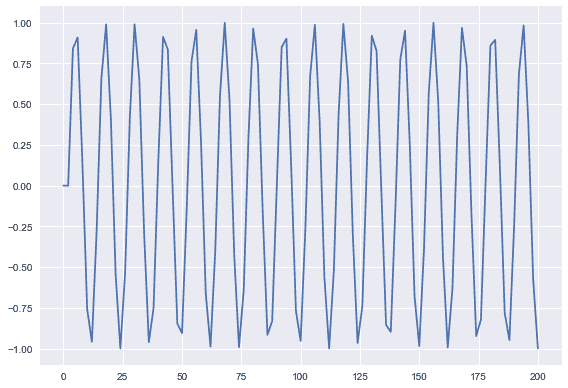

# Python 绘图:在 Python 中创建动画绘图

> 原文：<https://www.askpython.com/python-modules/matplotlib/animated-plots>

到目前为止，你一定已经看过基本的 [matplotlib 图](https://www.askpython.com/python-modules/matplotlib/3-dimensional-plots-in-python)，但是同样的 [matplotlib 模块](https://www.askpython.com/python-modules/matplotlib/python-matplotlib)也可以用来制作**动画图**！让我们看看如何建立相同的！

## 导入必要的模块

```py
import numpy as np
import matplotlib.pyplot as plt
import matplotlib.animation as animation
import random
from itertools import count
from IPython import display

```

下表显示了每个模块及其要求:

| 模块名 | 要求 |
| [Numpy 模块](https://www.askpython.com/python-modules/numpy/python-numpy-module) | 用于为绘图创建数据集。 |
| [Matplotlib 模块](https://www.askpython.com/python-modules/matplotlib/python-matplotlib) | 绘制所需的图 |
| matplotlib .动画 | 为动画情节提供功能 |
| [随机](https://www.askpython.com/python-modules/python-random-module-generate-random-numbers-sequences) | 为了最初为随机间隔生成随机点 |
| 计数模块 | 生成一系列连续的数字 |
| 显示组件 | 显示动画情节的视频 |

Name and Requirement of various modules

## 在 Python 中为动画地块创建数据集

为了创建数据集，我们创建了两个列表，即`x`和`y`，其中 x 存储 x 坐标，y 存储 y 坐标。

现在 x 坐标是连续的数字。在使用`count`函数创建计数迭代器之后，我们将使用 cound 模块从`0`开始计数。为了访问下一个数字，我们还使用了`next`功能。

对于 y 坐标，我们将使用`random`模块在两个整数之间选择任意的[随机整数](https://www.askpython.com/python-modules/python-randint-method)。下面的代码实现了同样的功能，其中包括一个`animate`函数，该函数执行值的递增:

```py
x=[]
y=[]
i = count()
def animate(j):
    x.append(next(i))
    y.append(random.randint(0, 10))
    plt.plot(x,y)

```

## 创建动画对象

下一步是创建一个名为`animation_1`的对象。为了在一定的时间间隔后重复执行`animate`功能，我们使用了`FuncAnimation`，它采用了下面提到的几个参数:

1.  plt.gcf():将作为下一个参数提到的函数作为“当前函数”。
2.  函数名:在这种情况下是**动画**。
3.  间隔:设置重复该功能的时间。

```py
animation_1 = animation.FuncAnimation(plt.gcf(),animate,interval=1000)
plt.show()

```

如果你正在使用`python IDLE`，一个绘图将自动生成。但是，如果您正在使用`jupyter notebook`、**，即使在代码后使用了`plt.show()`函数，也不会输出任何内容。**为了避免这种情况，需要将视频转换成 HTML 格式，这将在下一节提到。

## 将动画情节转换为 HTML 视频(针对 Jupyter 笔记本用户)

我们首先需要将创建的动画转换成 html5 视频，这是在下面代码中的第`1`行完成的。行号`2`创建一个 HTML 代码来显示 html5 视频。最后一行`3`显示了我们生成的显示视频的 html 代码。

```py
video_1 = animation_1.to_html5_video()
html_code_1 = display.HTML(video_1)
display.display(html_code_1)
plt.tight_layout()
plt.show()

```

在后面的行号`4`和`5`中，我们可以简单地绘制这些点。代码的输出结果如下所示。你的图可能与我的不同，因为这些点是随机生成的。

下图是某个时间点后的最终剧情。



x_vs_y_animated_plot

## 绘制动画正弦波图

我们可以使用下面的代码绘制一个漂亮的正弦波。我们所做的一些更改如下:

1.  使用生成的两倍计数值作为 x 坐标，以便更好地绘图
2.  减少动画功能中的间隔以获得更清晰的视觉效果

```py
x1=[]
y1=[]
i1 = count()
def animate1(j):
    t=next(i1)
    x1.append(2*t)
    y1.append(np.sin(t))
    plt.cla()
    plt.plot(x1,y1)
animation_2 = animation.FuncAnimation(plt.gcf(),animate1,interval=50)
video_2 = animation_2.to_html5_video()
html_code_2 = display.HTML(video_2)
display.display(html_code_2)
plt.tight_layout()
plt.show()

```

特定间隔后的输出动画图和静态图如下所示。

<https://www.askpython.com/wp-content/uploads/2021/04/Sine_x_vs_y_wave.mp4>

 

Sine plot after a certain interval of time

## 在同一个动画图上绘制正弦和余弦

查看下面的代码，查看同一动画中的两条动画曲线。我们分别取 y 值，一个代表正弦曲线，一个代表余弦曲线，并将它们绘制在同一个动画上。同样，让我们使用**‘黑暗背景’**来增加一点趣味。

```py
plt.style.use('dark_background')
x=[]
y_sin=[]
y_cos=[]
i_n = count()
def animate_n(j):
    t=2*next(i)
    x.append(t)
    y_sin.append(np.sin(t))
    y_cos.append(np.cos(t))
    plt.cla()
    plt.plot(x,y_sin,label="Sine wave",color="red")
    plt.plot(x,y_cos,label="Cosine wave",color="green")
animation_n = animation.FuncAnimation(plt.gcf(),animate_n,interval=500)
video_n = animation_n.to_html5_video()
html_code_n = display.HTML(video_n)
display.display(html_code_n)
plt.tight_layout()
plt.show()

```

下面的动画是上面代码的结果。

## 结论

恭喜你！今天，您学习了如何使用 matplotlib 模块绘制动画图。希望你喜欢自己编写代码。感谢您的阅读！快乐编码和学习！