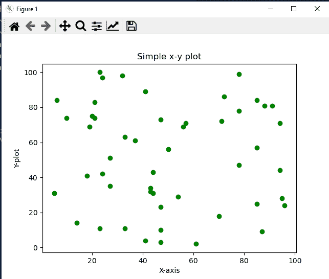

# 用 Python 制作数据动画——简单指南

> 原文：<https://www.askpython.com/python/examples/animating-data-in-python>

当我们听到术语**数据可视化时，**我们实际上想到了什么？一会儿，我们可以对图表、线图、散点图等有所了解。但是，如果我们能创造一些**现场剧情呢。**这些不是视频记录，这只是纯粹的编程和使用一些库。我们能够制作图形、直方图、偏差等漂亮的动画。

## 库和环境设置简介

我们将使用的库包括:

1.  **[【matplot lib】](https://www.askpython.com/python-modules/matplotlib/python-matplotlib)**
2.  **[海博](https://www.askpython.com/python-modules/python-seaborn-tutorial)**
3.  **[Numpy](https://www.askpython.com/python-modules/numpy/mean-of-a-numpy-array)**

集成开发环境环境:

1.  ***Visual Studio 代码***
2.  ***蟒蛇环境***
3.  ***Python 版本:3 . 9 . 7***

## Matplotlib 的动画类

Matplotlib 是一个非常著名的库，它使得绘图变得非常容易。它是免费和开源的，并且文档提供了一个简单的入门指南。为了动画的目的，它提供了一个特殊的类，即:**“animation”**。这个类有几个函数可以满足我们在 Python 中制作任何数据动画的需求。我们将通过一个简单的代码来看看如何使用它。

你可以在[https://matplotlib.org/stable/api/animation_api.html](https://matplotlib.org/stable/api/animation_api.html)查阅官方文件

首先，让我们简短地看看我们通过计算过程可视化的图形类型。

### Matplotlib 中的静止图

它们只是描述轴上几个点的数据流的图片。

### Matplotlib 中的动画情节

这些实际上是通过在屏幕上一个接一个地显示每个像素来告诉我们点在哪里。这使得情节本身生动起来。

### 简单散点图与动画散点图

**简单散点图代码:**

```py
from matplotlib import pyplot as plt
import random
import sys

x = []
y = []

for i in range(0, 50):
    x.append(random.randint(0, 100))
    y.append(random.randint(0, 100))

# plt.xlim(0, 100)
# plt.ylim(0, 100)
plt.xlabel("X-axis")
plt.ylabel("Y-plot")
plt.title("Simple x-y plot")
plt.scatter(x, y, color = "green")
# plt.pause(0.01)

sys.exit(plt.show())

```

**输出:**



A Simple Scatter Plot

**动画散点图代码:**

```py
from matplotlib import pyplot as plt
import random
import sys

x = []
y = []

plt.xlabel("X-axis")
plt.ylabel("Y-plot")
plt.title("Simple x-y plot")
for i in range(0, 50):
    x.append(random.randint(0, 100))
    y.append(random.randint(0, 100))
    plt.scatter(x, y, color = "green")
    plt.pause(0.01)

sys.exit(plt.show())

```

**输出:**

**说明:**

1.  首先，导入库。
2.  然后我们声明两个空列表 x 和 y。
3.  然后运行一个 for 循环，并使用 **`random`** 模块的 **`randint()`** 方法用一些随机整数填充列表。记得在循环中设置一个限制范围。
4.  然后我们从 **`pyplot`** 模块调用 scatter()函数。将绘图颜色设置为绿色。
5.  最后一条非常重要。我们使用`plt.pause()`功能设置每个图的 **0.01** 秒的时间间隔。
6.  最后使用 plt.show()函数来显示图表。

**条形图动画代码**

```py
from matplotlib import pyplot as plt
import random
import sys

x = []
y = []

plt.xlabel("X-axis")
plt.ylabel("Y-plot")
plt.title("Simple bar plot")
for i in range(0, 50):
    x.append(random.randint(0, 100))
    y.append(random.randint(0, 100))
    plt.bar(x, y, color = "green")
    plt.pause(0.01)

sys.exit(plt.show())

```

**输出:**

**说明:**

1.  所有的过程都和上面的情节一样。
2.  但是我们调用`plt.bar()`函数来绘制动画条形图。

## 使用 **matplotlib.animation** 模块

随着我们向前推进，主要的焦点转移到内置的**动画**类上。这可以更有趣地学习。这个子模块有几个元素:有两个子类继承了这个类的属性。

1.  **ArtistAnimation** :使用艺术家属性制作动画。
2.  **FuncAnimation** :遵循递归并连续调用一个函数来动画化图表/绘图。

为了使绘图更加精细，我们使用了这些类。举个简单的例子，我们将看到使用相同概念的 sin(x)函数的流程。

#### FuncAnimation 语法

```py
class FuncAnimation(fig, func, frames=None, init_func=None, fargs=None, save_count=None, *, cache_frame_data=True, **kwargs)

```

该类有三个基本参数:

1.  ***func*** :更新屏幕上每一帧的功能。
2.  ***init_func*** :读取绘图数据的初始化器。
3.  ***帧*** :每秒更新屏幕上每一帧的性质。

**代码:**

```py
import numpy as np
import matplotlib.pyplot as plt
from matplotlib.animation import FuncAnimation

fig, ax = plt.subplots()
xdata, ydata = [], []
ln, = plt.plot([], [], 'ro')

def init():
    ax.set_xlim(0, 2*np.pi)
    ax.set_ylim(-1, 1)
    return ln,

def update(frame):
    xdata.append(frame)
    ydata.append(np.sin(frame))
    ln.set_data(xdata, ydata)
    return ln,

ani = FuncAnimation(fig, update, frames=np.linspace(0, 2*np.pi, 128),
                    init_func=init, blit=True)
plt.show()

```

**输出:**

**说明:**

1.  在第一行中，从 matplotlib 的动画类中导入 FuncAnimation 函数。
2.  然后为子绘图创建两个对象**图，轴**。
3.  将两个空列表声明为 **xdata，ydata。**
4.  然后创建一个 **plt.plot()** 函数的实例**“ln”和“，”。**记住使用逗号，因为它会创建两个实例。
5.  空实例帮助我们返回艺术家对象序列。
6.  创建一个 **init()** 函数。在那设定中 **x_lim()** 从 **0 度，到 360 度**。在 **NumPy** 0 到 2 * NPπ。这决定了我们的函数从一个点到另一个点的旋转。将 y_lim()从-1 设置为 1，最后**返回 ln 和那个空实例。**
7.  然后创建一个 **update()** 函数来更新屏幕上的每一帧。它将一个**帧**作为参数。在**扩展数据**列表中追加帧。在 **ydata** 列表中追加 **np.sin(frame)** ，这是正弦转换。
8.  使用 **set_data()** 函数修复信息，并插入两个列表 xdata 和 ydata。返回 ln 和空实例。
9.  为 FuncAnimation()类创建一个动画对象。这需要两个函数作为参数。
    1.  初始化函数: **init()** 在我们的代码中。
    2.  update:我们代码中的 update()。
10.  最后使用 **plt.show()** 方法显示图形。
11.  我们有一个**漂亮的 sin(x)函数**,显示了它在轴中的流动。

## 现场图的应用

1.  在股票市场上，投资者可以看到股票价格的实时涨跌。
2.  多专科医院有心脏监测器，使用动画图显示病人的脉搏率。

## 结论

因此，通过这种方式，我们可以创造出美丽的视觉效果。它们有非常好的应用程序，在许多现实生活场景中非常有用。在这里，我们结束这个话题。