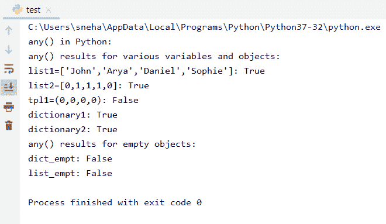

# Python 编程中的 any()方法

> 原文：<https://www.askpython.com/python/built-in-methods/any-method-in-python>

Python 中的 any()方法是另一种内置方法。我们之前看到了 Python 中 [all()方法的工作和用法。any()方法与该方法非常相似。它告诉我们任何可迭代对象的性质。让我们了解这个方法实际上是什么以及它是如何工作的。](https://www.askpython.com/python/built-in-methods/all-method-in-python)

## Python 中 any()方法的工作原理

Python 中的 any()方法检查可迭代对象的任何元素，如数组、列表、元组等。**是否为真**。

如果其中任何一个为真，该方法将直接返回'**真**'和'**假**'如果它们都不为真。如果提供的 iterable 对象为空，那么`any()`方法也返回一个“ **False** ”。仔细看看下面的语法，

**语法，**

```py
any( iterable_object_name )

```

这里，

*   `iterable_object_name`，顾名思义，是要进行检查的对象的名称
*   当且仅当任何 iterable 对象元素为真时，该方法将返回**True**
*   另一方面，如果所有的元素都是假的或者可迭代的是一个空的**元素，那么这个方法将返回“**假的****

## Python 中 any()方法的示例

下面给出的代码试图以最好的方式说明内置 Python 方法`any()`的使用和工作，

```py
# python any() example
print("any() in Python:")

# Defining different type of variables

list1 = ['John','Arya','Daniel','Sophie']
list2 = [0, 1, 1, 1, 0]
dictionary1 = {1: "True", 2: "False"}
dictionary2 = {0: "False", 1: "True"}
tpl1 = (0, 0, 0, 0)

# Evaluating the variables with the any() method.

print("any() results for various variables and objects:")
print("list1=['John','Arya','Daniel','Sophie']:", any(list1))
print("list2=[0,1,1,1,0]:", any(list2))
print("tpl1=(0,0,0,0):", any(tpl1))
print("dictionary1:", any(dictionary1))
print("dictionary2:", any(dictionary2))

# Testing any() method's evaluation for empty objects

dict_empt = {}
list_empt = []
print("any() results for empty objects:")
print("dict_empt:", any(list_empt))
print("list_empt:", any(dict_empt))

```

**输出:**



any() Method Testing Example

从我们在这个例子中考虑的不同的可迭代对象开始，我们使用了**列表**、**元组**，以及**字典**。但是`any()`方法适用于任何可迭代的对象，而不仅仅是我们所使用的对象。

理解代码，

*   由于**列表 1** 具有所有真值，列表 1 的`any()`方法返回**真值，**
*   类似地， **list2** 包含三(3)个非零、非虚假值，因此在这种情况下 **any()** 也返回 True
*   对于元组 **tpl1** ，该方法返回`False`，因为所有元素都是 **0** 并且评估为**假**
*   这两个字典，**字典 1** 和**字典 2** 至少有一个真值。所以我们得到了我们想要的输出，那就是`True`
*   对于空的 iterable 对象，如前所述，any()方法为空列表和字典返回 False

## Python 中 any()和 all()方法的区别

Python 中 all()和 any()方法之间的一个快速、概括的区别是:

*   `any()`检查**是否至少有一个元素**是真的
*   `all()`检查是否**一个可迭代的所有元素**都是真的
*   对于空对象， **any()** 返回假，而 **all()** 返回真

## 结论

在本教程中，我们学习了 **Python** 中的内置`any()`方法，它是如何工作的，以及它如何与各种可迭代对象交互。

你也可以看看我们之前关于 Python 中的[内置方法的文章，这将帮助你理解 Python 中总是可以使用的不同方法，而不需要导入任何东西。](https://www.askpython.com/python/built-in-methods)

## 参考

*   [https://stack overflow . com/questions/19389490/how-do-python-any-and-all-functions-work](https://stackoverflow.com/questions/19389490/how-do-pythons-any-and-all-functions-work)
*   [https://stack overflow . com/questions/16505456/how-确切地说，python-any-function-work](https://stackoverflow.com/questions/16505456/how-does-this-input-work-with-the-python-any-function)