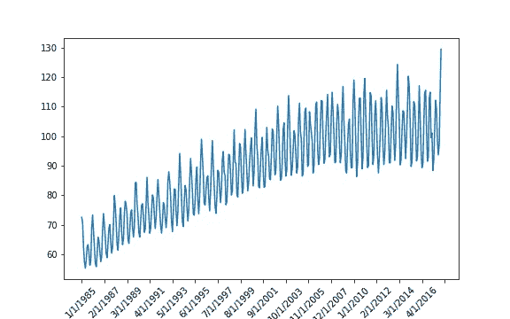
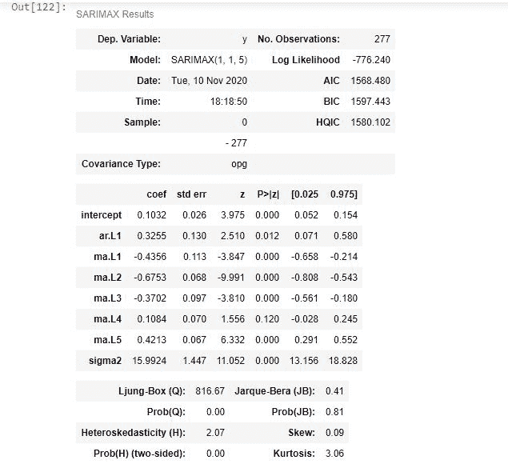

# Python 中的 ARIMA 模型演示

> 原文：<https://www.askpython.com/python/examples/arima-model-demonstration>

在本文中，我们将了解一个著名的时间序列预测模型——ARIMA 模型。

时间序列数据是不同的，因为数据是以固定的时间间隔记录的。时间序列数据添加了时间成分，并且序列中的每个数据点都依赖于先前的数据点。

时间序列预测的一种广泛使用的统计方法是 ARIMA 模型。

假设我们需要预测苹果的销售，并且我们有每天的销售记录。这个问题可以归类为时间序列建模。

在这篇文章中，我们将实现 ARIMA 模型。

## 什么是 ARIMA？

ARIMA 代表*自回归综合移动平均线*。它基于描述数据中的自相关性，是分析和预测时间序列数据的流行和强大的时间序列算法之一。

让我们来分解一下 ARIMA 的意思:

*   自回归(AR):一个观察值和一些滞后观察值之间的依赖关系。这意味着过去的值用于预测下一个值。
*   **积分** (I):对数列进行差分运算，使其平稳。
*   **移动平均** (MA):表示用来预测未来值的过去预测误差的个数。

### 1.ARIMA 模型的参数。

ARIMA 需要三个组件，`**p**`、`**d**`和`**q**`来构建模型。

*   **p** :自回归滞后的次数，模型的**自回归**方面需要。
*   **d** : `d`与模型的**集成**部分相关联。这是使数列平稳所需的差分阶。
*   **q** : q 指移动平均线滞后的次数。它与模型的**移动平均线**部分相关联。

### 2.平稳序列

平稳序列是指性质不随时间变化的序列。这意味着时间序列的统计特性，如[均值](https://www.askpython.com/python/examples/mean-and-standard-deviation-python)、方差和协方差都是恒定的。

如果我们的序列不是平稳的，我们就无法建立时间序列模型。ARIMA 模型要求数据是平稳序列。

制作平稳序列的一些流行方法有[增强迪基-富勒检验](https://en.wikipedia.org/wiki/Augmented_Dickey%E2%80%93Fuller_test)、[差分](https://www.statistics.com/glossary/differencing-of-time-series/)、去趋势等。

## 用 Python 演示 ARIMA 模型

我们将实现`auto_arima`函数。它会自动找到 ARIMA 模型的最佳参数。

换句话说，该函数将自动确定 ARIMA 模型的参数`p`、`d`和`q`，这非常方便，因为数据准备和参数调整过程最终非常耗时。

我们将使用具有 auto_arima 函数的`pmdarima`模块。所以让我们开始吧

### 1.导入数据集

我们将在本次演示中使用的数据集是*电力 _ 生产数据集*(从 Kaggle 下载的[)。](https://www.kaggle.com/shenba/time-series-datasets)

```py
import pandas as pd
import numpy as np
import matplotlib.pyplot as plt

series = pd.read_csv('Electric_Production.csv' , index_col = 0)

#divide into train and validation set
train = series[:int(0.7*(len(series)))]
valid = series[int(0.7*(len(series))):]

#Plotting the data
plt.figure(figsize = (8,5))
ax = plt.gca()
ax.xaxis.set_major_locator(plt.MaxNLocator(20))
plt.xticks(rotation = 45)
plt.plot(series)
plt.show()

```



Plot Of Electrical Production Dataset

### 2.检查系列是否稳定

让我们执行“扩展的 Dickey-Fuller 检验”来检查数据是否是稳定的。

```py
# Importing required modules
from pmdarima.arima import ADFTest

adf_test = ADFTest(alpha = 0.05)
adf_test.should_diff(series)

```

```py
Output: (0.01, False)
```

`pmdarima.arima`有`ADFTest`类来执行增强的 Dickey-Fuller 测试。

我们也可以使用具有`adfuller`类的`statsmodels.tsa.stattools`模块来执行测试。

上面代码的输出意味着这个序列不是平稳的，我们需要先把它变成一个平稳的序列来实现 ARIMA。

在这种情况下，auto Arima 非常有用，它会自动确定差分参数“d ”,使序列保持平稳。

### 3.实施 ARIMA 模式

```py
#Importing the module
import pmdarima as pmd

arima_model = pmd.auto_arima(train, 
                              start_p=0,d = 1,start_q=0,
                              test="adf", supress_warnings = True,
                              trace=True)

#Summary of the model
arima_model.summary()

```



Summary Stats Of The Fitted Model

我们传递给这个函数一些重要的输入参数。该函数的重要参数是:

1.  用于拟合 ARIMA 模型的时间序列。
2.  `start_p`:自回归(AR)模型的阶数。
3.  `start_q`:移动平均线(MA)模型的阶。
4.  `d`:先差的顺序。默认设置为无。
5.  `test`:用于检测平稳性的单位根检验的类型。

### 4.使用 MAPE 检查模型性能

现在，使用[平均绝对百分比误差](https://www.askpython.com/python/examples/mape-mean-absolute-percentage-error)作为性能指标，检查我们的模型有多好。

```py
#Predict the future values
valid['predicted'] = arima_model.predict(n_periods = len(valid))

def MAPE(true, pred): 
    true, pred = np.array(true), np.array(pred)
    return np.mean(np.abs((true - pred) / true)) * 100

MAPE(valid.IPG2211A2N, valid.predicted)

```

**输出:**

```py
12.44044096590272
```

MAPE 值应该尽可能低，这表明我们的模型犯的错误越来越少。

## 结论

在本文中，我们学习了时间序列预测的 ARIMA 模型，并用 Python 实现了它。我们确定了模型的时间序列数据集的平稳条件，并实施了扩展的 Dickey-Fuller 测试来检查平稳性。

快乐学习！