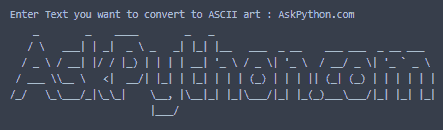
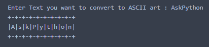
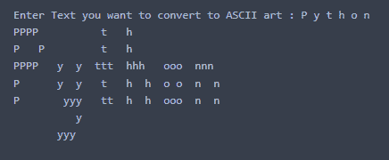
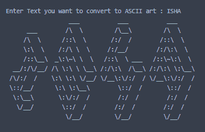

# Python 编程语言中的 ASCII 艺术

> 原文：<https://www.askpython.com/python-modules/ascii-art>

在本教程中，我们将使用`pyfiglet`库创建 ASCII 艺术，这将使在屏幕上显示艺术更加容易和有趣！ **ASCII 艺术**意味着使用一些图案或特殊符号来显示一个单词或句子，以特别使文本更具创造性，并增强文本的整体外观。

正如我提到的，为了创建 ASCII 艺术，我们需要一个 python 模块 pyfiglet，在命令提示符中使用`pip`命令。

```py
pip install pyfiglet

```

我们将从导入模块开始，然后使用`input`函数从用户那里获取文本输入。然后，我们将使用将文本作为参数的`figlet_format`函数。我们将最终打印 ASCII 艺术。

```py
import pyfiglet
T = input("Enter Text you want to convert to ASCII art : ")
ASCII_art_1 = pyfiglet.figlet_format(T)
print(ASCII_art_1)

```

让我们看一下代码执行后的示例输出。



ASCII Art Output 1

我们也可以改变字体风格。我们所需要做的就是给名为`font`的 **pyfiglet** 库的主函数添加一个新参数。

```py
import pyfiglet
T = input("Enter Text you want to convert to ASCII art : ")
ASCII_art_1 = pyfiglet.figlet_format(T,font='digital')
print(ASCII_art_1)

```

执行完代码后，看看文本如何通过改变字体属性来改变。



ASCII Art Output 2

如果您希望使用字母而不是符号行，您可以通过将字体属性更改为`alphabet`来轻松实现。看看下面提到的代码。

```py
import pyfiglet
T = input("Enter Text you want to convert to ASCII art : ")
ASCII_art_1 = pyfiglet.figlet_format(T,font='alphabet')
print(ASCII_art_1)

```

请看下面的示例输出。



ASCII Art Output 3

每个人都喜欢事物的三维可视化。幸运的是，通过再次改变字体样式，ASCII 艺术也可以以 3D 形式显示，

```py
import pyfiglet
T = input("Enter Text you want to convert to ASCII art : ")
ASCII_art_1 = pyfiglet.figlet_format(T,font='isometric1')
print(ASCII_art_1)

```



ASCII Art Output 4

## 结论

恭喜你！您可以每天在项目中使用 ASCII 艺术，以确保您的项目从其他项目中脱颖而出。您可以尝试字体样式并探索更多的显示选项。

感谢您的阅读！编码快乐！😁