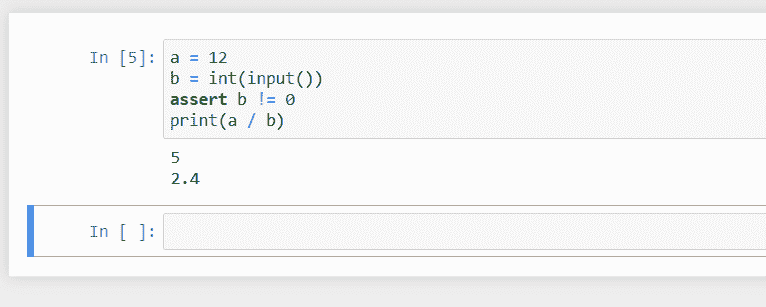
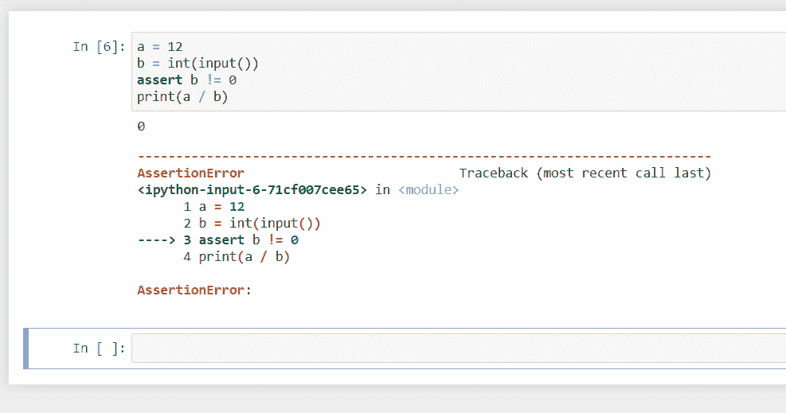
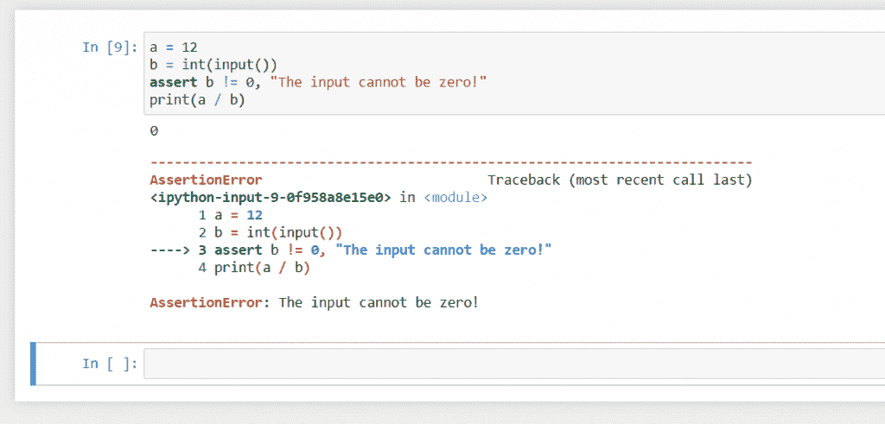

# Python 中的断言

> 原文：<https://www.askpython.com/python/built-in-methods/assertions-in-python>

让我们了解一种常用的测试和调试技术，在 Python 中称为断言。我们将学习什么是断言，为什么使用它们，什么时候不使用它们，以及它们的语法。所以让我们开始吧。

## Python 中的断言是什么？

Python 中的断言是用来断言程序中的一个条件的语句。它们被设计成如果断言的条件被证明为假，程序将不会继续。

如果断言的条件为假，该语句产生一个`AssertionError`。
您可以选择随`AssertionError`异常一起发送消息。

## 为什么要使用断言？

断言语句被程序员用来在开发周期中测试和调试代码，并且**通知程序员代码中可能存在的任何 bug**。

这些语句仅供开发人员使用，因为 assert 语句是测试和调试代码的一部分。

因此，为了确保在块执行之前或之后满足某些条件，以便在程序的后面可以避免逻辑错误和异常，我们使用断言。

assert 语句的预期用途是，您在语句中编写的**条件永远不会为假**。如果这个条件被证明是假的，那么它应该是程序中的一个错误，必须被删除。

断言的一个很好的例子是确保计算一个数的反对数的函数总是给出一个正的结果，如果不是这样，那么错误是在函数的逻辑中，而不是在输入或任何其他外部因素中。

### 什么时候不使用断言？

断言不应该处理运行时错误。

类似“*文件未找到*”、“*内存/堆不足*”、“*连接未建立*”等错误。可以在 else 子句或 except 子句中处理和更正。

这些语句不是 bug，只是因为某些外部因素没有满足而存在，程序本身很可能是没问题的。

因为断言是调试指令，**如果程序在优化模式下运行，那么在程序执行期间所有的断言都被忽略**。

为了在优化模式下运行程序，我们使用-O 标志，如下所示:

```py
python -O file_name.py

```

这将禁用代码调试，所有断言语句都将被忽略。

因此，如果任何断言被用于验证输入或安全问题，那么它的验证在优化模式下不再存在，并且**会导致不必要的错误和安全漏洞**。

例如，如果您使用断言来断言用户是管理员，并给予他们管理员权限，那么用户可以简单地在优化模式下运行代码，断言将被忽略，给予所有用户管理员权限。

类似地，如果使用断言来验证用户的年龄是否超过 18 岁，那么如果代码以优化模式运行，任何用户都可以绕过断言。

不言而喻，如果条件是程序本身的错误导致的，即代码中有问题，而不是输入或外部条件中有问题，那么断言用于断言条件，以便可以确定错误的存在。

## 用 Python 实现断言

让我们举几个例子来理解如何用 Python 写断言。

**请注意，代码示例是非常基本的示例，仅用于解释语句的语法和工作原理。**

```py
a = 12
b = int(input())
assert b != 0
print(a / b)

```

在上面的代码中，我们在转到下一条语句之前断言了条件`b`不能为零。

在输出之前，让我们先看看语法。

关键字 assert 后面必须始终跟一个将得出 True 或 False 的表达式。我们也可以选择添加消息，但我们稍后会看到。

在上面的例子中，如果输入不是`0`，表达式将产生`True`，输出如下:



Assertion example when condition is satisfied

这里我们给了`5`作为输入，代码运行没有任何问题。
现在让我们看看当我们给`0`作为输入时会发生什么:



Assertion example when condition is not satisfied

当`b`的值为`0`时，条件返回`False`，语句引发`AssertionError`。

这就像任何其他异常一样，可以在 [try-except-clause](https://www.askpython.com/python/python-exception-handling) 中处理，然而，这样做违背了断言的目的，因为它们应该通知程序员程序中可能存在的 bug。

让我们给断言添加一条消息:

```py
a = 12
b = int(input())
assert b != 0, "The input cannot be zero!"
print(a / b)

```

这里，我们再次断言条件`b`不能是`0`，如果条件为假，断言将给出一个`AssertionError`和一条消息。

**因此，要给出异常的消息，我们需要在编写条件并用逗号分隔条件和消息之后，指定一个包含消息的字符串。**

对于非零输入，输出不会有任何变化，但如果输入是`0`，那么输出会是这样的:



Assertion fail with a message

请注意，异常后面是我们指定的错误消息。如果你有多个断言，断言语句应该总是有一个消息来理解哪个断言失败了。

## 结论

在本教程中，我们学习了什么是 assert 语句，讨论了什么时候使用它们，什么时候不使用它们。然后我们看到了它们是如何用 Python 编写的，以及它们如何帮助调试您的代码。

我希望你学到了一些东西，下节课再见。