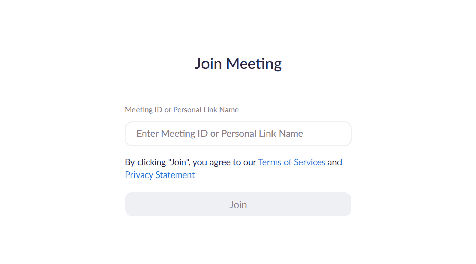
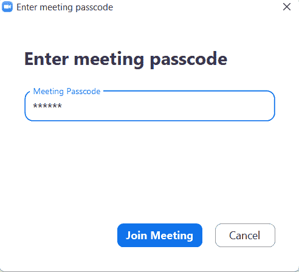

# 使用 Python 脚本自动加入缩放会议

> 原文：<https://www.askpython.com/python/examples/auto-join-zoom-meetings>

在本教程中，我们将创建一个简单的 zoom bot，它可以使用 python selenium 和 pyautogui 自动参加 zoom 会议。

## 如何使用 Python 自动加入 Zoom 会议

现在让我们创建自动加入机器人来连接 Zoom 会议。这个机器人将根据设定的时间连接到特定的链接。

### 1.安装 Selenium 和 Pyautogui

对于这个项目，我们需要 [selenium](https://www.askpython.com/python-modules/selenium-introduction-and-setup) 和 [pyautogui](https://www.askpython.com/python-modules/pyautogui-in-python) 模块，它们可以使用 pip 包管理器中的以下命令下载。

```py
pip install selenium
pip install pyautogui

```

除了这些模块，我们还需要下载 chrome 或 firefox 网络驱动程序。webdriver 和 web 浏览器的版本必须相同，这一点很重要，您可以在他们的官方浏览器网站或简单的 google 搜索中下载。

推荐阅读:[在 Selenium Python 中安装 Web 驱动](https://www.askpython.com/python-modules/selenium-introduction-and-setup)

```py
from selenium import webdriver
import pyautogui as py
import time

```

导入必要的模块后，我们现在需要初始化 webdriver。在下面的代码中，我们将传递 webdriver 的路径。

```py
driver = webdriver.Chrome(Path of downloaded chrome webdriver)

```

### 2.打开缩放并获取所需信息

现在我们的设置已经完成，我们可以开始编码我们的机器人自动参加会议。

为了参加 zoom 上的任何会议，我们需要一个**会议 id** 和**密码**。所以我们将两者保存在一个变量中。此链接将打开 zoom join 会议网页。

```py
driver.get('https://zoom.us/join')

# --> storing meeting id and passcode, you may also take this as an input in your code from the user

meet_code = "275 816 9386"
passcode = "9pX9pT"

```

### 3.查找 Web 元素

当我们尝试加入会议时，Zoom 客户端会向我们显示身份验证页面，这也是通过获取上一步中的 URL 获得的，网页要求输入会议代码。



Authentication In Zoom

我们将检查 **id 框**和 **join 按钮**，以便找到它们的 **xpath** ，这样我们就可以定位元素并使用 **selenium** 自动执行这些操作。在下面的代码中，我们首先找到 id 框，并使用 **send keys 方法**给它我们的会议代码。

填写会议代码后，我们将点击**加入按钮**进入下一步。

我们的机器人将模仿相同的人类行为来输入值和加入会议。

```py
# finding id text box and sending it our meeting code.

element_box = driver.find_element_by_xpath("//input[@id='join-confno']")
element_box.send_keys(meet_code)

#waiting for 2 seconds to send the code
time.sleep(2)   

#finding the join button and clicking on it

Btn = driver.find_element_by_xpath("//a[@id='btnSubmit']")

Btn.click()

```

### 4.使用 Pyautogui 键入密码

单击“加入”按钮后，缩放客户端将打开，要求您输入会议密码。因此，为了找到输入密码和提交按钮的文本框，我们将使用 pyautogui。我们将获取输入字段和提交按钮的**截图**,并将其保存在与 python 文件相同的目录中。



Entering Meeting Password Automatically

使用 pyautogui 的**locate center screen(' image _ path ')**我们将找到这些图像在屏幕上的中心坐标，并将这些坐标传递给 **moveTo()** 方法，该方法将光标移动到文本字段和按钮。

```py
enter_passcode = py.locateCenterOnScreen('passcode.png')
py.moveTo(enter_passcode)
py.click()
py.write(passcode)

```

在上面的代码中，我们找到了文本框并用 **write** 方法填充它。

```py
btn = py.locateCenterOnScreen("zoom\join.png")
py.moveTo(btn)
py.click()

```

就这样，我们只需运行一个 python 脚本，就能自动参加任何会议。

***也读作:[使用 Python 自动键入文本](https://www.askpython.com/python/examples/auto-type-text-using-python)***

## 完成 Python 脚本以自动加入缩放会议

机器人的最终代码:

```py
from selenium import webdriver
import pyautogui as py
import time

passcode = "9pX9PT"
meet_code = "272 916 9386"

def join(meet, password):
    driver = webdriver.Chrome('C://software/chromedriver.exe')
    driver.get('https://zoom.us/join')

    time.slee(5) #to let the webpage open completely

    driver.find_element_by_xpath("//input[@id='join-confno']").send_keys(meet_code)

    time.sleep(2)
    driver.find_element_by_xpath("//a[@id='btnSubmit']").click()

    time.sleep(5)

    # enter passcode
    enter_passcode = py.locateCenterOnScreen('passc.png')
    py.moveTo(enter_passcode)
    py.click()
    py.write(passcode)

    # join the meeting
    time.sleep(5)
    btn = py.locateCenterOnScreen("join.png")
    py.moveTo(btn)
    py.click()

join(meet_code,passcode)

```

在这个脚本中，还可以提供在特定时间加入和离开会议的方法。此外，您可以为任何其他会议客户端(如 Google Meet、微软团队等)构建一个机器人。使用上面讨论的方法。

## 结论

对机器人来说就是这样。希望您已经很好地学习了如何创建一个自动加入 Zoom 会议的机器人，并准备好为您的会议创建一个机器人并自动完成任务。