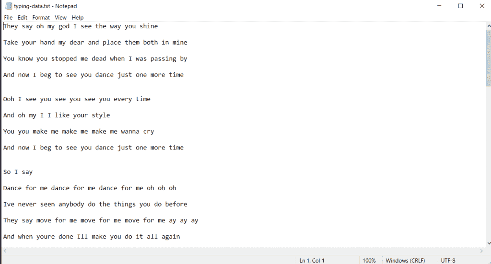

# 使用 Python Pyautogui 自动键入文本

> 原文：<https://www.askpython.com/python/examples/auto-type-text-using-python>

想学习如何使用 Python 自动输入文本吗？复制粘贴不是模仿文本文件输入的好方法。如果一些 python 脚本可以模仿真人从键盘输入文本，你会怎么想？通过打字，我的意思是指实际的打字，一个字母接一个字母，一个单词接一个单词地在任何输入框，聊天框等等。

在本教程中，我们将向您展示如何编写一个 python 脚本，它接受一个文件(文本、数据、符号)并在您指示它键入的任何地方自动地将它的内容键入到**中。**

## 使用 Python 实现自动类型化

让我们来看看使用 Python 实现自动化类型的代码。这段代码可以用来在任何文本编辑器上打字，让它看起来很酷🙂

为什么需要自动文字输入？

您可能会猜测为什么您需要任何自动文本输入 python 脚本，但是这里有几个原因。

*   它可以自动输入任意字数或行数的文本
*   模仿实际的键盘输入
*   当你休息的时候，为你做些事情是很有趣的。此外，仅出于教育目的，这可能会被用来发送垃圾邮件。

### 1.设置 pyautogui

第一步是在您的计算机系统中安装所需的库和模块来编写脚本，并使您可以轻松地使用这些功能。

虽然 **pyautogui** 和 [**时间模块**](https://www.askpython.com/python-modules/python-time-module) 都与 python 安装捆绑在一起，但是如果它不在您的计算机中，那么您可以使用 [pip 包管理器](https://www.askpython.com/python-modules/python-pip)来安装它们，如图所示:

```py
pip install pyautogui
pip install time

```

现在，我们已经安装了所需的库，我们开始将它导入到我们的代码文件中。

```py
import pyautogui
import time

```

### 2.创建包含数据的文件

为了输入我们的自动脚本来编写/键入文本，我们需要文本形式的数据(可以是任何东西，任何语言)。尽管我们可以直接在 python 代码文件中插入我们想要输入的文本，但这看起来并不优雅，也不是执行此操作的明智方式。

*   用创建一个文件。txt 扩展名
*   在我们的示例中，创建名为“typing-data.txt”的文件
*   您可以在这个文件中存储任何文本，例如。“你好，我是 Python，我正在自动输入这段文字”。

对于我们的例子，我将使用一首流行歌曲的歌词——“舞猴”，这是我很容易从谷歌搜索得到的。

样本数据后的文本文件如下所示:



Typing Data File

### 3.使用 Python 自动输入

现在，我们已经执行了一些必需的步骤，让脚本自动输入的最后一步是在 python 脚本文件中编写输入功能。

#### 设置时间延迟

为了获得一些时间，让用户选择文本字段，在运行/执行 python 文件后，我们希望在该字段中键入内容。

```py
time.sleep(10)

```

#### 打开要读取的文本文件

为了打开我们的文本文件(typing-data.txt ),我们使用 pyautogui 库的 [open()方法](https://www.askpython.com/python/built-in-methods/python-open-method),以 Read 格式打开文件。

```py
open("typing-data.txt", "r"):

```

但是现在，我们需要从文件中读取文本，这是多行的，我们需要一次又一次地迭代，直到文件中的**文本结束。为此，我们使用 for 循环对文本文件中的每一行****进行读取。**

```py
import pyautogui
import time

time.sleep(10)

for line in open("typing-data.txt", "r"):

```

#### 键入变量中的文本

现在，我们需要输入/写入读取或存储在“line”变量中的文本行。

我们通过使用模块的 typewrite()方法来实现这一点。

```py
pyautogui.typewrite(line)

```

我们需要每次发送消息，对于每一行，这意味着我们需要逐行发送我们的消息，对于这一点，我们在每次迭代时按 enter 键。但是，如果你想一次发送消息(从文本文件中)**，你必须跳过**这一行。

要一个字一个字地输入文本，而不是一行一行地输入，你需要另一个循环来迭代句子中的每个单词。

```py
pyautogui.press("enter")

```

#### 使用 Python 自动键入文本的完整代码

下面给出了自动输入文本的最终代码。为了使用这个脚本自动输入，我们运行 python 文件，然后快速导航到文本字段，我们打算在这里演示自动输入。如输出视频所示。

```py
import pyautogui
import time

time.sleep(10)

for line in open("typing-data.txt", "r"):

    pyautogui.typewrite(line)

    pyautogui.press("enter")

```

输出-

<https://www.askpython.com/wp-content/uploads/2022/01/output-to-auto-text-type.mp4>

## 结论

教程到此为止。我希望你已经学会了如何用 Python 编写一个脚本来自动输入文本。