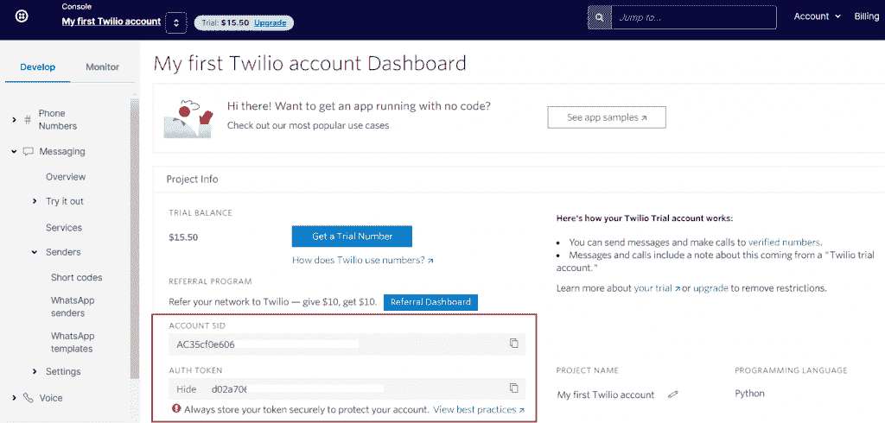
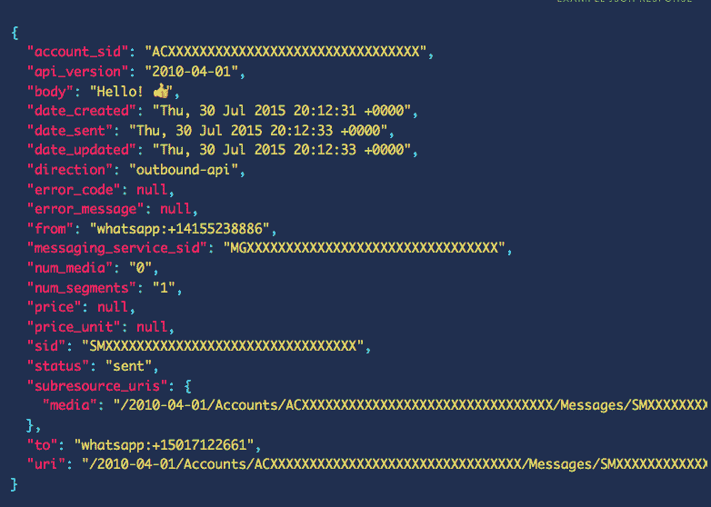

# python Twilio–自动化 WhatsApp 业务 API 消息

> 原文：<https://www.askpython.com/python-modules/automate-whatsapp-business-api-python-twilio>

在本文中，我们将探索使用 Python Twilio 模块自动化 WhatsApp 消息传递的更好方法。我们将讨论如何设置，以及这种方法的注意事项。

## 什么是 Twilio？

Twilio 是一个云通信平台，允许其客户通过互联网拨打和接听电话、短信、社交媒体消息和各种功能。Twilio 及其 API 可编程地用于发送个人或商业用途所需的自动消息和呼叫。

它的最新功能是与 Whatsapp Business API 的集成，允许企业主自动与客户沟通。

**使用消息服务提供商(如 Twilio)的优势**

大量的个人和企业正在使用消息应用程序来发送他们的商业优惠、购买等的通知/警报。甚至有些甚至提供获取用户和帐户信息的查询。

**为什么要使用按摩服务 API？**

*   当脚本在服务器上运行时，可以在一天中的任何时间发送消息/通知/响应
*   没有或很少停机时间
*   易于实现，因为我们只需要负责传递参数，API 会为我们处理其余的事情。

### 如何使用 Python Twilio 自动化 WhatsApp 业务 API 消息

现在让我们来看一下使用 WhatsApp Business API 和 Python Twilio 库来自动化消息的步骤。这种方法比我们以前使用 Pywhatkit 发送消息的方式[要好，因为你不需要保持你的 WhatsApp 网站打开并登录。](https://www.askpython.com/python-modules/python-pywhatkit-send-whatsapp-messages)

此外，一旦你可以访问 API，你可以执行更多的自动化操作，包括创建成熟的 WhatsApp 机器人。

### 第一步。创建帐户

使用免费试用版账户在 [Twilio](https://www.twilio.com/) 上创建一个账户，该账户甚至不需要信用卡/借记卡授权。

验证您的电子邮件和电话号码，以便使用所有可用的工具和功能(免费)。请随意完成帐户设置的其他手续，这是完全免费的，你可以获得 15.50 美元的试用帐户奖金。

当您创建 Twilio 帐户时，Whatsapp 必须得到您的**脸书业务经理帐户**的批准，以便将您的 Twilio 号码与 Whatsapp 业务档案相关联。

### 第二步。获取帐户详细信息

一旦您的 Twilio 号码获得批准，您就可以使用 python 库发送和接收消息。

按照以下分步指南自动发送 WhatsApp 信息:

1.  从 Twilio 控制台获取你的**账号** **SID** 和**认证令牌**，在首页你账号的**项目信息**部分显示。



Account SID And Authentication In Twilio

### 3.安装所需的库[代码实现]

在你的命令提示符或终端窗口中，使用 pip 包管理器将 **Twilio 库**安装到你的计算机中。如果你没有 PIP 的权限，有其他方法可以安装它 [这里](https://www.twilio.com/docs/libraries/python#install-the-library) 。

```py
pip install twilio

```

现在我们已经安装了所需的库，我们需要将它导入到我们的代码中。

创建一个新的 python 文件(例如 whatsapp-msg.py)。从刚刚创建的文件顶部的助手库中导入客户机函数。

```py
#import the Client function from the helper library
from twilio.rest import Client

```

然后导入 OS 库。我们将使用这个库的环境变量。这些值可以在计算机终端中访问，并用于以更一致的方式存储数据。

```py
#import OS for environment variables
import os

```

### 4.在代码中授权 Twilio API

现在，为 SID 和 Auth 键设置**环境变量**。这些是我们在步骤 2 中从 Twilio 控制台获得的值。他们将帮助 Twilio 授权(确认)我们是他们 WhatsApp 消息 API 的实际用户。

```py
#set the User credentials
account_sid = os.environ['TWILIO_ACCOUNT_SID']
auth_token = os.environ['TWILIO_AUTH_TOKEN']
client = Client(account_sid, auth_token)

```

您需要在代码中输入帐户 SID 和验证令牌(来自 TWILIO 仪表板)来代替“TWILIO_ACCOUNT_SID”和“AUTH_TOKEN”，以获得有效授权。

### 5.发送文本消息

为了发送标准的 WhatsApp 文本消息，我们使用 Twilio 库中客户端对象的“messages.create()”方法，使用以下参数:

*   正文:您希望发送/广播的信息
*   From_:获得 Whatsapp 网络许可的 Twilio 号码
*   收件人:你要在 WhatsApp 上发送信息的号码

```py
#send text message

text_message = client.messages.create(
                              body='Hello there!',
                              from_='whatsapp:+14155238886',
                              to='whatsapp:+15005550006'
                          )

```

### 6.发送媒体(图像/视频)消息

要创建媒体消息，请使用以下参数调用客户端对象下的“messages.create()”函数:

除了主体参数之外，一切都保持不变。

*   media_url:要发送的媒体文件(图像/视频/gif )(可以是文件或链接)

```py
#send media message

media_message = client.messages.create(
                              media_url=['https://images.unsplash.com/photo-1545093149-618ce3bcf49d?ixlib=rb-1.2.1&ixid=eyJhcHBfaWQiOjEyMDd9&auto=format&fit=crop&w=668&q=80'],
                              from_='whatsapp:+14155238886',
                              to='whatsapp:+15005550006'
                          )

```

### 7.打印响应

这很重要，因为它告诉我们 Twilio 给出的回应。在出现错误的情况下，这就是我们如何知道错误是什么或者代码的哪一部分导致了错误

```py
#print response
print(text_message.sid)
print(media_message.sid)

```

成功的回应应该是这样的



Successful Response From Twilio API

## 结论

与我们之前使用网络浏览器和模拟键盘和鼠标移动的方法相比，这种方法需要额外的步骤。但是如果你是一家企业，并且正在寻找为你的客户支持建立高级响应系统的方法，这个方法绝对值得一试。