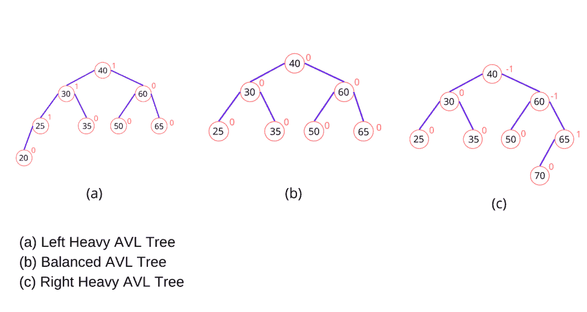
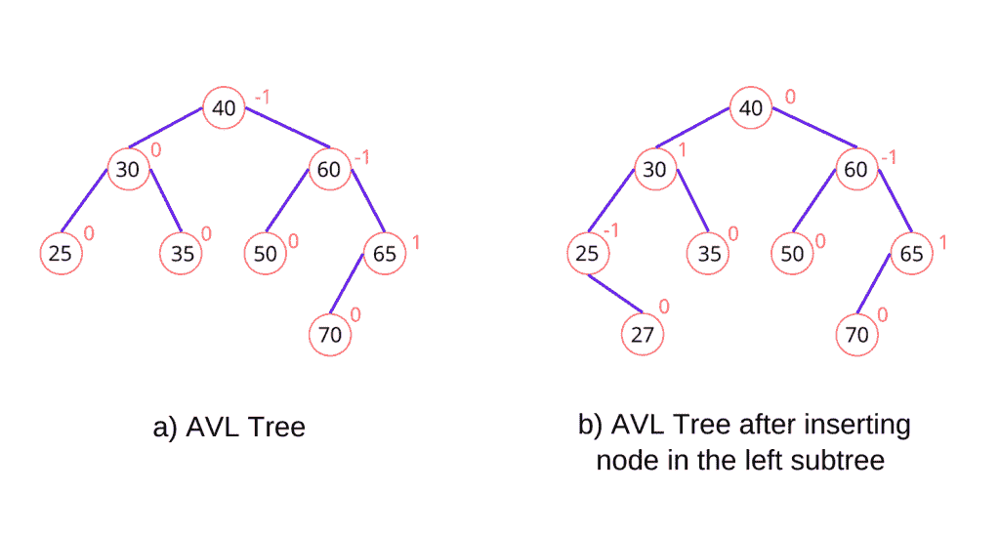
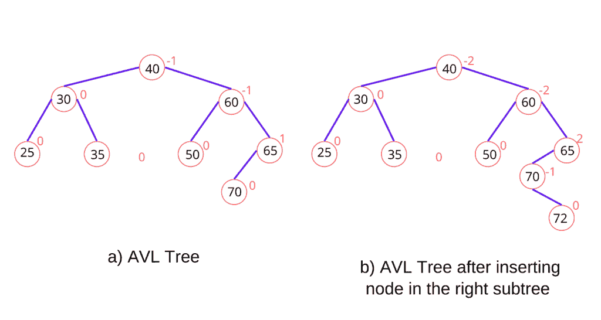
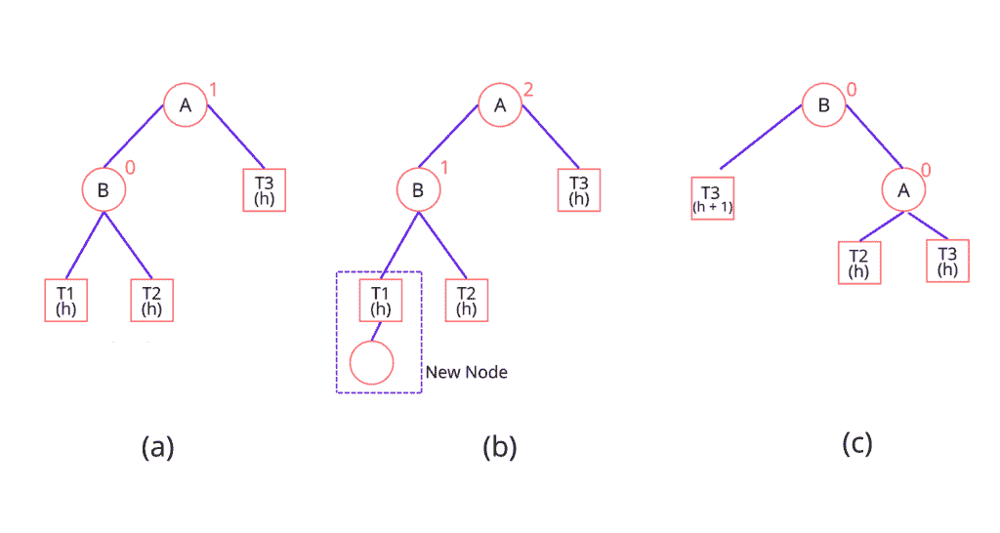
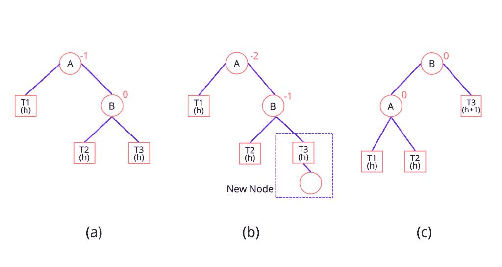
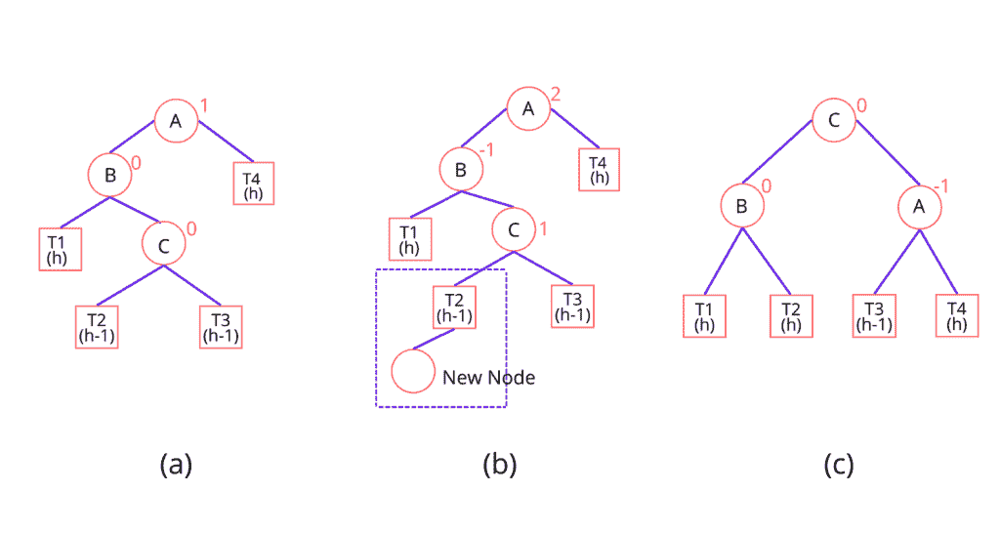
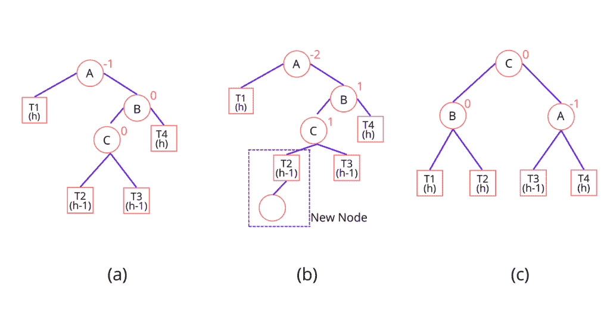

# Python 中的 AVL 树:完整指南

> 原文：<https://www.askpython.com/python/examples/avl-tree-in-python>

在本文中，让我们理解 Python 中 AVL 树的概念；俗称自我平衡的二叉查找树。这种树是为了纪念它的发明者 G.M.Adelson-Velsky 和 E.M.Landis 而命名的。要彻底理解 AVL 树，必须先了解二叉查找树。

使用这种数据结构的本质优势在于，在一般情况和最坏情况下，执行任何操作都需要花费 **O(log N)** 的时间。无论是插入、删除还是搜索操作，所有函数的时间复杂度都是一样的。

***也读作:[【二叉查找树】用 Python 实现](https://www.askpython.com/python/examples/binary-search-tree)***

## Python 中 AVL 树的平衡因子

AVL 树的结构类似于标准的二叉树，但是 AVL 树在其结构中有一个称为平衡因子的额外变量。这个变量被分配给树的每个节点。平衡因子是通过从其左子树的高度中减去其右子树的高度来计算的。

**平衡因子=高度(左子树)-高度(右子树)**

Python 中计算平衡系数的函数实现如下:

平衡因子本身的值描述了树。在高度平衡树的情况下，它可以是 1、0 或-1。如果树的任何节点有任何其他值，那么它是一个不平衡的树，需要重新平衡。

*   如果平衡因子= 1，那么该树被称为*左重树*，这意味着该树的左子树比其右子树高一级。
*   如果平衡因子= 0，那么就说这棵树是完全平衡的，这意味着左子树等于右子树。
*   如果平衡因子= -1，那么该树被称为*右重树*，这意味着该树有一个比其右子树低一级的左子树。



Balance Factor

## 在 Python 中搜索 AVL 树中的节点

AVL 树中的搜索操作与二叉查找树中的完全相同。因为搜索操作不会以任何可能的方式修改树的结构，所以不需要任何特殊的规定。该操作的时间复杂度保持为 O(Logn)

## 用 Python 在 AVL 树中插入节点

插入操作也与二叉查找树中的操作相同，但是在 Python 中的 AVL 树中，插入操作之后是一个额外的步骤。如果在树中插入新节点后，树的平衡因子改变，则需要称为*旋转*的附加步骤来恢复树的平衡。

新节点总是作为叶节点插入，作为叶节点，新节点的平衡因子等于零。通过递归地比较新节点的值和根节点的值来决定新节点的位置。如果新节点的值小于根节点的值，则将该节点移动到左子树，否则将该节点移动到右子树。

位于从根节点到新插入节点的路径中的所有节点的平衡因子。为了更好地理解，考虑下面的例子。



Insertion In Leftsubtree



Insertion In Rightsubtree

现在，在插入节点后，有四种方法可以根据新插入节点的位置重新平衡树。这四种类型的旋转是

*   **LL 旋转**:当一个节点插入到关键节点的左子树左侧时。
*   **RR 旋转:**当一个节点插入到关键节点的右子树的右侧时。
*   **LR 旋转:**当一个节点插入到关键节点的左子树的右侧时。
*   **RL 旋转:**当一个节点插入到关键节点的右子树左侧时。

## LL 旋转

考虑下图中给出的树。树(a)是 Python 中的 AVL 树。在树(b)中，在关键节点 A 的左子树的左子树中插入一个新节点(节点 A 是关键节点，因为它是平衡因子不是-1、0 或 1 的最近祖先)，因此我们应用 LL 旋转，如树(c)所示。

树(a)是一棵 AVL 树。在树(b)中，在关键节点 A 的左子树的左子树中插入新节点(节点 A 是关键节点，因为它是平衡因子不是-1、0 或 1 的最近的祖先)，因此我们应用 LL 旋转，如树(c)中所示。旋转时，节点 B 成为根，T1 和 A 是其左右子节点。T2 和 T3 成为 a 的左右子树



LL Rotation

## RR 旋转

考虑下图中给出的树。

树(a)是 Python 中的 AVL 树。在树(b)中，新节点被插入到关键节点 A 的右子树的右子树中(节点 A 是关键节点，因为它是平衡因子不是-1、0 或 1 的最近的祖先)，因此我们应用 RR 旋转，如树(c)中所示。

注意，新节点现在已经成为树 T3 的一部分。旋转时，节点 B 成为根，A 和 T3 作为其左右子节点。T1 和 T2 成为 a 的左右子树



RR Roatation

## 左右旋转

考虑下图中给出的树。树(a)是 Python 中的 AVL 树。在树(b)中，在关键节点 A 的左子树的右子树中插入新节点(节点 A 是关键节点，因为它是平衡因子不是-1、0 或 1 的最近的祖先)，因此我们应用 LR 旋转，如树(c)所示。注意，新节点现在已经成为 T2 树的一部分。旋转时，节点 C 成为根，B 和 A 作为其左右子节点。节点 B 将 T1 和 T2 作为其左右子树，T3 和 T4 成为节点 a 的左右子树



LR Rotation

## RL 旋转

考虑下图中给出的树。树(a)是 Python 中的 AVL 树。在树(b)中，新节点被插入到关键节点 A 的右子树的左子树中(节点 A 是关键节点，因为它是平衡因子不是-1、0 或 1 的最近的祖先)，因此我们应用 RL 旋转，如树(c)中所示。注意，新节点现在已经成为 T2 树的一部分。旋转时，节点 C 成为根，A 和 B 作为其左右子节点。节点 A 将 T1 和 T2 作为其左右子树，T3 和 T4 成为节点 b 的左右子树



RL Rotation

## 在 Python 中从 AVL 树中删除节点

在 Python 中从 AVL 树中删除节点类似于从二叉查找树中删除节点。但是在 AVL 树的情况下，增加了一个步骤，即在删除节点之后重新平衡树。在删除节点之前，我们首先检查要删除的节点的位置。

***也读作:[Python 中的决策树——分步实现](https://www.askpython.com/python/examples/decision-trees)***

如果该节点是叶节点(没有子节点的节点)，那么我们只需删除该节点。在节点只有一个子节点的情况下，我们将子节点的值存储在要删除的节点中，然后删除子节点。最后，如果节点有两个孩子，那么我们找到一个没有更多孩子的节点的后继节点，并将这个后继节点的值存储到要删除的节点中，然后删除这个后继节点。

## Python 函数

**定义类并初始化节点**

```py
class avl_Node(object):
	def __init__(self, value):
		self.value = value
		self.leaf = None
		self.root = None
		self.height = 1

```

**定义一个计算身高和平衡系数的函数。**

```py
def avl_Height(self, root):
		if not root:
			return 0
		return root.height

def avl_BalanceFactor(self, root):
	  //base case for leaf nodes
       if not root:
			return 0

       //implementing the above mentioned formula
		return self.avl_Height(root.l) - self.avl_Height(root.r)

```

**定义一个函数来寻找一个空节点**

```py
def avl_MinValue(self, root):
        if root is None or root.left is None:
            return root
        return self.avl_MinValue(root.left)

```

定义一个函数，以预先排序的方式遍历树。

```py
def preOrder(self, root):
        if not root:
            return
        print("{0} ".format(root.value), end=" ")
        self.preOrder(root.left)
        self.preOrder(root.right)

```

**定义旋转函数**

```py
def leftRotate(self, b):
        a = b.right
        T2 = a.left
        a.left = b
        b.right = T2
        b.height = 1 + max(self.avl_Height(b.left),
                           self.avl_Height(b.right))
        a.height = 1 + max(self.avl_Height(a.left),
                           self.avl_Height(a.right))
        return a

    def rightRotate(self, b):
        a = b.left
        T3 = a.right
        a.right = z
        b.left = T3
        b.height = 1 + max(self.avl_Height(b.left),
                           self.avl_Height(b.right))
        a.height = 1 + max(self.avl_Height(a.left),
                           self.avl_Height(a.right))
        return a

```

**在 Python 中定义一个在 AVL 树中插入节点的函数**

```py
def insert_node(self, root, value):

        if not root:
            return avl_Node(value)
        elif value < root.value:
            root.left = self.insert_node(root.left, value)
        else:
            root.right = self.insert_node(root.right, value)

        root.height = 1 + max(self.avl_Height(root.left),
                              self.avl_Height(root.right))

        # Update the balance factor and balance the tree
        balanceFactor = self.avl_BalanceFactor(root)
        if balanceFactor > 1:
            if value < root.left.value:
                return self.rightRotate(root)
            else:
                root.left = self.leftRotate(root.left)
                return self.rightRotate(root)

        if balanceFactor < -1:
            if value > root.right.value:
                return self.leftRotate(root)
            else:
                root.right = self.rightRotate(root.right)
                return self.leftRotate(root)

        return root

```

**在 Python 中定义一个从 AVL 树中删除节点的函数**

```py
def delete_node(self, root, value):

        # Find the node to be deleted and remove it
        if not root:
            return root
        elif value < root.value:
            root.left = self.delete_node(root.left, value)
        elif value > root.value:
            root.right = self.delete_node(root.right, value)
        else:
            if root.left is None:
                temp = root.right
                root = None
                return temp
            elif root.right is None:
                temp = root.left
                root = None
                return temp
            temp = self.avl_MinValue(root.right)
            root.value = temp.key
            root.right = self.delete_node(root.right, temp.value)
        if root is None:
            return root

        # Update the balance factor of nodes
        root.height = 1 + max(self.avl_Height(root.left), self.avl_Height(root.right))
        balanceFactor = self.avl_BalanceFactor(root)

        # Balance the tree
        if balanceFactor > 1:
            if self.avl_BalanceFactor(root.left) >= 0:
                return self.rightRotate(root)
            else:
                root.left = self.leftRotate(root.left)
                return self.rightRotate(root)
        if balanceFactor < -1:
            if self.avl_BalanceFactor(root.right) <= 0:
                return self.leftRotate(root)
            else:
                root.right = self.rightRotate(root.right)
                return self.leftRotate(root)
        return root

```

## Python 中 AVL 树的完整代码

```py
class avl_Node(object):
	def __init__(self, value):
		self.value = value
		self.left = None
		self.right = None
		self.height = 1

class AVLTree(object):

    def insert_node(self, root, value):

        if not root:
            return avl_Node(value)
        elif value < root.value:
            root.left = self.insert_node(root.left, value)
        else:
            root.right = self.insert_node(root.right, value)

        root.height = 1 + max(self.avl_Height(root.left),
                              self.avl_Height(root.right))

        # Update the balance factor and balance the tree
        balanceFactor = self.avl_BalanceFactor(root)
        if balanceFactor > 1:
            if value < root.left.value:
                return self.rightRotate(root)
            else:
                root.left = self.leftRotate(root.left)
                return self.rightRotate(root)

        if balanceFactor < -1:
            if value > root.right.value:
                return self.leftRotate(root)
            else:
                root.right = self.rightRotate(root.right)
                return self.leftRotate(root)

        return root
    def avl_Height(self, root):
        if not root:
            return 0
        return root.height

    # Get balance factore of the node
    def avl_BalanceFactor(self, root):
        if not root:
            return 0
        return self.avl_Height(root.left) - self.avl_Height(root.right)

    def avl_MinValue(self, root):
        if root is None or root.left is None:
            return root
        return self.avl_MinValue(root.left)

    def preOrder(self, root):
        if not root:
            return
        print("{0} ".format(root.value), end=" ")
        self.preOrder(root.left)
        self.preOrder(root.right)

    def leftRotate(self, b):
        a = b.right
        T2 = a.left
        a.left = b
        b.right = T2
        b.height = 1 + max(self.avl_Height(b.left),
                           self.avl_Height(b.right))
        a.height = 1 + max(self.avl_Height(a.left),
                           self.avl_Height(a.right))
        return a

    def rightRotate(self, b):
        a = b.left
        T3 = a.right
        a.right = b
        b.left = T3
        b.height = 1 + max(self.avl_Height(b.left),
                           self.avl_Height(b.right))
        a.height = 1 + max(self.avl_Height(a.left),
                           self.avl_Height(a.right))
        return a

    def delete_node(self, root, value):

        # Find the node to be deleted and remove it
        if not root:
            return root
        elif value < root.value:
            root.left = self.delete_node(root.left, value)
        elif value > root.value:
            root.right = self.delete_node(root.right, value)
        else:
            if root.left is None:
                temp = root.right
                root = None
                return temp
            elif root.right is None:
                temp = root.left
                root = None
                return temp
            temp = self.avl_MinValue(root.right)
            root.value = temp.key
            root.right = self.delete_node(root.right, temp.value)
        if root is None:
            return root

        # Update the balance factor of nodes
        root.height = 1 + max(self.avl_Height(root.left), self.avl_Height(root.right))
        balanceFactor = self.avl_BalanceFactor(root)

        # Balance the tree
        if balanceFactor > 1:
            if self.avl_BalanceFactor(root.left) >= 0:
                return self.rightRotate(root)
            else:
                root.left = self.leftRotate(root.left)
                return self.rightRotate(root)
        if balanceFactor < -1:
            if self.avl_BalanceFactor(root.right) <= 0:
                return self.leftRotate(root)
            else:
                root.right = self.rightRotate(root.right)
                return self.leftRotate(root)
        return root

Tree = AVLTree()       
root = None
root = Tree.insert_node(root,40)
root = Tree.insert_node(root,60)
root = Tree.insert_node(root,50)
root = Tree.insert_node(root,70)

print("PREORDER")
Tree.preOrder(root)

```

## 输出:

预订

50 40 60 70

## 总结:

AVL 树是二叉查找树的有效实现之一。本文涵盖了 AVL 树的理论知识和实际实现。

要了解更多关于二分搜索法树的信息，请点击此处参考。也可以看看 Python 中的[抽象语法树](https://docs.python.org/3/library/ast.html)。