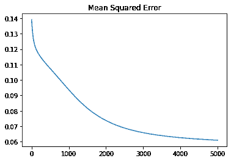
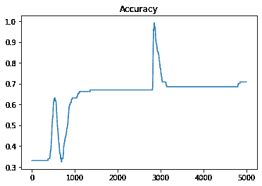

# Python 中的反向传播——快速指南

> 原文：<https://www.askpython.com/python/examples/backpropagation-in-python>

有时候你需要提高你的神经网络模型的精度，反向传播恰恰可以帮助你达到想要的精度。反向传播算法帮助您获得神经网络模型的良好预测。在本文中，我们将详细了解反向传播算法，以及如何用 Python 实现它。

## 什么是反向开发，为什么它是必要的？

反向传播算法是一种用于人工神经网络的监督学习算法，其中我们微调权重函数并提高模型的准确性。它采用梯度下降法来降低成本函数。它减少了预测数据和实际数据之间的均方距离。这种类型的算法通常用于为给定数据训练前馈神经网络，该给定数据的分类是我们已知的。

为了获得更高的准确性，您也可以将反向传播视为误差的反向传播。如果我们从一个神经网络模型接收到一个与实际输出有巨大差异的预测，我们需要应用反向传播算法来实现更高的精度。

**注:**前馈神经网络一般为多层神经网络(MLN)。数据从输入层到隐藏层，再到输出层。

## Python 中的反向传播是如何工作的？

现在让我们直观地了解算法实际上是如何工作的。反向传播模型主要有三层，即输入层、隐藏层和输出层。以下是该算法的主要步骤:

*   **步骤 1** :输入层接收输入。
*   **步骤 2:** 然后对输入进行加权平均。
*   **第三步**:每个隐层处理输出。每个输出在这里被称为“误差”,它实际上是实际输出和期望输出之间的差。
*   **步骤 4** :在这一步中，算法再次移回隐藏层，以优化权重并减少误差。

## Python 中反向传播的类型

主要有两种类型的反向传播方法，即静态反向传播和递归反向传播。让我们看看这两种类型的实际含义。在静态反向传播中，静态输入产生静态输出。这是专门用于静态分类问题，如光学字符识别。另一方面，循环传播继续发生，直到它达到一个确定的值或阈值。一旦达到固定值，误差就会反向传播。

## 在 Python 中实现反向传播

让我们看看如何以循序渐进的方式在 Python 中实现反向传播。首先，我们需要导入所有必需的库。

### 1.导入库

```py
import numpy as np
import pandas as pd
from sklearn.datasets import load_iris
from sklearn.model_selection import train_test_split
import matplotlib.pyplot as plt

```

现在，让我们看看我们将使用什么数据集。

### 2.加载数据集

我们今天将使用一个非常简单的数据集，即虹膜数据集。我们将使用 load_iris()函数加载数据集，它是 scikit-learn 库的一部分。数据集由三个主要类组成。我们将它们分为目标变量和特征。

```py
# Loading dataset
data = load_iris()
# Dividing the dataset into target variable and features
X=data.data
y=data.target

```

### 3.在训练和测试中拆分数据集

现在我们将[把数据集分成训练集和测试集](https://www.askpython.com/python/examples/split-data-training-and-testing-set)。我们将使用函数 train_test_split()。该函数有三个参数:测试集的特性、目标和大小。

```py
X_train, X_test, y_train, y_test = train_test_split(X, y, test_size=20, random_state=4)

```

现在，在下一步中，我们必须开始初始化超参数。我们将输入学习率、迭代次数、输入大小、隐藏层数和输出层数。

```py
learning_rate = 0.1
iterations = 5000
N = y_train.size

# Input features
input_size = 4

# Hidden layers 
hidden_size = 2 

# Output layer
output_size = 3  

results = pd.DataFrame(columns=["mse", "accuracy"])

```

### 3.初始化权重

```py
np.random.seed(10)

# Hidden layer
W1 = np.random.normal(scale=0.5, size=(input_size, hidden_size))   

# Output layer
W2 = np.random.normal(scale=0.5, size=(hidden_size , output_size)) 

```

现在，我们将创建辅助函数，如均方差、精确度和 sigmoid。

```py
def sigmoid(x):
    return 1 / (1 + np.exp(-x))

def mean_squared_error(y_pred, y_true):
    return ((y_pred - y_true)**2).sum() / (2*y_pred.size)

def accuracy(y_pred, y_true):
    acc = y_pred.argmax(axis=1) == y_true.argmax(axis=1)
    return acc.mean()

```

现在我们将开始建立我们的反向传播模型。

### 4.用 Python 构建反向传播模型

我们将为给定次数的迭代创建一个 for 循环，并在每次迭代中更新权重。该模型将经历三个阶段前馈传播、误差计算阶段和反向传播阶段。

```py
for itr in range(iterations):    

    # Implementing feedforward propagation on hidden layer
    Z1 = np.dot(X_train, W1)
    A1 = sigmoid(Z1)

    # Implementing feed forward propagation on output layer
    Z2 = np.dot(A1, W2)
    A2 = sigmoid(Z2)

    # Calculating the error
    mse = mean_squared_error(A2, y_train)
    acc = accuracy(A2, y_train)
    results=results.append({"mse":mse, "accuracy":acc},ignore_index=True )

    # Backpropagation phase
    E1 = A2 - y_train
    dW1 = E1 * A2 * (1 - A2)

    E2 = np.dot(dW1, W2.T)
    dW2 = E2 * A1 * (1 - A1)

    # Updating the weights
    W2_update = np.dot(A1.T, dW1) / N
    W1_update = np.dot(X_train.T, dW2) / N

    W2 = W2 - learning_rate * W2_update
    W1 = W1 - learning_rate * W1_update

```

现在，我们将使用 pandas plot()函数绘制均方误差和精度。

```py
results.mse.plot(title="Mean Squared Error")

```



```py
results.accuracy.plot(title="Accuracy")

```



现在我们将计算模型的精度。

```py
Z1 = np.dot(X_test, W1)
A1 = sigmoid(Z1)

Z2 = np.dot(A1, W2)
A2 = sigmoid(Z2)

acc = accuracy(A2, y_test)
print("Accuracy: {}".format(acc))

```

输出:

```py
Accuracy: 0.8

```

可以看到模型的准确率已经大幅提高到了 80%。

## Python 中反向传播的优势

它是实现起来相对更快更简单的算法。广泛应用于人脸识别和语音识别领域。此外，这是一种灵活的方法，因为不需要神经网络的先验知识。

## 反向传播的缺点

该算法对于有噪声和不规则的数据不是不利的。反向传播的性能高度依赖于输入。

## 结论

总之，我们知道反向传播是一种提高前馈神经网络模型精度的好方法。这是一个非常简单和灵活的算法，但不适合有噪声的数据。这是减少误差和提高模型精度的一个很好的方法。它通过借助梯度下降最小化损失函数来向后优化权重。