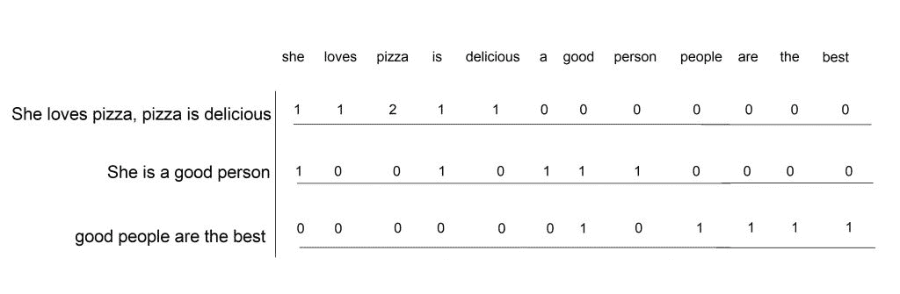
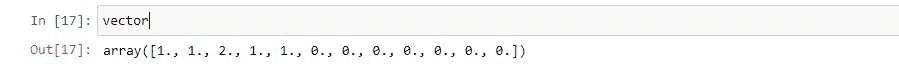

# 用 python 从头开始创建单词包模型

> 原文：<https://www.askpython.com/python/examples/bag-of-words-model-from-scratch>

单词袋模型是一种非常简单的表示文本数据的方式，便于机器学习算法理解。在自然语言处理问题领域，如文档分类，它被证明是非常有效的。

在本文中，我们将使用 python 实现一个 BOW 模型。

## 理解单词袋模型模型

在实现单词袋模型之前，让我们先直观地了解一下它是如何工作的。

考虑下面的文本，我们希望使用 BOW 模型以矢量的形式表示:

*   她喜欢披萨，披萨很好吃。
*   她是个好人。
*   好人是最好的。

现在我们创建一组给定文本中的所有单词。

```py
set = {'she', 'loves', 'pizza', 'is', 'delicious', 'a', 'good', 'person', 'people', 'are', 'the', 'best'}

```

我们的文本语料库中有 12 个不同的单词。这将是我们矢量的长度。

现在，我们只需要计算单词在每个文档中出现的频率，我们得到的结果是一个单词包，代表句子。



Bag Of Words Model

在上图中，我们只需要计算每个单词在句子中出现的次数。

## 用 Python 实现单词包模型

让我们开始将上述概念编写成代码。

### 1.预处理数据

数据预处理和[句子分词](https://www.askpython.com/python-modules/tokenization-in-python-using-nltk)。(我们还将单词转换为小写以避免单词重复)

```py
#Importing the required modules
import numpy as np
from nltk.tokenize import word_tokenize
from collections import defaultdict 

#Sample text corpus
data = ['She loves pizza, pizza is delicious.','She is a good person.','good people are the best.']

#clean the corpus.
sentences = []
vocab = []
for sent in data:
    x = word_tokenize(sent)
    sentence = [w.lower() for w in x if w.isalpha() ]
    sentences.append(sentence)
    for word in sentence:
        if word not in vocab:
            vocab.append(word)

#number of words in the vocab
len_vector = len(vocab)

```

### 2.给这些词指定一个索引

创建一个索引字典，为每个单词分配唯一的索引

```py
#Index dictionary to assign an index to each word in vocabulary
index_word = {}
i = 0
for word in vocab:
    index_word[word] = i 
    i += 1 

```

### 3.定义单词袋模型函数

最后定义单词包函数来返回输入句子的向量表示。

```py
def bag_of_words(sent):
    count_dict = defaultdict(int)
    vec = np.zeros(len_vector)
    for item in sent:
        count_dict[item] += 1
    for key,item in count_dict.items():
        vec[index_word[key]] = item
    return vec   

```

### 4.测试我们的模型

完成了完整的实现后，让我们测试一下我们的模型功能。

```py
vector = bag_of_words(sentences[0])
print(vector)

```



BOW Representation of Input Sentence

## 词汇袋的局限性

即使单词袋模型实现起来超级简单，它仍然有一些缺点。

*   **稀疏度** : BOW 模型创建稀疏向量，这增加了空间复杂性，也使得我们的预测算法难以学习。
*   **含义**:BOW 模型中不保留序列的顺序，因此句子的上下文和含义可能会丢失。

## 结论

这篇文章是关于理解 BOW 模型是如何工作的，我们使用 python 从头开始实现了我们自己的模型。我们还关注了这个模型的局限性。

快乐学习！