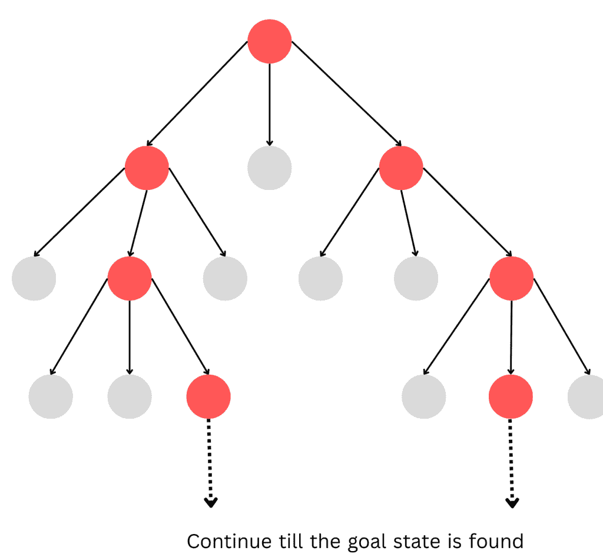
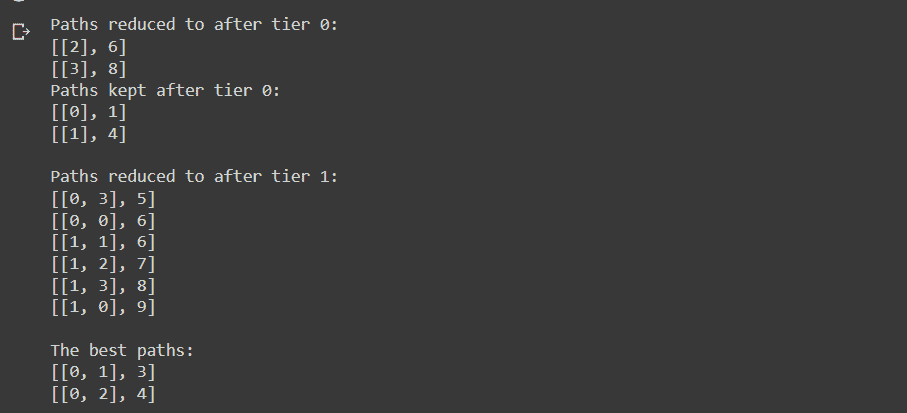

# 带逻辑的波束搜索算法及其 Python 实现

> 原文：<https://www.askpython.com/python/examples/beam-search-algorithm>

读者朋友们好，在本文中，我们来试着了解一下人工智能中使用的最高效的算法之一:波束搜索算法。

## 什么是波束搜索算法？

波束搜索算法是最佳优先搜索算法的改进版本。它根据条件概率选择节点。波束搜索方法的每次迭代可以包括根据路径长度排序和选择的多个路径。因此，用于查找最短或最便宜的路径。

## 波束搜索是如何工作的？

一种称为波束搜索的启发式搜索策略总是在每一层扩展 W 个最佳节点。它一级一级地前进，总是从每一级中最上面的 W 个节点开始。波束搜索使用广度优先搜索构建其搜索树。它在树的每一层产生当前层的状态的所有后继者，并按照启发式值的升序对它们进行组织。

不过，它只考虑了每个级别的 W 州。省略了其他节点。基于节点的启发式成本，选择最佳节点。这里的 w 指的是波束搜索的宽度。如果 B 是分支因子，则只选择 W 个节点，因为在任何级别只考虑 W * B 个节点。消除的状态数随着束宽的减小而增加。如果 W = 1，那么搜索转换为爬山搜索，其中总是挑选最佳的后继节点。没有状态被消除，如果波束宽度不确定，波束搜索与呼吸优先搜索相同。

## 算法

输入:开始和目标状态

局部变量:OPEN，NODE，SUCCs，W_OPEN，FOUND

输出:是或否

**方法:**

*   NODE =根节点:Found = false:
*   如果节点是目标节点，那么 Found = true 否则查找节点的 SUCCs。如果有的话，其估计成本和存储在开放列表中:
*   while(发现为假，无法继续)do
    *   排序开放列表:
    *   从开放列表中选择顶部的 W 个元素，并将它们放入 W_OPEN 列表中，并清空开放列表。
    *   对于 W_OPEN 列表中的每个节点
        *   {如果 NODE = goal state then FOUND = true，则查找节点的 SUCCs。如果有的话，连同其估计成本并存储在开放列表中。}
    *   结束 while 循环
*   如果发现=真，则返回是，否则返回否
*   停下来。

## 复杂性

*   (W 是波束宽度，B 是任何路径的最大深度)
*   时间复杂度:取决于启发式函数，其 O(W*B)
*   空间复杂度:由于该算法在搜索树的每一层只存储 W 个节点，所以它的 O(W*B)

## 工作

假设 W = 2 和 B = 3，使用波束搜索算法生成的搜索树在下面给出。在这里，基于它们的启发值来选择彩色节点，以便进一步扩展。



Beam Algorithm

## 用 Python 实现波束搜索算法

下面是 python 中波束搜索算法的一个简单实现。我们使用 python 中的 NumPy 模块来处理性能中使用的数组数据结构。主函数 beam_search()被多次迭代以找到最短路径。该函数中传递的参数是

*   距离–顶点之间权重值的距离
*   β-光束的宽度

```py
from numpy import array

#main function
#beta here is width of beam and distances can be considered as weights.
def beam_search(distances, beta):
    #initialising some record
    paths_so_far = [[list(), 0]]  

    #traverse through the neighbouring vertices row by row.
    for idx, tier in enumerate(distances):
        if idx > 0:
            print(f'Paths kept after tier {idx-1}:')
            print(*paths_so_far, sep='\n')
        paths_at_tier = list()

        for i in range(len(paths_so_far)):
            path, distance = paths_so_far[i]

            # Extending the paths
            for j in range(len(tier)):
                path_extended = [path + [j], distance + tier[j]]
                paths_at_tier.append(path_extended)

        paths_ordered = sorted(paths_at_tier, key=lambda element: element[1])

        # The best paths are saved
        paths_so_far = paths_ordered[:beta]
        print(f'\nPaths reduced to after tier {idx}: ')
        print(*paths_ordered[beta:], sep='\n')

    return paths_so_far

#Distance matrix
dists = [[1, 4, 6, 8],
         [5, 2, 3, 4]]
dists = array(dists)

# Calculating the best paths
best_paths = beam_search(dists, 2)
print('\nThe best paths:')
for beta_path in best_paths:
    print(beta_path)

```

## 输出



Output

从输出中，我们可以看到海滩搜索算法中路径的选择方法。在第一次迭代(第 0 层)之后，减少或切断两条路径，保留两条用于进一步扩展。这两个保留的路径被进一步迭代(第 1 层)，六个路径被切断，两个最适合的路径被保留并被声明为最佳路径。

## 比较

*   除了鲁棒性之外，波束搜索算法在处理巨大而密集的图形时保持资源有限的系统的可伸缩性和效率的能力可能是其最突出的特征。
*   波束搜索比最佳优先搜索需要更少的内存。这是因为不需要将所有后续节点存储在一个队列中。相反，它只选择β(波束宽度)方面最好的。
*   然而，它仍然有一些 Best First Search 的缺点。首先，它是不完整的，这意味着它甚至可能没有提出一个解决方案。其表现不佳是第二个问题。因此，它返回的答案可能不是最佳答案。

***应用-*** 在可能有多个合适解的情况下，比如在机器翻译中，波束搜索算法被广泛使用。

## 结论

在本文中，我们学习并实现了人工智能项目中常用的波束搜索算法。