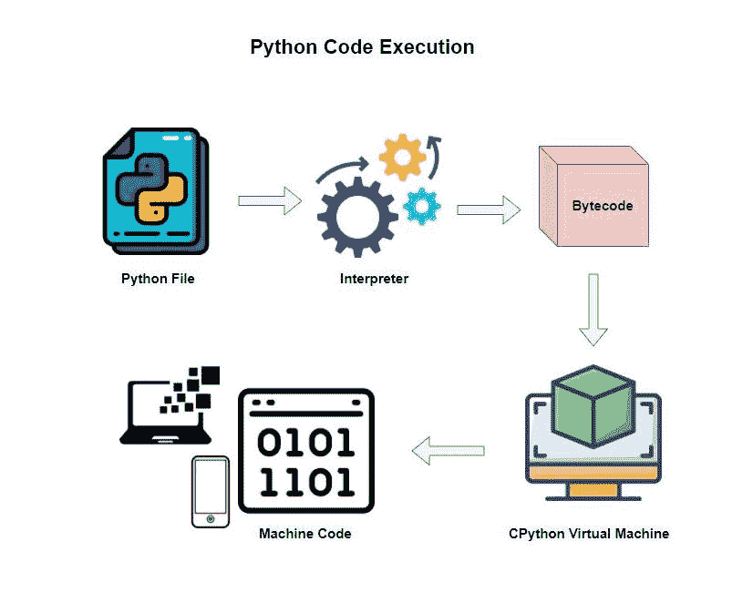

# 初学 Python 编程面试问题

> 原文：<https://www.askpython.com/python/beginner-python-programming-interview-questions-beginners>

Python 是一种动态类型的、通用的、垃圾收集的高级编程语言，它专注于读者友好的代码，并使用缩进来实现这一点。Python 支持多种范例，如过程式(逐步)、函数式和面向对象编程。

1991 年，Guido von Rossum 创作了 Python，它的灵感来自于英国喜剧团体 Monty Python 的飞行马戏团的名字。2008 年，Guido 决定，已经使用了很长时间的 Python 版本 2 有一些他和社区想要改变的东西。所以在 2008 年，他们决定开发 Python 3，这是该语言在 2008 年发布的新版本。Python 3 不向后兼容以前的版本。Python 版本 2 在 2020 年的版本 2.7.18 中停止了。

## Python 如何执行代码？

当我们谈论 **Python** 语言时，我们指的是实现。本质上，我们不是在谈论语言本身，因为语言 **Python** 只是一个规范。你可以把它想象成某人写的一份文件，上面写着“嘿！当我写下单词 **def** 或 **print** 时，这在 Python 中意味着什么。但是翻译机器呢？我们可以有很多。不同的解释器，不同的编译器。

例如，当下载 Python 时，我们实际上是在下载 [CPython](https://github.com/cython/cython) ，因为它是用 **C 编程语言**编写的。这是一个用 C 写的程序，用来读取你的 Python 文件，然后在机器上运行它。但是还有其他实现。例如，有[Jython 项目](https://www.jython.org/jython-old-sites/)。这是一个用 Java 语言编写的翻译器。还有 [PyPy](https://www.pypy.org/) ，用 Python 写的。所以，它是用 Python 写的解释器或翻译机。而且还有像 [IronPython](https://ironpython.net/) 这种为**dot****net**框架编写的东西。

我们从 Python 下载的时候，官方语言是 **CPython** 。我们正在下载遵循 Python 规范的解释器。但归根结底，它是由某人制造的机器，这些机器可以有多种形式。所以当大多数人谈论 Python 时，他们谈论的是为我们做翻译的 **CPython** 。我们通过解释器 **CPython** 运行的 Python 文件创建了一个叫做**的字节码**。解释器会在幕后自动为我们完成这项工作。

现在，一旦它创建了一个更接近机器码的字节码，它就使用运行这个代码的 **CPython** 虚拟机或 **VM** ，然后这个代码在我们的计算机、笔记本电脑、电话和许多其他设备上运行。因此，当我们从 www.python.org[下载](https://www.python.org)时，我们正在下载这两个部分，即**解释器**和 **CPython VM** ，我们可以运行 Python。



Python Code Execution

## 初学 Python 编程要知道的问题

Python 是整个科技行业最顶尖的编程语言之一。在本文中，我们将讨论 Python 面试中的一些重要问题。

### 1.展示一些例子来检查 Python 中不同数据类型的数字。

解决方案:

```py
print(type(11))
print(type(11.05))
print(type(11.05j))

"""
Output:

<class 'int'>
<class 'float'>
<class 'complex'>

"""

```

### 2.用 Python 编写模/余数、指数和底数除法运算的示例。

解决方案:

```py
num1 = int(input("Enter first number: "))
num2 = int(input("Enter second number: "))

print(f"Modulo/Remainder: {num1 % num2}")
print(f"Exponent: {num1 ** num2}")
print(f"Floor Division: {num1 // num2}")

"""
Output:

Enter first number: 10
Enter second number: 3
Modulo/Remainder: 1
Exponent: 1000
Floor Division: 3

"""

```

### 3.写一个程序，找出三个用户输入数字中最大的一个。

```py
num1 = float(input("Enter first number: "))
num2 = float(input("Enter second number: "))
num3 = float(input("Enter third number: "))

if (num1 >= num2) and (num1 >= num3):
    largest = num1
elif (num2 >= num1) and (num2 >= num3):
    largest = num2
else:
    largest = num3

print("The largest number is", largest)

"""
Output:

Enter first number: 45
Enter second number: 67
Enter third number: 23
The largest number is 67.0

"""

```

### 4.写一个函数来计算两个数的和。

解决方案:

```py
def my_sum(num1, num2):
    return num1 + num2

print(my_sum(10, 39))  # Output: 49

```

### 5.用 Python 写一个匿名函数，计算两个数相乘。

解决方案:

```py
multiply_func = lambda num1, num2: num1 * num2

print(multiply_func(2, 6))  # Output: 12

```

### 6.编写一个 lambda 函数，将整数值转换为字符串值并打印输出。另外，检查输出类型。

解决方案:

```py
conversion_func = lambda value: str(value)

result = conversion_func(123)

print(result)  # Output: 123
print(type(result))  # Output: <class 'str'>

```

### 7.编写一个函数，它接受两个字符串类型的数字，并计算它们的和。

解决方案:

```py
def my_sum(num1, num2):
    return int(num1) + int(num2)

print(my_sum("21", "34"))  # Output: 55

```

### 8.写一个函数来连接两个字符串输入。

解决方案:

```py
concat_strings = lambda s1, s2: s1 + s2

print(concat_strings("123", "hello"))  # Output: 123hello
print(concat_strings("67", "89"))  # Output: 6789

```

如果你想更好地理解这个概念，我们还会更详细地介绍[**λ函数或匿名函数**](https://www.askpython.com/python/python-lambda-anonymous-function) 。

### 9.写一个程序，接受两个字符串并打印较长的字符串。

解决方案:

```py
def compare_func(str1, str2):

    if len(str1) > len(str2):
        return f"{str1} is longer than {str2}"

    elif len(str1) < len(str2):
        return f"{str2} is longer than {str1}"

    elif len(str1) == len(str2):
        return f"{str1} and {str2} have same length"

print(compare_func("three", "four"))
# Output: three is longer than four

print(compare_func("one", "two"))
# Output: one and two have same length

```

您还可以了解更多关于 Python 中的 [**if-else 块的信息，以便更好地掌握这段代码。**](https://www.askpython.com/python/examples/multi-conditional-if-statement)

### 10.写一个程序，找出所有能被 9 整除，但不是 6 的倍数的数。数字应该在 300 到 500 之间(应该包括这两个数字)。结果应该打印在一行中，每个结果应该用逗号分隔。

解决方案:

```py
my_list = []
for eachItem in range(300, 501):
    if (eachItem % 9 == 0) and (eachItem % 6 != 0):
        my_list.append(str(eachItem))

print(",".join(my_list))

"""
Output:

315,333,351,369,387,405,423,441,459,477,495

"""

```

这里我们使用 Python 中的 **[join](https://www.askpython.com/python/string/python-string-join-method)** 和 [**list append**](https://www.askpython.com/python/list/append-to-a-list-in-python) 函数。

### 11.写一个计算给定数字的阶乘的程序。

解决方案:

```py
def factorial_function(arg):
    if arg == 0:
        return 1
    return arg * factorial_function(arg - 1)

num = int(input("Enter a number: "))

print(f"Factorial {num} is {factorial_function(num)}")

"""
Output:

Enter a number: 7
Factorial 7 is 5040

"""

```

### 12.写一个程序打印一个字典，格式为`{num, num*num*num}`的键:值对。“num”是一个整数，应该由用户输入。结果字典应该包含输入整数的整个长度的结果:例如:如果输入是 5，那么结果应该是`{1: 1, 2: 8, 3: 27, 4: 64, 5: 125}`

解决方案:

```py
num = int(input("Enter a number: "))
result_dictionary = dict()

for eachItem in range(1, num + 1):
    result_dictionary[eachItem] = eachItem**3

print(result_dictionary)

"""
Output: 

Enter a number: 5      
{1: 1, 2: 8, 3: 27, 4: 64, 5: 125}

"""

```

### 13.写一个程序，从一个条目列表中请求输入，并把它转换成一个元组。显示两个序列。

解决方案:

```py
input_items = input("Enter a list of items: ")
my_list = input_items.split(",")

my_tuple = tuple(my_list)

print(my_list)
print(my_tuple)

"""
Output:

Enter a list of items: apple,orange
['apple', 'orange']
('apple', 'orange')

"""

```

### 14.下面给出了一个对象类“Dog ”,它在构造函数中接受名字和年龄作为参数。为下列问题编写代码。

```py
class Dog:
    # constructor
    def __init__(self, name, age):
        self.name = name
        self.age = age

    # Class Object Attribute
    scientific_name = "Canis lupus familiaris"

```

*   问题 1:列举 3 只狗的名字和年龄。
*   问题 2:打印出“scientific_name”属性。
*   问题 3:写一个函数找到最老的狗。
*   问题 4:打印如下:“最老的狗是 x 岁。”通过使用第三个问题的函数，x 将是最老的狗的年龄。

解决方案:

```py
# 1 Instantiate the Dog object with 3 dogs
Dog1 = Dog("Arnold", 2)
Dog2 = Dog("Stan", 4)
Dog3 = Dog("Hufflepuff", 6)

# 2 Print out class attribute
print(f"The scientific name for Dog is {Dog.scientific_name}")

# 3 Create a function that finds the oldest dog
def oldest_dog(*args):
    return max(args)

# 4 Print out: "The oldest dog is x years old." x will be the oldest dog's age by using the function from the third question."
print(f"The oldest dog is {oldest_dog(Dog1.age, Dog2.age, Dog3.age)} years old")

"""
Output:

The scientific name for Dog is Canis lupus familiaris
The oldest dog is 6 years old

"""

```

### 15.编写一个程序，接受一个句子作为输入，并按字母顺序打印出单词。在程序中利用列表理解。

解决方案:

```py
words = [eachItem for eachItem in input("Enter a sentence: ").split(" ")]
words.sort()

print(f"Rearranged Sequence: {' '.join(words)}")

"""
Output:

Enter a sentence: hi how are you doing today
Rearranged Sequence: are doing hi how today you

"""

```

### 16.写一个程序，接受一个句子作为输入。该计划应删除重复的话，也安排/排序字母数字的话。

解决方案:

```py
input_sentence = input("Enter a sentence: ")
words = [eachWord for eachWord in input_sentence.split(" ")]
print(" ".join(sorted(list(set(words)))))

"""
Output:

Enter a sentence: I felt happy because I saw the others were happy and because I knew I should feel happy
I and because feel felt happy knew others saw should the were

"""

```

### 17.编写一个计算输入句子的数字和字母的程序。

解决方案:

```py
sentence = input("Enter a sentence with numbers as well: ")
letter_count, digit_count = 0, 0

for each in sentence:
    if each.isalpha():
        letter_count += 1
    elif each.isnumeric():
        digit_count += 1
print(
    f"Number of letters: {letter_count}\nNumber of digits: {digit_count}"
)  

"""
Output:

Enter a sentence with numbers as well: my name is alpha47
Number of letters: 13
Number of digits: 2

"""

```

### 18.写一个程序，计算一个输入句子中大写和小写字母的数量。

解决方案:

```py
sentence = input("Enter a sentence with different cases: ")
num_upper, num_lower = 0, 0

for each in sentence:
    num_lower += each.islower()
    num_upper += each.isupper()

print(
    f"Numer of Upper Case Letters: {num_upper}\nNumer of Lower Case Letters: {num_lower}"
)

"""
Output:

Enter a sentence with different cases: HELLO My Name is QUINN
Numer of Upper Case Letters: 12
Numer of Lower Case Letters: 6

"""

```

### 19.编写一个程序来计算序列(z+ZZ+zzz+zzzz+zzzz)的值，其中“z”是用户输入的数字。

解决方案:

```py
def calc_func(num):
    return sum(int(num * n) for n in range(1, 6))

digit_value = input("Enter a digit between 0 to 9: ")

print(f"The sequence total is: {calc_func(digit_value)}")

"""
Output:

Enter a digit between 0 to 9: 7
The sequence total is: 86415

"""

```

### 20.使用 Python functools 模块中的 reduce 函数，编写一个程序来计算序列(z + zz + zzz + zzzz + zzzzz)的值，其中“z”是用户输入的数字。

解决方案:

```py
from functools import reduce

input_digit = input("Enter a digit between 0 to 9: ")
total = reduce(
    lambda accumulator, eachItem: int(accumulator) + int(eachItem),
    [input_digit * i for i in range(1, 6)],
)

print(f"The sequence total with the reduce function is: {total}")

"""
Output:

Enter a digit between 0 to 9: 7
The sequence total with the reduce function is: 86415

"""

```

### 21.从用户提供的数字列表中，编写一个程序来查找偶数并打印立方体。

解决方案:

```py
my_list = input("Enter a list of numbers: ")

only_even_cubed_list = [
    str(int(eachNum) ** 3) for eachNum in my_list.split(",") if int(eachNum) % 2 == 0
]

print(f"The new list is: {','.join(only_even_cubed_list)}")

"""
Output:

Enter a list of numbers: 3,5,2,7,8
The new list is: 8,512

"""

```

### 22.编写一个程序，根据输入的交易金额计算银行账户中的金额。

解决方案:

```py
acc_balance = 0
confirm_msg = "Account balance Updated Successfully!"

while True:
    user_request = input(
        "B for Balance|| D for Deposit || W for Withdraw || E for Exit: "
    ).lower()

    if user_request == "d":
        add_balance = input("Enter deposit amount: ")
        acc_balance = acc_balance + int(add_balance)
        print(confirm_msg)

    elif user_request == "w":
        withdraw_amount = input("Enter withdrawal amount: ")
        acc_balance = acc_balance - int(withdraw_amount)
        print(confirm_msg)

    elif user_request == "b":
        print(acc_balance)

    else:
        quit()

"""

Output:

B for Balance|| D for Deposit || W for Withdraw || E for Exit: d
Enter deposit amount: 1200
Account balance Updated Successfully!
B for Balance|| D for Deposit || W for Withdraw || E for Exit: w
Enter withdrawal amount: 500
Account balance Updated Successfully!
B for Balance|| D for Deposit || W for Withdraw || E for Exit: b
700
B for Balance|| D for Deposit || W for Withdraw || E for Exit: e

"""

```

### 23.编写一个 Python 类和一个生成器，它可以遍历一系列可被 3 整除的数字，并打印出这些数字。

解决方案:

```py
class CalcFunc:
    def three_divisor(self, num):
        for eachNum in range(1, num + 1):
            if eachNum % 3 == 0:
                yield eachNum

my_instance = CalcFunc()

user_number = int(input("Enter a number: "))

generator_function = my_instance.three_divisor(user_number)

for eachItem in generator_function:
    print(eachItem)

"""
Output:

Enter a number: 10
3
6
9

"""

```

### 24.写一个程序来计算每个单词在用户输入中出现的次数。此外，打印按字母数字排序的结果。请参见下面的输入和输出语句示例。

```py
Input: I bought 3 oranges and finished eating all 3 of them.

Expected Output:

'3' x 2 times
'I' x 1 times
'all' x 1 times
'and' x 1 times
'bought' x 1 times
'eating' x 1 times
'finished' x 1 times
'of' x 1 times
'oranges' x 1 times
'them.' x 1 times

```

解决方案:

```py
user_input_sentence = input("Enter a sentence: ")
splitted = user_input_sentence.split()

unique_and_sorted = sorted(set(splitted))

for eachItem in unique_and_sorted:
    print(f"'{eachItem}' x {user_input_sentence.count(eachItem)} times")

"""
Output:

Enter a sentence: I bought 3 oranges and finished eating all 3 of them.
'3' x 2 times
'I' x 1 times
'all' x 1 times
'and' x 1 times
'bought' x 1 times
'eating' x 1 times
'finished' x 1 times
'of' x 1 times
'oranges' x 1 times
'them.' x 1 times

"""

```

### 25.如何才能看到 Python 内置的函数文档？举例说明。此外，为自定义函数编写一个文档。

*   检查[内置函数](https://www.askpython.com/python/built-in-methods/python-built-in-functions-brief-overview)的文档

```py
print(float.__doc__)
# Output: Convert a string or number to a floating point number, if possible.

print(abs.__doc__)
# Output: Return the absolute value of the argument.

```

*   [自定义函数](https://www.askpython.com/python-modules/creating-a-python-module)与文档

```py
def cube(num):
    """
    Docstring: Returns the cube of a number
    """
    return num**3

print(cube(5))
print(cube.__doc__)

"""
Output:

125

    Docstring: Returns the cube of a number

"""

```

### 26.写一个程序把摄氏温度转换成华氏温度，反之亦然。公式:`Celcius = (5 / 9) * (Fahrenheit - 32)`

解决方案:

```py
input_temperature = float(input("Enter a temperature value: "))
input_unit = input(
    "Choose a unit for the above temperature: C for Celcuis || F for Fahrenheit: "
)

if input_unit == "C" or input_unit == "c":
    temp_in_F_units = 9 / 5 * input_temperature + 32
    print(f"Temperature in Fahrenheit is {temp_in_F_units}")

elif input_unit == "F" or input_unit == "f":
    temp_in_C_units = 5 / 9 * (input_temperature - 32)
    print(f"Temperature in Celsius is {temp_in_C_units}")
else:
    print("Invalid unit provided")

"""
Output:

Enter a temperature value: 40
Choose a unit for the above temperature: C for Celcuis || F for Fahrenheit: c
Temperature in Fahrenheit is 104.0

"""

```

### 27.写一个程序来计算作为输入参数的前 n 个自然数的立方之和。

解决方案:

```py
def series_summation_func(num):
    accumulated_sum = 0

    for eachNum in range(1, num + 1):
        accumulated_sum += eachNum**3

    return accumulated_sum

print(series_summation_func(4))  # Output: 100
print(series_summation_func(5))  # Output: 225

```

### 28.写一个程序来检查用户输入的数字是否是质数。

解决方案:

```py
user_input = int(input("Please enter a number: "))

is_prime = True

if user_input > 1:
    # Factor Checking
    for each in range(2, user_input):
        if user_input % each == 0:
            is_prime = False
            break

if is_prime:
    print(f"{user_input} is a prime number.")
else:
    print(f"{user_input} is a not prime number.")

"""
Output: 

Please enter a number: 23
23 is a prime number.

"""

```

### 29.写一个函数来计算用户输入半径的圆的面积。

解决方案:

```py
def calc_circle_area(radius):
    PI = 3.147
    return PI * (radius**2)

input_radius = float(input("Please enter a radius value: "))
print(f"Area of the circle is {calc_circle_area(input_radius)} ")

"""
Output:

Please enter a radius value: 10
Area of the circle is 314.7

"""

```

### 30.写一个程序，从给定的数字列表中找出最高的偶数。

解决方案:

```py
my_list = [11, 2, 3, 4, 14, 8, 10]

def highest_even_func(lst):
    even_list = []

    for eachItem in lst:
        if eachItem % 2 == 0:
            even_list.append(eachItem)

    return max(lst)

val = highest_even_func(my_list)
print(f"Highest even number in the list is {val}")

# Output: Highest even number in the list is 14

```

### 31.编写一个程序，从给定的列表中查找重复项，并在新列表中打印这些项。

解决方案:

```py
my_list = ["a", "a", "b", "c", "a", "e", "d", "c", "c", "e"]

list_of_duplicates = []

for eachItem in my_list:
    if my_list.count(eachItem) > 1:
        if eachItem not in list_of_duplicates:
            list_of_duplicates.append(eachItem)

print(list_of_duplicates)  # Output: ['a', 'c', 'e']

```

### 32.使用 list comprehension，编写与上面相同的程序，从给定的列表中打印出一个新的重复项列表。

解决方案:

```py
some_random_list = ["b", "n", "m", "n", "a", "b", "c"]

list_with_duplicate_items = list(
    set([value for value in some_random_list if some_random_list.count(value) > 1])
)
print(list_with_duplicate_items)

# Output: ['b', 'n']

```

### 33.编写一个程序，转换所有列表项的 2 次幂，并输出一个新列表。

解决方案:

```py
my_list = [12, 10, 31, 4, 7]

def squared(item):
    return item**2

mapped = map(squared, my_list)

print(f"Original List: {my_list}")
print(f"Squared List: {list(mapped)}")

"""
Output:

Original List: [12, 10, 31, 4, 7]
Squared List: [144, 100, 961, 16, 49]

"""

```

### 34.Python 中的 reduce 函数是如何使用的？举个例子。

解决方案:

```py
from functools import reduce

my_list = [1, 2, 3, 4]

def add_numbers(accumulator, number):
    return accumulator + number

# reduce(function, iterable, initial_value)
result_obtained = reduce(add_numbers, my_list, 10)

print(f"Accumulated Result is {result_obtained}")

# Output: Accumulated Result is 20

```

### 35.写一个程序来检查一个输入字符串是否是回文。

解决方案:

```py
my_str = input("Enter a string: ")

my_str = my_str.lower()

rev_str = reversed(my_str)

if list(my_str) == list(rev_str):
    print("The input string is a palindrome.")
else:
    print("The input string is not a palindrome.")

"""
Output:

Enter a string: MAlAYaLAm
The input string is a palindrome.

"""

```

## 结论

这些是 Python 面试中的一些顶级编程问题。掌握解决特定问题的基本概念和语法是非常重要的。最重要的是，要想擅长编码，需要花费相当多的时间和努力。所以，祝你的编码面试好运，我希望这篇文章能以某种方式帮助你更好地解决 Python 编程问题。编码快乐！