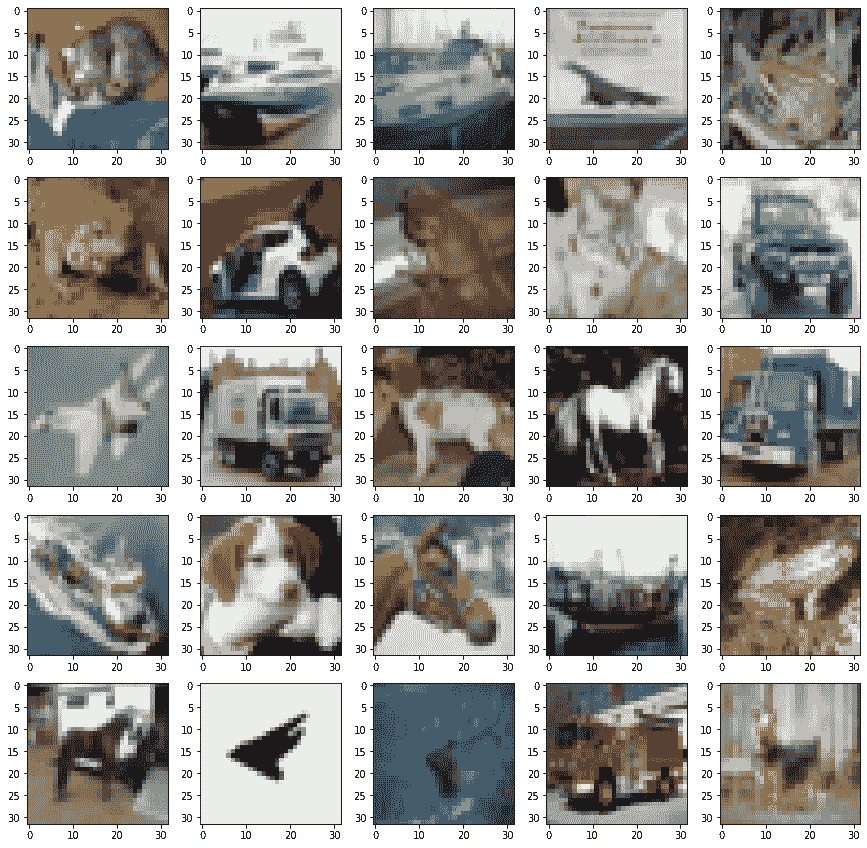
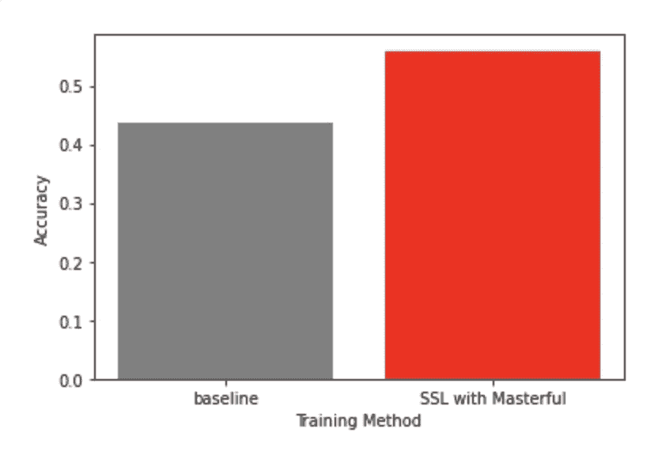

# 使用半监督学习(SSL)训练带有未标记数据的分类器模型的初学者教程

> 原文：<https://www.askpython.com/python/beginners-tutorial-to-train-a-classifier-model-semi-supervised-learning-ssl>

传统上，训练像分类器这样的计算机视觉模型需要标记数据。训练数据中的每个示例都需要成对出现:一个图像和一个描述该图像的人工生成的标签。

最近，新的 SSL 技术为 Imagenet 等经典挑战提供了计算机视觉中最准确的模型。半监督学习(SSL)允许模型从标记和未标记的数据中学习。无标签数据仅由图像组成，没有任何标签。

SSL 很棒，因为通常未标记的数据比标记的数据多得多，尤其是当您将模型部署到生产环境中时。此外，SSL 减少了标记的时间、成本和工作量。

但是一个模型如何从没有标签的图像中学习呢？关键的洞见是图像本身有信息。SSL 的神奇之处在于，它可以通过根据图像的结构自动对相似的图像进行聚类，从未标记的数据中提取信息，这种聚类为模型提供了额外的学习信息。

本教程使用 Google Colab 中包含的几个常见 Python 库，包括 matplotlib、numpy 和 TensorFlow。如果你需要安装它们，你通常可以在 Jupyter 笔记本中运行`!pip install --upgrade pip; pip install matplotlib numpy tensorflow`或者从命令行运行`pip install --upgrade pip; pip install matplotlib numpy tensorflow`(没有感叹号)。

如果你使用的是 Google Colab，一定要把运行时类型改成 GPU。

对于本教程，让我们在 CIFAR-10 数据集上训练一个分类器。这是自然图像的经典研究数据集。让我们把它装上来看看。我们将在 CIFAR-10 中看到一些职业:青蛙、船、汽车、卡车、鹿、马、鸟、猫、狗和飞机。

```py
import matplotlib.pyplot as plt

def plot_images(images):
  """Simple utility to render images."""
  # Visualize the data.
  _, axarr = plt.subplots(5, 5, figsize=(15,15))

  for row in range(5):
    for col in range(5):
      image = images[row*5 + col]
      axarr[row, col].imshow(image)

import tensorflow as tf

NUM_CLASSES = 10
# Load the data using the Keras Datasets API. 
(x_train, y_train), (x_test, y_test) = tf.keras.datasets.cifar10.load_data()

plot_images(x_test)

```



## 创建模型

通常，您会想要使用现成的模型架构。这为您节省了摆弄模型架构设计的努力。模型大小调整的一般规则是选择一个足够大的模型来处理您的数据，但不要大到在推理时很慢。对于像 CIFAR-10 这样非常小的数据集，我们将使用一个非常小的模型。对于具有较大图像大小的较大数据集，高效网络系列是一个不错的选择。

```py
def get_model():    
    return tf.keras.applications.MobileNet(input_shape=(32,32,3), 
                                           weights=None, 
                                           classes=NUM_CLASSES, 
                                           classifier_activation=None)

model = get_model()

```

## 准备数据

现在，让我们通过将标签(表示 10 类对象的从 0 到 9 的整数)转换成像[1，0，0，0，0，0，0，0，0，0，0]和[0，0，0，0，0，0，0，0，1]这样的单热点向量来准备数据。我们还将把图像像素更新到模型架构所期望的范围，即范围[-1，1]。

```py
def normalize_data(x_train, y_train, x_test, y_test):
  """Utility to normalize the data into standard formats."""

  # Update the pixel range to [-1,1], which is expected by the model architecture.
  x_train = x = tf.keras.applications.mobilenet.preprocess_input(x_train)
  x_test = x = tf.keras.applications.mobilenet.preprocess_input(x_test)

  # Convert to one-hot labels. 
  y_train = tf.keras.utils.to_categorical(y_train, NUM_CLASSES)
  y_test = tf.keras.utils.to_categorical(y_test, NUM_CLASSES)

  return x_train, y_train, x_test, y_test

x_train, y_train, x_test, y_test = \
  normalize_data(x_train, y_train, x_test, y_test)

```

该数据集包括 50，000 个示例。我们用其中的 5000 张作为标记图片，20000 张作为未标记图片。

```py
import numpy as np

def prepare_data(x_train, y_train, num_labeled_examples, num_unlabeled_examples):
    """Returns labeled and unlabeled datasets."""
    num_examples = x_train.size

    assert num_labeled_examples + num_unlabeled_examples <= num_examples

    # Generate some random indices. 
    dataset_size = len(x_train)
    indices = np.array(range(dataset_size))
    generator = np.random.default_rng(seed=0)
    generator.shuffle(indices)

    # Split the indices into two sets: one for labeled, one for unlabeled. 
    labeled_train_indices = indices[:num_labeled_examples]
    unlabeled_train_indices = indices[num_labeled_examples : num_labeled_examples + num_unlabeled_examples]

    x_labeled_train = x_train[labeled_train_indices]
    y_labeled_train = y_train[labeled_train_indices]

    x_unlabeled_train = x_train[unlabeled_train_indices]
    # Since this is unlabeled, we won't need a y_labeled_data. 

    return x_labeled_train, y_labeled_train, x_unlabeled_train

NUM_LABELED = 5000
NUM_UNLABELED = 20000

x_labeled_train, y_labeled_train, x_unlabeled_train = \
    prepare_data(x_train, 
                 y_train, 
                 num_labeled_examples=NUM_LABELED, 
                 num_unlabeled_examples=NUM_UNLABELED)

del x_train, y_train

```

## 基线训练

为了测量 SSL 带来的性能改进，让我们首先使用没有 SSL 的标准训练循环来测量模型的性能。

让我们用一些基本的数据增强来建立一个标准的训练循环。数据扩充是一种正则化，它可以防止过度拟合，并允许您的模型更好地概括从未见过的数据。

下面的超参数值(学习率、时期、批量等)是普通默认值和手动调整值的组合。

结果是一个大约 45%准确的模型。(记得看验证精度，不是训练精度)。我们的下一个任务将是弄清楚我们是否可以使用 SSL 来提高模型的准确性。

```py
model.compile(
    optimizer=tf.keras.optimizers.Adam(),
    loss=tf.keras.losses.CategoricalCrossentropy(from_logits=True),
    metrics=[tf.keras.metrics.CategoricalAccuracy()],
)

# Setup Keras augmentation. 
datagen = tf.keras.preprocessing.image.ImageDataGenerator(
    featurewise_center=False,
    featurewise_std_normalization=False,
    horizontal_flip=True)

datagen.fit(x_labeled_train)

batch_size = 64
epochs = 30
model.fit(
    x = datagen.flow(x_labeled_train, y_labeled_train, batch_size=batch_size),
    shuffle=True,
    validation_data=(x_test, y_test),
    batch_size=batch_size,
    epochs=epochs,
)
baseline_metrics = model.evaluate(x=x_test, y=y_test, return_dict=True)
print('')
print(f"Baseline model accuracy: {baseline_metrics['categorical_accuracy']}")

```

输出:

```py
Epoch 1/30
79/79 [==============================] - 4s 23ms/step - loss: 2.4214 - categorical_accuracy: 0.1578 - val_loss: 2.3047 - val_categorical_accuracy: 0.1000
Epoch 2/30
79/79 [==============================] - 1s 16ms/step - loss: 2.0831 - categorical_accuracy: 0.2196 - val_loss: 2.3063 - val_categorical_accuracy: 0.1000
Epoch 3/30
79/79 [==============================] - 1s 16ms/step - loss: 1.9363 - categorical_accuracy: 0.2852 - val_loss: 2.3323 - val_categorical_accuracy: 0.1000
Epoch 4/30
79/79 [==============================] - 1s 16ms/step - loss: 1.8324 - categorical_accuracy: 0.3174 - val_loss: 2.3496 - val_categorical_accuracy: 0.1000
Epoch 5/30
79/79 [==============================] - 1s 16ms/step - loss: 1.8155 - categorical_accuracy: 0.3438 - val_loss: 2.3339 - val_categorical_accuracy: 0.1000
Epoch 6/30
79/79 [==============================] - 1s 15ms/step - loss: 1.6477 - categorical_accuracy: 0.3886 - val_loss: 2.3606 - val_categorical_accuracy: 0.1000
Epoch 7/30
79/79 [==============================] - 1s 15ms/step - loss: 1.6120 - categorical_accuracy: 0.4100 - val_loss: 2.3585 - val_categorical_accuracy: 0.1000
Epoch 8/30
79/79 [==============================] - 1s 16ms/step - loss: 1.5884 - categorical_accuracy: 0.4220 - val_loss: 2.1796 - val_categorical_accuracy: 0.2519
Epoch 9/30
79/79 [==============================] - 1s 18ms/step - loss: 1.5477 - categorical_accuracy: 0.4310 - val_loss: 1.8913 - val_categorical_accuracy: 0.3145
Epoch 10/30
79/79 [==============================] - 1s 15ms/step - loss: 1.4328 - categorical_accuracy: 0.4746 - val_loss: 1.7082 - val_categorical_accuracy: 0.3696
Epoch 11/30
79/79 [==============================] - 1s 16ms/step - loss: 1.4328 - categorical_accuracy: 0.4796 - val_loss: 1.7679 - val_categorical_accuracy: 0.3811
Epoch 12/30
79/79 [==============================] - 2s 20ms/step - loss: 1.3962 - categorical_accuracy: 0.5020 - val_loss: 1.8994 - val_categorical_accuracy: 0.3690
Epoch 13/30
79/79 [==============================] - 1s 16ms/step - loss: 1.3271 - categorical_accuracy: 0.5156 - val_loss: 2.0416 - val_categorical_accuracy: 0.3688
Epoch 14/30
79/79 [==============================] - 1s 17ms/step - loss: 1.2711 - categorical_accuracy: 0.5374 - val_loss: 1.9231 - val_categorical_accuracy: 0.3848
Epoch 15/30
79/79 [==============================] - 1s 15ms/step - loss: 1.2312 - categorical_accuracy: 0.5624 - val_loss: 1.9006 - val_categorical_accuracy: 0.3961
Epoch 16/30
79/79 [==============================] - 1s 19ms/step - loss: 1.2048 - categorical_accuracy: 0.5720 - val_loss: 2.0102 - val_categorical_accuracy: 0.4102
Epoch 17/30
79/79 [==============================] - 1s 16ms/step - loss: 1.1365 - categorical_accuracy: 0.6000 - val_loss: 2.1400 - val_categorical_accuracy: 0.3672
Epoch 18/30
79/79 [==============================] - 1s 18ms/step - loss: 1.1992 - categorical_accuracy: 0.5840 - val_loss: 2.1206 - val_categorical_accuracy: 0.3933
Epoch 19/30
79/79 [==============================] - 2s 25ms/step - loss: 1.1438 - categorical_accuracy: 0.6012 - val_loss: 2.4035 - val_categorical_accuracy: 0.4014
Epoch 20/30
79/79 [==============================] - 2s 24ms/step - loss: 1.1211 - categorical_accuracy: 0.6018 - val_loss: 2.0224 - val_categorical_accuracy: 0.4010
Epoch 21/30
79/79 [==============================] - 2s 21ms/step - loss: 1.0425 - categorical_accuracy: 0.6358 - val_loss: 2.2100 - val_categorical_accuracy: 0.3911
Epoch 22/30
79/79 [==============================] - 1s 16ms/step - loss: 1.1177 - categorical_accuracy: 0.6116 - val_loss: 1.9892 - val_categorical_accuracy: 0.4285
Epoch 23/30
79/79 [==============================] - 1s 19ms/step - loss: 1.0236 - categorical_accuracy: 0.6412 - val_loss: 2.1216 - val_categorical_accuracy: 0.4211
Epoch 24/30
79/79 [==============================] - 1s 18ms/step - loss: 0.9487 - categorical_accuracy: 0.6714 - val_loss: 2.0135 - val_categorical_accuracy: 0.4307
Epoch 25/30
79/79 [==============================] - 1s 16ms/step - loss: 1.1877 - categorical_accuracy: 0.5876 - val_loss: 2.3732 - val_categorical_accuracy: 0.3923
Epoch 26/30
79/79 [==============================] - 2s 20ms/step - loss: 1.0639 - categorical_accuracy: 0.6288 - val_loss: 1.9291 - val_categorical_accuracy: 0.4291
Epoch 27/30
79/79 [==============================] - 2s 19ms/step - loss: 0.9243 - categorical_accuracy: 0.6882 - val_loss: 1.8552 - val_categorical_accuracy: 0.4343
Epoch 28/30
79/79 [==============================] - 1s 15ms/step - loss: 0.9784 - categorical_accuracy: 0.6656 - val_loss: 2.0175 - val_categorical_accuracy: 0.4386
Epoch 29/30
79/79 [==============================] - 1s 17ms/step - loss: 0.9316 - categorical_accuracy: 0.6800 - val_loss: 1.9916 - val_categorical_accuracy: 0.4305
Epoch 30/30
79/79 [==============================] - 1s 17ms/step - loss: 0.8816 - categorical_accuracy: 0.7054 - val_loss: 2.0281 - val_categorical_accuracy: 0.4366
313/313 [==============================] - 1s 3ms/step - loss: 2.0280 - categorical_accuracy: 0.4366

Baseline model accuracy: 0.436599999666214

```

## 使用 SSL 进行培训

现在，让我们看看是否可以通过向训练数据中添加未标记的数据来提高模型的准确性。我们将使用 Masterful，一个为像我们的分类器这样的计算机视觉模型实现 SSL 的平台。

让我们安装 Masterful。在 Google Colab 中，我们可以从笔记本电脑上进行 pip 安装。我们也可以通过命令行安装它。更多详情，请参见[专业安装指南](http://docs.masterfulai.com/0.4.1/tutorials/tutorial_installation.html?utm_campaign=ask%20python%20ssl&utm_source=askpython&utm_medium=ssl)。

```py
!pip install --upgrade pip
!pip install masterful

import masterful

masterful = masterful.register()

```

输出:

```py
Loaded Masterful version 0.4.1\. This software is distributed free of
charge for personal projects and evaluation purposes.
See http://www.masterfulai.com/personal-and-evaluation-agreement for details.
Sign up in the next 45 days at https://www.masterfulai.com/get-it-now
to continue using Masterful.

```

## 设置高手

现在，让我们设置一些 Masterful 的配置参数。

```py
# Start fresh with a new model
tf.keras.backend.clear_session()
model = get_model()

# Tell Masterful that your model is performing a classification task
# with 10 labels and that the image pixel range is 
# [-1,1]. Also, the model outputs logits rather than a softmax activation.
model_params = masterful.architecture.learn_architecture_params(
    model=model,
    task=masterful.enums.Task.CLASSIFICATION,
    input_range=masterful.enums.ImageRange.NEG_ONE_POS_ONE,
    num_classes=NUM_CLASSES,
    prediction_logits=True,
)

# Tell Masterful that your labeled training data is using one-hot labels. 
labeled_training_data_params = masterful.data.learn_data_params(
    dataset=(x_labeled_train, y_labeled_train),
    task=masterful.enums.Task.CLASSIFICATION,
    image_range=masterful.enums.ImageRange.NEG_ONE_POS_ONE,
    num_classes=NUM_CLASSES,
    sparse_labels=False,
)

unlabeled_training_data_params = masterful.data.learn_data_params(
    dataset=(x_unlabeled_train,),
    task=masterful.enums.Task.CLASSIFICATION,
    image_range=masterful.enums.ImageRange.NEG_ONE_POS_ONE,
    num_classes=NUM_CLASSES,
    sparse_labels=None,
)

# Tell Masterful that your test/validation data is using one-hot labels. 
test_data_params = masterful.data.learn_data_params(
    dataset=(x_test, y_test),
    task=masterful.enums.Task.CLASSIFICATION,
    image_range=masterful.enums.ImageRange.NEG_ONE_POS_ONE,
    num_classes=NUM_CLASSES,
    sparse_labels=False,
)

# Let Masterful meta-learn ideal optimization hyperparameters like
# batch size, learning rate, optimizer, learning rate schedule, and epochs.
# This will speed up training. 
optimization_params = masterful.optimization.learn_optimization_params(
    model,
    model_params,
    (x_labeled_train, y_labeled_train),
    labeled_training_data_params,
)

# Let Masterful meta-learn ideal regularization hyperparameters. Regularization
# is an important ingredient of SSL. Meta-learning can
# take a while so we'll use a precached set of parameters.
# regularization_params = \
#   masterful.regularization.learn_regularization_params(model, 
#                                                        model_params, 
#                                                        optimization_params, 
#                                                        (x_labeled_train, y_labeled_train),
#                                                        labeled_training_data_params)

regularization_params = masterful.regularization.parameters.CIFAR10_SMALL

# Let Masterful meta-learn ideal SSL hyperparameters. 
ssl_params = masterful.ssl.learn_ssl_params(
    (x_labeled_train, y_labeled_train),
    labeled_training_data_params,
    unlabeled_datasets=[((x_unlabeled_train,), unlabeled_training_data_params)],
)

```

输出:

```py
MASTERFUL: Learning optimal batch size.
MASTERFUL: Learning optimal initial learning rate for batch size 256.

```

## 火车！

现在，我们准备使用 SSL 技术进行培训！我们会把[叫做 masterful.training.train](http://docs.masterfulai.com/0.4.1/api/api_training.html#masterful-training-train?utm_campaign=ask%20python%20ssl&utm_source=askpython&utm_medium=ssl) ，这是 masterful 的训练引擎的入口。

```py
training_report = masterful.training.train(
    model,
    model_params,
    optimization_params,
    regularization_params,
    ssl_params,
    (x_labeled_train, y_labeled_train),
    labeled_training_data_params,
    (x_test, y_test),
    test_data_params,
    unlabeled_datasets=[((x_unlabeled_train,), unlabeled_training_data_params)],
)

```

输出:

```py
MASTERFUL: Training model with semi-supervised learning enabled.
MASTERFUL: Performing basic dataset analysis.
MASTERFUL: Training model with:
MASTERFUL: 	5000 labeled examples.
MASTERFUL: 	10000 validation examples.
MASTERFUL: 	0 synthetic examples.
MASTERFUL: 	20000 unlabeled examples.
MASTERFUL: Training model with learned parameters partridge-boiled-cap in two phases.
MASTERFUL: The first phase is supervised training with the learned parameters.
MASTERFUL: The second phase is semi-supervised training to boost performance.
MASTERFUL: Warming up model for supervised training.
MASTERFUL: 	Warming up batch norm statistics (this could take a few minutes).
MASTERFUL: 	Warming up training for 500 steps.
100%|██████████| 500/500 [00:47<00:00, 10.59steps/s]
MASTERFUL: 	Validating batch norm statistics after warmup for stability (this could take a few minutes).
MASTERFUL: Starting Phase 1: Supervised training until the validation loss stabilizes...
Supervised Training: 100%|██████████| 6300/6300 [02:33<00:00, 41.13steps/s]
MASTERFUL: Starting Phase 2: Semi-supervised training until the validation loss stabilizes...
MASTERFUL: Warming up model for semi-supervised training.
MASTERFUL: 	Warming up batch norm statistics (this could take a few minutes).
MASTERFUL: 	Warming up training for 500 steps.
100%|██████████| 500/500 [00:23<00:00, 20.85steps/s]
MASTERFUL: 	Validating batch norm statistics after warmup for stability (this could take a few minutes).
Semi-Supervised Training: 100%|██████████| 11868/11868 [08:06<00:00, 24.39steps/s]

```

## 分析结果

您传递到 [masterful.training.train](http://docs.masterfulai.com/0.4.1/api/api_training.html#masterful-training-train?utm_campaign=ask%20python%20ssl&utm_source=askpython&utm_medium=ssl) 中的模型现在已经训练并更新到位，因此您可以像评估任何其他训练过的 Keras 模型一样评估它。

```py
masterful_metrics = model.evaluate(
    x_test, y_test, return_dict=True, verbose=0
)
print(f"Baseline model accuracy: {baseline_metrics['categorical_accuracy']}")
print(f"Masterful model accuracy: {masterful_metrics['categorical_accuracy']}")

```

输出:

```py
Baseline model accuracy: 0.436599999666214
Masterful model accuracy: 0.558899998664856

```

## 可视化结果

如您所见，您将准确率从大约 0.45 提高到了 0.56。当然，更严格的研究将试图消除基线训练和通过 Masterful 平台使用 SSL 的训练之间的其他差异，以及重复几次运行并生成误差线和 p 值。现在，让我们确保将它绘制成图表，以帮助解释我们的结果。

```py
import matplotlib.cm as cm
from matplotlib.colors import Normalize

data = (baseline_metrics['categorical_accuracy'], masterful_metrics['categorical_accuracy'])
fig, ax = plt.subplots(1, 1)

ax.bar(range(2), data, color=('gray', 'red'))

plt.xlabel("Training Method")
plt.ylabel("Accuracy")

plt.xticks((0,1), ("baseline", "SSL with Masterful"))

plt.show()

```



## 结论

恭喜你。我们刚刚成功地采用了 SSL，这是目前最先进的培训方法之一，通过一个简单的教程来提高您的模型准确性。一路走来，你避免了贴标签的成本和努力。

SSL 不仅仅适用于分类——各种风格适用于几乎任何计算机视觉任务。要更深入地了解这个主题，并了解 SSL 在对象检测中的作用，请查看其他教程[这里](http://docs.masterfulai.com/0.4.1/concepts/intro_to_ssl.html?utm_campaign=ask%20python%20ssl&utm_source=askpython&utm_medium=ssl)。