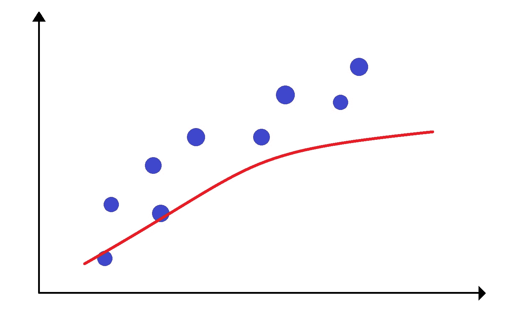
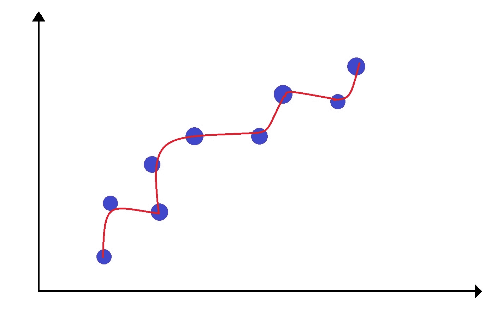
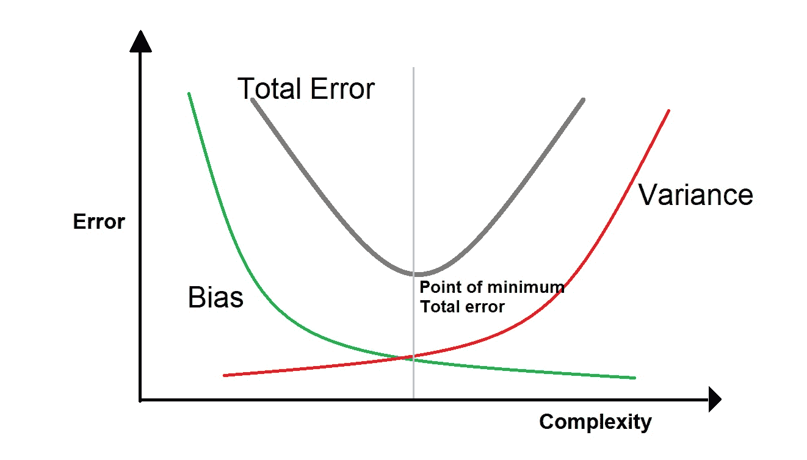
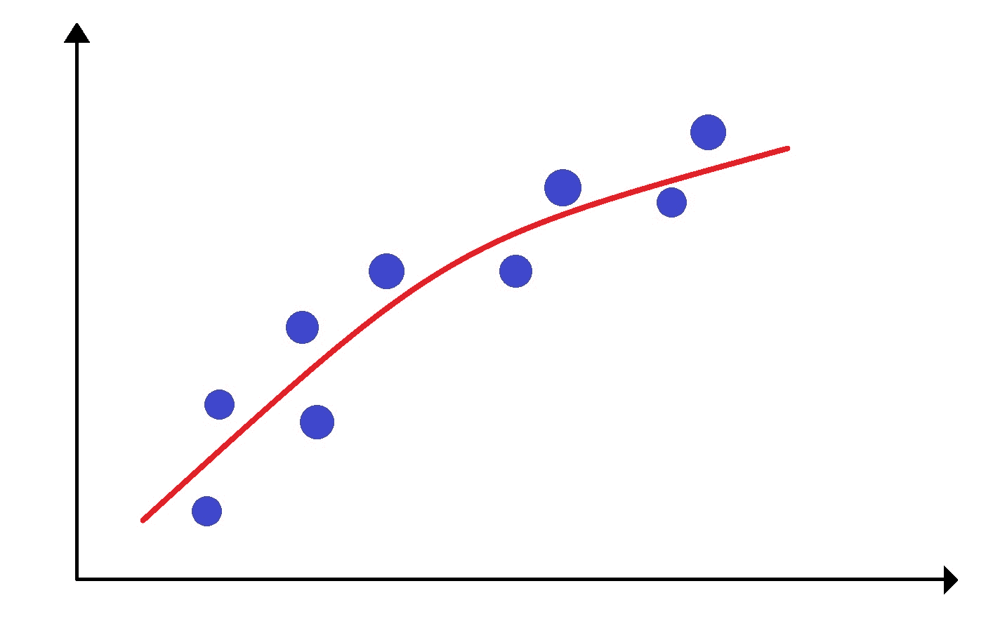
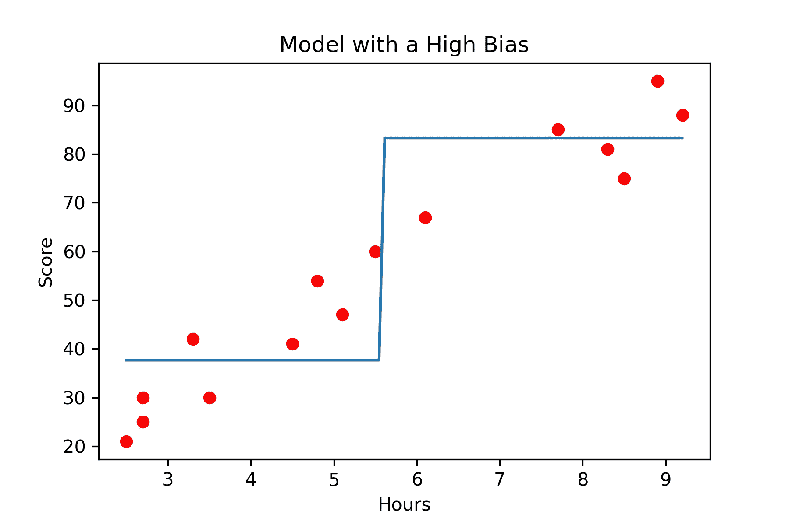

# 偏差方差权衡–理解概念

> 原文：<https://www.askpython.com/python/bias-variance-tradeoff>

为了评估模型性能，我们必须了解预测误差，主要是偏差和方差。 ***偏差方差权衡*** 是机器学习中一个非常本质的概念。

正确理解这些误差将有助于创建良好的模型，同时在训练算法时避免数据欠拟合和过拟合。

在这篇文章中我们将理解这个基本概念。

## 什么是偏见？

偏差是我们的模型的平均预测值和模型试图预测的正确目标值之间的差异。

具有高偏差的模型会过度简化我们的模型，并导致实际值和预测值之间的更大差异。

为了理解偏差，让我们看下图:



High Bias

从上图中可以清楚地看出，模型或线与数据不匹配，这被著名地称为**拟合不足**。这是一个具有高偏差的示例，因为实际值(蓝色数据点)和预测值(红线)之间的差异很大。

它总是导致训练和测试数据的高误差。

## 什么是方差？

方差是给定数据点的模型预测的可变性，它告诉我们数据的分布。那么高方差是什么样子的呢？



High Variance

具有高方差的模型对数据的拟合非常复杂，这基本上意味着我们的模型只是记住了训练数据。由于这个原因，我们的模型不能对以前看不见的数据给出正确的预测。

这种模型在训练数据上表现很好，但是在测试数据上有很高的错误率。

这被称为**过拟合**。

## 总误差是多少？

偏差和方差由下式给出:

*   **Bias[f '(X)]= E[f '(X)-f(X)]**
*   **方差[**f '(x)**]= e[x^2]−e[x]^2**

其中 f(X)是真实值，f'(x)是我们预测接近 f(X)的值的模型函数

这里需要注意的唯一要点是，模型中的总误差由三个要素组成。

**总误差=偏差+方差+不可约误差**

总误差是偏差、方差和不可约误差的总和。

这里不可约误差是不可约的误差。这是我们数据中固有的噪音。但是我们当然可以控制模型的偏差和方差。

因此，我们试图通过改变模型的复杂性来获得偏差和方差的最优值。我们在偏差和方差之间找到了一个很好的平衡，使得总误差最小。



Total Error

## 什么是偏差方差权衡？

如果我们有一个非常简单的模型，这意味着我们有一个高偏差，低方差，正如我们在前面部分看到的。类似地，如果我们在训练数据上得到一个复杂的[拟合，我们说该模型具有高方差和低偏差。不管怎样，我们都不会有好结果。](https://www.askpython.com/python/examples/split-data-training-and-testing-set)

因此，偏差方差权衡意味着模型偏差和方差之间必须有一个适当的平衡，以便在不过度拟合和欠拟合数据的情况下最小化总误差。



**Optimal Balance between Bias and Variance**

偏差和方差之间的最佳平衡永远不会导致过度拟合或欠拟合。

## Python 中偏差方差权衡的示例

让我们看看如何计算模型的偏差和方差。在命令提示符下运行这一行来获取包。

```py
pip install mlxtend

```

您可以在此处下载本例中使用的数据集(文件名–score . CSV)。

让我们看看如何使用 mlxtend 库来确定模型的偏差和方差。

```py
#Importing the required modules
from mlxtend.evaluate import bias_variance_decomp
from sklearn.tree import DecisionTreeRegressor
from sklearn.model_selection import train_test_split
import matplotlib.pyplot as plt
from sklearn.metrics import mean_squared_error
import pandas as pd
import numpy as np

#Reading the dataset
df = pd.read_csv('score.csv')

x = np.array(df.Hours).reshape(-1,1)
y = np.array(df.Scores).reshape(-1,1)

#Splitting the dataset into train and test set
x_train,x_test, y_train, y_test = train_test_split(x,y, test_size = 0.4 , random_state = 0)

#Making the model
regressor = DecisionTreeRegressor(max_depth = 1)

#Fitting the data to the model
regressor.fit(x_train,y_train)

#Calculating Bias and Variance 
avg_expected_loss, avg_bias, avg_var = bias_variance_decomp(
        regressor, x_train, y_train, x_test, y_test, 
        loss='mse',
        random_seed=1)

#Plotting the results
x= np.linspace(min(x_train) , max(x_train), 100)
plt.plot(x, regressor.predict(x))
plt.scatter(x_train , y_train , color = 'red')
plt.xlabel('Hours')
plt.ylabel('Score')
plt.title('Model with a High Bias')

print('average Bias: ',avg_bias)
print('average Variance: ',avg_var)

```

```py
average Bias:  10455.986051700678
average Variance:  61.150793197489904

```



Model With High Bias

上面的图清楚地表明，我们的模型没有很好地学习，因此有很高的偏差，因为我们将树的最大深度设置为 1。当在测试集上评估时，这样的模型将产生差的结果。

您可以尝试在不同的数据集上使用代码，使用不同的模型并更改参数，以获得低偏差和低方差的模型。

## 结论

偏差和方差在决定使用哪个预测模型时起着重要的作用。在本文中，我们学习了偏差和方差权衡，欠拟合和过拟合是什么样子。最后，我们了解到，一个好的模型应该具有较低的偏差误差和较低的方差误差。

快乐学习