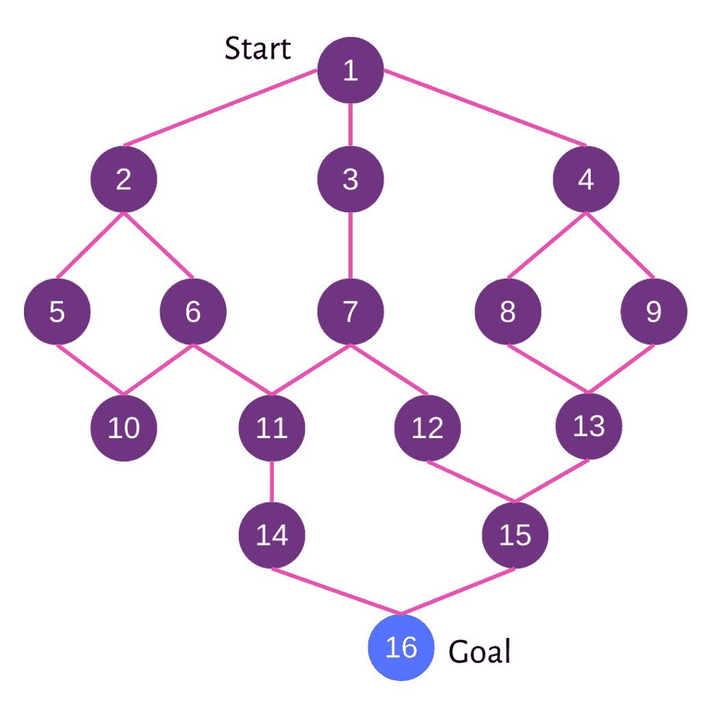
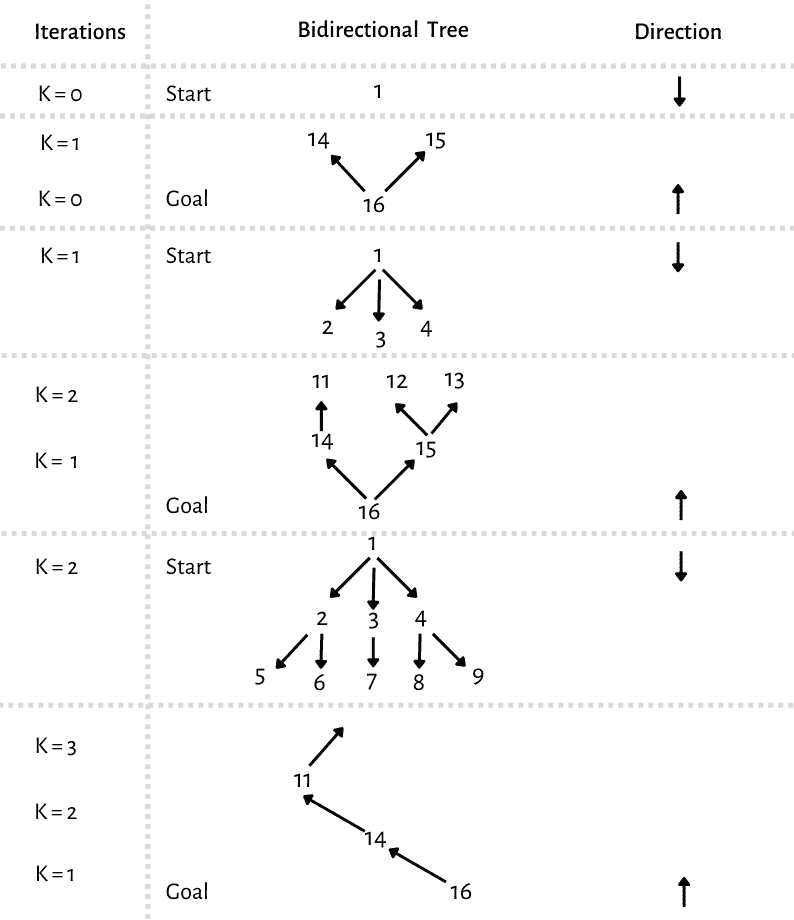

# Python 中的双向搜索

> 原文：<https://www.askpython.com/python/examples/bidirectional-search-in-python>

读者们好，在本文中，让我们试着理解什么是双向搜索，它的优点、缺点，以及它在 python 中的实现。

***也读作:[深度优先迭代深化(DFID)算法 Python 中的](https://www.askpython.com/python/examples/depth-first-iterative-deepening-dfid)***

## 什么是双向搜索？

一种称为双向搜索的图搜索算法同时进行两种搜索。当两个搜索在中途相遇时，一个停止从起点向前移动，另一个停止从目的地向后移动。对于只有一个起始状态和一个目标状态的问题，这很有帮助。

当对 *k* = 1，2，…进行双向搜索时，可以使用[深度优先迭代深化搜索](https://www.askpython.com/python/examples/depth-first-iterative-deepening-dfid) (DFID)。在*第 k 次*迭代中，不是存储状态，而是简单地与从转发方向生成的存储状态进行匹配，使用广度优先搜索从起始状态到深度 k 以及从目标状态到深度 k 和深度 k+ 1 生成转发方向上的所有状态。

这里，为了识别奇数长度的答案，需要反向或向后搜索到深度 *k+ 1* 。如果识别出匹配，则可以确定从起点到匹配状态以及从匹配状态到目标状态的路线。应该注意，每个节点都有到其后继节点以及其父节点的链接。这些链接将有助于生成从开始到目标状态的完整路径。

## 双向搜索是如何工作的？

让我们用现有的图表来说明这种方法的工作原理。考虑下图，如图所示。考虑该图，找出从为 1 的第一个节点到最后一个元素 16 的路由。



Bidirectional Graph 1

同时在两个方向上跟踪节点。



Iteration

## 在 Python 中实现双向搜索

```py
class adjacent_Node:

	def __init__(self, v):

		self.vertex = v
		self.next = None

class bidirectional_Search:

	def __init__(self, vertices):

		self.vertices = vertices
		self.graph = [None] * self.vertices

		self.source_queue = list()
		self.last_node_queue = list()

		self.source_visited = [False] * self.vertices
		self.last_node_visited = [False] * self.vertices

		self.source_parent = [None] * self.vertices
		self.last_node_parent = [None] * self.vertices

	def AddEdge(self, source, last_node):

		node = adjacent_Node(last_node)
		node.next = self.graph[source]
		self.graph[source] = node

		node = adjacent_Node(source)
		node.next = self.graph[last_node]
		self.graph[last_node] = node

	def breadth_fs(self, direction = 'forward'):

		if direction == 'forward':

			current = self.source_queue.pop(0)
			connected_node = self.graph[current]

			while connected_node:
				vertex = connected_node.vertex

				if not self.source_visited[vertex]:
					self.source_queue.append(vertex)
					self.source_visited[vertex] = True
					self.source_parent[vertex] = current

				connected_node = connected_node.next
		else:

			current = self.last_node_queue.pop(0)
			connected_node = self.graph[current]

			while connected_node:
				vertex = connected_node.vertex

				if not self.last_node_visited[vertex]:
					self.last_node_queue.append(vertex)
					self.last_node_visited[vertex] = True
					self.last_node_parent[vertex] = current

				connected_node = connected_node.next

	def is_intersecting(self):

		#
		for i in range(self.vertices):
			if (self.source_visited[i] and
				self.last_node_visited[i]):
				return i

		return -1

	def path_st(self, intersecting_node,
				source, last_node):

		path = list()
		path.append(intersecting_node)
		i = intersecting_node

		while i != source:
			path.append(self.source_parent[i])
			i = self.source_parent[i]

		path = path[::-1]
		i = intersecting_node

		while i != last_node:
			path.append(self.last_node_parent[i])
			i = self.last_node_parent[i]

		path = list(map(str, path))

		print(' '.join(path))

	def bidirectional_search(self, source, last_node):

		self.source_queue.append(source)
		self.source_visited[source] = True
		self.source_parent[source] = -1

		self.last_node_queue.append(last_node)
		self.last_node_visited[last_node] = True
		self.last_node_parent[last_node] = -1

		while self.source_queue and self.last_node_queue:

			self.breadth_fs(direction = 'forward')

			self.breadth_fs(direction = 'backward')

			intersecting_node = self.is_intersecting()

			if intersecting_node != -1:
				print("Path exists between {} and {}".format(source, last_node))
				print("Intersection at : {}".format(intersecting_node))
				self.path_st(intersecting_node,
								source, last_node)
				exit(0)
		return -1

if __name__ == '__main__':

	n = 17

	source = 1

	last_node = 16

	my_Graph = bidirectional_Search(n)
	my_Graph.AddEdge(1, 2)
	my_Graph.AddEdge(1, 3)
	my_Graph.AddEdge(1, 4)
	my_Graph.AddEdge(2, 5)
	my_Graph.AddEdge(2, 6)
	my_Graph.AddEdge(3, 7)
	my_Graph.AddEdge(4, 8)
	my_Graph.AddEdge(4, 9)
	my_Graph.AddEdge(5, 10)
	my_Graph.AddEdge(6, 10)
	my_Graph.AddEdge(10, 11)
	my_Graph.AddEdge(7, 11)
	my_Graph.AddEdge(7, 12)
	my_Graph.AddEdge(8, 13)
	my_Graph.AddEdge(9, 13)
	my_Graph.AddEdge(10, 6)
	my_Graph.AddEdge(11, 14)
	my_Graph.AddEdge(12, 15)
	my_Graph.AddEdge(13, 15)
	my_Graph.AddEdge(14, 16)
	my_Graph.AddEdge(15, 16)

	out = my_Graph.bidirectional_search(source, last_node)

	if out == -1:
		print("No path between {} and {}".format(source, last_node))

```

**输出:**

路径存在于 1 和 16 之间

十字路口:8

1 4 8 13 15 16

## 双向搜索的复杂性

这种方法的原因是两个搜索中的每一个都具有 O(b^d/2 和 O(b^d/2+b^d/2 的时间复杂度，这比一个搜索从开始到目标 O(b^d).的运行时间少得多该搜索可以在已经存在的图/树中进行，或者可以生成搜索图/树作为搜索的一部分。

## 优势

*   我们获得期望结果的速度是双向搜索的主要优势之一。
*   通过同时进行多个搜索，搜索时间显著缩短。
*   用户还可以节省资源，因为存储所有搜索所需的内存更少。

## 不足之处

*   如果算法不够健壮，无法识别搜索应该终止的交叉点，就有可能出现无限循环。
*   另一个挑战是，这种算法的实现需要额外的代码和指令，并且每个节点和步骤都应该仔细实现，以便进行这样的搜索。
*   双向搜索有一个基本问题，用户必须知道目标状态才能使用它，因此减少了它的用例。

## 摘要

它确实有一些缺点，双向搜索是最流行和广泛研究的搜索算法之一，因为当在搜索开始之前知道目的地状态时，它是达到期望的搜索结果的最有效和快速的方法。