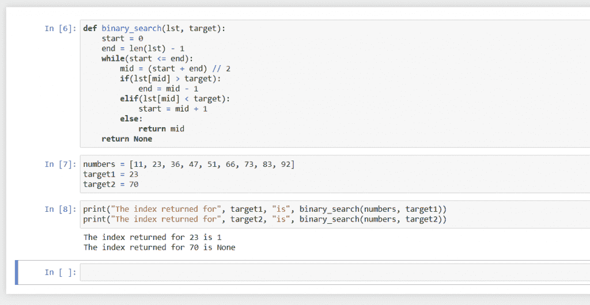

# Python 中的二分搜索法算法

> 原文：<https://www.askpython.com/python/examples/binary-search-algorithm-in-python>

今天，我们将学习一种非常快速的搜索算法 Python 中的二分搜索法算法。我们会看到它的逻辑，如何用 Python 写，是什么让它这么快。

## 二分搜索法算法

开始前有一点需要注意，**算法要求给定的列表要排序**。这是因为我们可以根据列表的排序来确定一个数字是在列表中某个数字之前还是之后。

回想一下我们是如何在字典中找到单词或者在书中找到页码的。我们简单地去序列中的一个点，检查我们需要找到的是在这个点之前还是之后，我们像这样进行猜测，直到我们找到那个项目。

同样，在二分搜索法，我们从清单的中心开始。要么我们将在那里找到该项，在这种情况下算法结束，要么我们将根据列表的排序方式知道该项是在中间项之后还是之前。

在这之后，我们将简单地忽略不应该有我们需要的项目的那一半。我们重复这个过程，到另一半的中间。

最终，我们要么找到物品，要么不再有一半要消除，这将成功或不成功地结束算法。

请注意，我们将列表分成两半，然后去掉一半，由于算法的这种行为，它被恰当地命名为二分搜索法。

韦氏词典对“二元”的解释:*被认为是截然相反的两个组或两个类的划分*。

***推荐阅读:[Python 中的二叉查找树算法](https://www.askpython.com/python/examples/binary-search-tree)***

## 二分搜索法算法的理论示例

让我们举一个例子来更好地理解它:

**给定列表** : 11，23，36，47，51，66，73，83，92
**找** : 23

*   列表有 9 项，所以中间的一项必须在位置 5，即 51。
*   51 不等于 23，但比 23 多。所以如果 23 在列表中，它必须在 51 之前。所以我们排除 51 和它之后的所有项目。
*   **剩余名单** : 11、23、36、47
*   现在我们在列表中有 4 个条目，根据你如何计算中心索引，它会告诉我们 2 是中心位置，或者 3 是中心位置。
*   为了简单起见，我们将计算开始和结束位置的平均值来获得中心。
*   这里 start = 1，end = 4，所以均值是 2(2.5 的整数部分)。
*   因此，在位置 2，我们有 23，这是我们需要找到的项目。算法会结束并给出目标的位置。

现在让我们看看二分搜索法算法是如何用 Python 编写的。

## 蟒蛇皮二分搜索法

```py
def binary_search(lst, target):
    start = 0
    end = len(lst) - 1
    while(start <= end):
        mid = (start + end) // 2
        if(lst[mid] > target):
            end = mid - 1
        elif(lst[mid] < target):
            start = mid + 1
        else:
            return mid
    return None

```

**让我们来看一下算法，**

*   我们创建一个函数，它有两个参数，第一个是列表，第二个是我们需要找到的目标。
*   我们声明两个变量`start`和`end`，分别指向列表的开始(0)和结束(length–1)。
*   这两个变量负责从搜索中排除项目，因为算法不会考虑此范围之外的项目。
*   只要开始小于或等于结束，下一个循环将继续查找并消除项目，因为开始变得大于结束的唯一方式是如果项目不在列表上。
*   在循环内部，我们找到了`start`和`end`的平均值的整数值，并将其视为列表的中间项。

现在，如果中项多于目标，则意味着目标只能出现在中项之前。所以我们将列表的末尾设置为中间之前的索引，这样，`mid`之后的所有索引，包括`mid`，都被排除在考虑之外。

同样，如果中项小于目标，则意味着目标只能出现在中项之后，为了消除索引`mid`和`mid`之前的所有索引，我们将`start`变量设置为`mid`之后的索引。

如果上述两种情况都不成立，即如果中间的项目既不大于也不小于目标，那么它一定是目标。所以我们简单的返回这个中项的索引，结束算法。

如果循环结束，那么这意味着没有找到目标，这意味着目标不在列表中，函数简单地返回`None`。

让我们看看代码的执行并检查它的输出。

**输出**



Binary Search example

我们可以看到 23 出现在列表`numbers`中，所以函数返回它的索引，也就是 2，但是 70 不在列表中，所以函数返回`None`。

## 是什么让二分搜索法如此之快？

考虑一个简单的搜索算法，比如线性搜索，我们必须遍历每个项目，直到找到我们要找的东西。这意味着对于较大的输入大小，查找项目所需的时间会随着输入大小的增加而增加。可量化地，其时间复杂度为 O(n)。

时间复杂度是一种量化算法速度或效率的方法。在二分搜索法的例子中，它的时间复杂度是" *O(log [2] n)* "，这意味着如果我们将输入列表的大小加倍，算法将只执行一次额外的迭代。

类似地，如果输入大小乘以 1000，那么这个循环将不得不再运行 10 次。

回想一下，在每次迭代中，列表的一半被消除，所以消除整个列表并不需要很长时间。

## 结论

在本教程中，我们学习了二分搜索法是什么，它的名字是怎么来的，它到底是做什么来查找项目的，以及它是如何这么快。我们从时间复杂性的角度讨论了它的效率，并看到了如何用 Python 对它进行编码。

二分搜索法是众多搜索算法中的一种，也是最快的一种。我希望你喜欢学习二分搜索法，并在下一个教程中看到你。