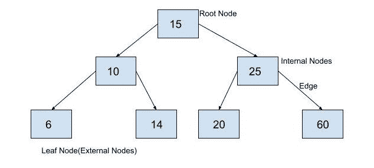

# Python 中的二叉查找树实现

> 原文：<https://www.askpython.com/python/examples/binary-search-tree>

在这篇文章中，我们将了解二分搜索法树。我们将研究二分搜索法树背后的基本概念，然后实现代码。要阅读这篇文章，你应该熟悉[二叉树](https://www.askpython.com/python/examples/binary-tree-implementation)的概念。

## 什么是二叉查找树？

二叉查找树是一种二叉树数据结构，除了二叉树的属性之外，还具有其他属性。在二叉查找树，

*   没有重复的值。
*   节点的左子树的所有数据值都小于它自己的数据。即左孩子或左孩子的孩子总是小于当前节点中的值。
*   一个节点的右边子树的所有数据值都大于它自己的数据。即当前节点的右子节点或右子节点的子节点总是大于当前节点。

这可以在下面的例子中观察到。



Depiction of Binary Search Tree

## 二叉查找树在 Python 中的实现

为了实现二叉查找树，我们将使用与二叉树相同的节点结构，如下所示。

```py
class BinaryTreeNode:
  def __init__(self, data):
    self.data = data
    self.leftChild = None
    self.rightChild=None

```

现在，为了实现二叉查找树，我们将实现在树中插入一个值的函数，在二叉树中搜索一个值，然后我们将看到如何从二叉查找树中找到最小和最大元素。

## 在二叉查找树插入一个节点

在二叉查找树中插入节点时，可能会出现三种情况。

1.  二叉查找树可以是空的。即根本身将是一个值 None。
2.  要插入的值小于根。
3.  要插入的值大于根。

要实现第一个条件，我们只需创建一个新节点，并将其声明为 root。为了实现第二和第三个条件，我们遵循下面的方法。

从二叉查找树的性质，我们可以看到，每一个子树本身就是一个二叉查找树。因此，我们可以将每个节点视为另一个二叉树的根。

在插入新节点时，如果新数据的值小于当前节点的值，我们将把它添加到二叉查找树的左子节点，否则，我们将把它添加到右子节点。

递归进行，我们将总是达到第一个条件，然后我们将声明一个新的节点，并将该节点添加到二叉查找树。

下面是上述方法的实现。

```py
class BinaryTreeNode:
  def __init__(self, data):
    self.data = data
    self.leftChild = None
    self.rightChild=None

def insert(root,newValue):
    #if binary search tree is empty, make a new node and declare it as root
    if root is None:
        root=BinaryTreeNode(newValue)
        return root
    #binary search tree is not empty, so we will insert it into the tree
    #if newValue is less than value of data in root, add it to left subtree and proceed recursively
    if newValue<root.data:
        root.leftChild=insert(root.leftChild,newValue)
    else:
        #if newValue is greater than value of data in root, add it to right subtree and proceed recursively
        root.rightChild=insert(root.rightChild,newValue)
    return root

root= insert(None,15)
insert(root,10)
insert(root,25)
insert(root,6)
insert(root,14)
insert(root,20)
insert(root,60)
a1=root
a2=a1.leftChild
a3=a1.rightChild
a4=a2.leftChild
a5=a2.rightChild
a6=a3.leftChild
a7=a3.rightChild
print("Root Node is:")
print(a1.data)
print("left child of node is:")
print(a1.leftChild.data)
print("right child of node is:")
print(a1.rightChild.data)
print("Node is:")
print(a2.data)
print("left child of node is:")
print(a2.leftChild.data)
print("right child of node is:")
print(a2.rightChild.data)
print("Node is:")
print(a3.data)
print("left child of node is:")
print(a3.leftChild.data)
print("right child of node is:")
print(a3.rightChild.data)
print("Node is:")
print(a4.data)
print("left child of node is:")
print(a4.leftChild)
print("right child of node is:")
print(a4.rightChild)
print("Node is:")
print(a5.data)
print("left child of node is:")
print(a5.leftChild)
print("right child of node is:")
print(a5.rightChild)
print("Node is:")
print(a6.data)
print("left child of node is:")
print(a6.leftChild)
print("right child of node is:")
print(a6.rightChild)
print("Node is:")
print(a7.data)
print("left child of node is:")
print(a7.leftChild)
print("right child of node is:")
print(a7.rightChild)

```

输出:

```py
Root Node is:
15
left child of node is:
10
right child of node is:
25
Node is:
10
left child of node is:
6
right child of node is:
14
Node is:
25
left child of node is:
20
right child of node is:
60
Node is:
6
left child of node is:
None
right child of node is:
None
Node is:
14
left child of node is:
None
right child of node is:
None
Node is:
20
left child of node is:
None
right child of node is:
None
Node is:
60
left child of node is:
None
right child of node is:
None

```

在上面的输出中，我们可以验证示例中二叉查找树的每个属性。在这里，在声明了根节点之后，不管元素的插入顺序是什么，输出总是相同的。尝试将这段代码复制并粘贴到您自己的 python IDE 中。

## 在二叉查找树中搜索元素

我们在上面已经看到，值小于当前节点的值的节点将总是在当前节点的左子树中，而值大于当前节点的值的节点将总是在当前节点的右子树中。我们将使用该属性在二叉查找树中搜索元素。

1.  如果当前节点为空，即无，则树中不存在要搜索的元素，我们将返回 False。
2.  如果当前节点的值等于搜索查询，我们将返回 True。
3.  如果要搜索的值大于当前节点的值，我们将搜索当前节点的右子树。
4.  如果要搜索的值小于当前节点的值，我们将搜索当前节点的左子树

下面给出了该逻辑的实现。

```py
class BinaryTreeNode:
  def __init__(self, data):
    self.data = data
    self.leftChild = None
    self.rightChild=None

def insert(root,newValue):
    #if binary search tree is empty, make a new node and declare it as root
    if root is None:
        root=BinaryTreeNode(newValue)
        return root
    #binary search tree is not empty, so we will insert it into the tree
    #if newValue is less than value of data in root, add it to left subtree and proceed recursively
    if newValue<root.data:
        root.leftChild=insert(root.leftChild,newValue)
    else:
        #if newValue is greater than value of data in root, add it to right subtree and proceed recursively
        root.rightChild=insert(root.rightChild,newValue)
    return root
def search(root,value):
    #Condition 1
    if root==None:
        return False
    #Condition 2
    elif root.data==value:
        return True
    #Condition 3
    elif root.data <value:
        return search(root.rightChild,value)
    # Condition 4
    else:
        return search(root.leftChild,value)
root= insert(None,15)
insert(root,10)
insert(root,25)
insert(root,6)
insert(root,14)
insert(root,20)
insert(root,60)
print(search(root,14))
print(search(root,22))

```

输出:

```py
True
False

```

## 如何求二叉查找树的最大元素？

从我们目前所看到的，我们知道一个比当前节点大的元素总是在它的右边。

当我们递归地从根开始移动到每个节点的右边的子节点时，最大的元素将出现在最后。

所以，要找到二叉查找树的最大元素，我们只需要找到树的最右边的元素。下面是这个逻辑的实现。

```py
class BinaryTreeNode:
  def __init__(self, data):
    self.data = data
    self.leftChild = None
    self.rightChild=None

def insert(root,newValue):
    #if binary search tree is empty, make a new node and declare it as root
    if root is None:
        root=BinaryTreeNode(newValue)
        return root
    #binary search tree is not empty, so we will insert it into the tree
    #if newValue is less than value of data in root, add it to left subtree and proceed recursively
    if newValue<root.data:
        root.leftChild=insert(root.leftChild,newValue)
    else:
        #if newValue is greater than value of data in root, add it to right subtree and proceed recursively
        root.rightChild=insert(root.rightChild,newValue)
    return root
def findLargestElement(root):
    #check if binary search tree is empty
    if root==None:
        return False
    #check if current node is rightmost node
    elif root.rightChild==None:
        return root.data
    #check right subtree of current node
    else:
        return findLargestElement(root.rightChild)
root= insert(None,15)
insert(root,10)
insert(root,25)
insert(root,6)
insert(root,14)
insert(root,20)
insert(root,60)
print("Largest Element is:")
print(findLargestElement(root))

```

输出:

```py
Largest Element is:
60

```

## 如何求二叉查找树的最小元素？

我们知道比当前节点小的元素总是在它的左边。当我们递归地从根开始移动到每个节点的左侧子节点时，最小的元素将出现在最后。

因此，要找到二叉查找树的最小元素，我们只需找到树的最左边的元素。下面是这个逻辑的实现。

```py
class BinaryTreeNode:
  def __init__(self, data):
    self.data = data
    self.leftChild = None
    self.rightChild=None

def insert(root,newValue):
    #if binary search tree is empty, make a new node and declare it as root
    if root is None:
        root=BinaryTreeNode(newValue)
        return root
    #binary search tree is not empty, so we will insert it into the tree
    #if newValue is less than value of data in root, add it to left subtree and proceed recursively
    if newValue<root.data:
        root.leftChild=insert(root.leftChild,newValue)
    else:
        #if newValue is greater than value of data in root, add it to right subtree and proceed recursively
        root.rightChild=insert(root.rightChild,newValue)
    return root
def findSmallestElement(root):
    #check if binary search tree is empty
    if root==None:
        return False
    #check if current node is leftmost node
    elif root.leftChild==None:
        return root.data
    #check right subtree of current node
    else:
        return findSmallestElement(root.leftChild)
root= insert(None,15)
insert(root,10)
insert(root,25)
insert(root,6)
insert(root,14)
insert(root,20)
insert(root,60)
print("Smallest Element is:")
print(findSmallestElement(root))

```

输出:

```py
Smallest Element is:
6

```

## 结论

在本文中，我们已经看到了二分搜索法树背后的基本概念。我们还实现了各种操作，如插入、搜索、查找二叉查找树中的最大元素和最小元素。

我会鼓励你执行这些代码，并利用它们。请继续关注更多内容丰富的教程。

快乐学习。