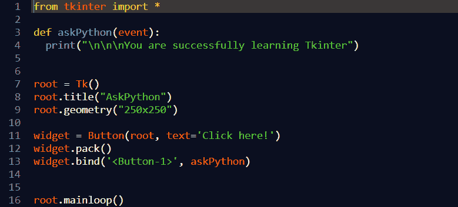
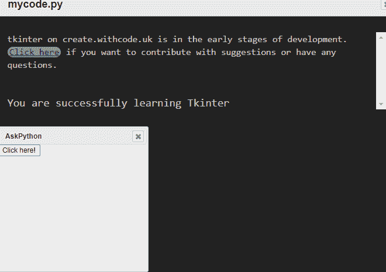

# Tkinter 中的绑定和事件

> 原文：<https://www.askpython.com/python-modules/tkinter/bind-and-events-in-tkinter>

读者们好，在这篇文章中让我们试着去了解 Tkinter 中有哪些事件。在开始这个话题之前，我们必须记住 [**Python 的 Tkinter**](https://www.askpython.com/python-modules/tkinter/tkinter-padding-tutorial) 包是用来设计基于 GUI 的界面的。Tkinter 具有多种内置功能和扩展，可用于增强应用程序的功能和性能。

## 什么是事件？

“事件”一词的基本定义是特定事件的发生，或者可以定义为类似地发生或发生的事情。事件是用户执行的操作，如鼠标移动或按键。事件用于将用户执行的动作连接到应用程序可理解的逻辑，从而导致图形变化。

当我们在 Tkinter 中使用小部件时，它们确实有很多内置的行为。例如，一个按钮将执行它的命令回调来响应鼠标点击。但是，您可以使用 Tkinter 的事件绑定功能来添加、修改或删除动作/行为。

这种绑定功能是通过使用`.bind()`函数实现的，事件和事件处理程序在小部件中定义

```py
widget.bind(event, event handler)

```

*   **事件**–由用户引起的可能反映变化的事件。
*   **事件处理器**–事件发生时应用程序中被调用的函数。
*   **Bind**–配置一个事件处理程序(python 函数)，当一个事件发生在一个小部件上时，调用这个事件处理程序。

例如:



Example

**输出**

作为输出，首先会出现一个对话框，上面显示一个按钮，一旦用户在显示的按钮上单击鼠标左键，事件处理程序(这里名为`askPython`的函数作为事件处理程序)被调用，文本消息“你正在成功学习 Tkinter”将出现在输出窗口。



Output

## 事件的语法。

事件序列通常是包含一个或多个事件模式的字符串。每个事件模式描述了一个可能的结果。如果一个序列有许多事件模式，处理程序将不会被调用，直到每个模式都出现在该序列中。记住事件顺序总是在"`<....>`"之间描述

```py
Syntax:
<modifier - type - detail>

```

修改器和细节部分是可选的。类型是定义事件的关键部分。

*   modifier–指定组合的部分，例如使用鼠标或单击其他键时按住 shift 或 control 按钮。
*   类型–定义特定类型的事件，如鼠标点击或按键。
*   细节–描述您正在寻找的鼠标按钮或按键时使用的元素。鼠标上的按钮 1 为 1，按钮 2 为 2，按钮 3 为 3。

## 事件的类型

```py
**`<button>`**
```

用户单击了一个鼠标按钮。细节部分示例中指定了哪个按钮:<button-1>是最左边的按钮，<button-2>是中间的按钮(如果有的话)，<button-3>是最右边的按钮，<button-4>是向上滚动，<button-5>是向下滚动。</button-5></button-4></button-3></button-2></button-1>

```py
**`<buttonRelease>`**
```

用户释放了鼠标按钮。由于用户可能会将鼠标从小部件上移开以防止误按按钮，这无疑是大多数场景中比按钮事件更好的替代方法。

```py
**`<Configure>`**
```

用户修改了小部件的大小，例如通过扩展窗口的角或边。

```py
**`<Destroy>`**
```

小组件正在被销毁。

```py
**`<Enter>`**
```

用户将鼠标指针放在小部件的可见区域上。(这不同于回车键，回车键是按键事件)

```py
**`<Expose>`**
```

每当您的小工具或应用程序的至少一部分在被另一个窗口隐藏后变得可见时，就会发生这种情况。

```py
**`<FocusIn>`**
```

这可能是为了响应用户交互(例如使用 tab 键在小部件之间切换)或以编程方式(例如，当您的软件调用。小部件上的 focus set()方法)。

```py
**`<FocusOut>`**
```

作为输入焦点的小部件已被更改。与`<focusin>`类似，用户或您的软件都可以启动该事件。

```py
**`<KeyPress>`**
```

用户按下了键盘键。该键在事件部分的详细信息部分中指定。“key”这个词可以用作缩写。

```py
**`<KeyRelease>`**
```

用户释放了按键。

```py
**`**<**Leave>`**
```

用户将鼠标指针移出小部件。

```py
**`**<**Map>`**
```

一个应用程序正在映射，或者使一个小部件可见。例如，如果您使用小部件的. grid()方法，就会发生这种情况。

```py
**`**<**Motion>`**
```

当按下鼠标按钮时，鼠标移动。使用<b1-motion>、<b2-motion>或<b3-motion>分别选择鼠标左键、中键或右键。</b3-motion></b2-motion></b1-motion>

```py
**`**<**MouseWheel>`**
```

用户上下移动了鼠标滚轮。

```py
**`**<**Unmap>`**
```

未映射的微件是那些不再可见的微件。例如，当您使用 widgets.grid remove()方法时，就会出现这种情况。

```py
**`**<**Visibility>`**
```

当应用程序窗口的至少一部分在屏幕上可见时，这就发生了。

## 摘要

我们已经在 Tkinter 中详细讨论了主题 events，并理解了使用 events 的主要目的是理解用户执行的动作(可以通过鼠标移动或按键)并通过改变 GUI 的行为来响应这些动作。