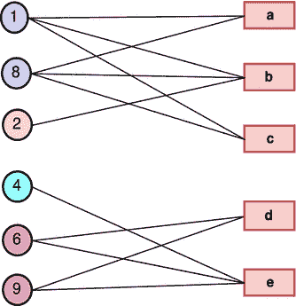
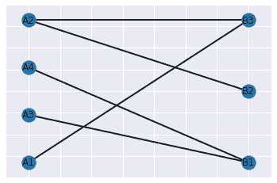

# Python 中的二分图–完整指南

> 原文：<https://www.askpython.com/python/examples/bipartite-graph-in-python>

嘿伙计们！今天，在本教程中，我们将了解什么是二分图，以及如何使用 networkx 库在 python 编程语言中实现它们。

* * *

## **二分图简介**

A ***[二部图](https://en.wikipedia.org/wiki/Bipartite_graph)*** 是顶点可以分成两个独立集合——A 和 b 的图，每一个(A，b)都意味着集合 A 中的一个节点和集合 b 中的一个节点之间的连接，这里“A”属于 A，“b”属于 b

一个集合中的节点不能相互连接；它们只能连接到另一组中的节点。



Bipartite Graph Example

例如，二分图在客户购买的建模中非常有用。在这种情况下，节点分为两组:客户分区和产品分区。

边缘表示消费者已经购买了某种产品。在这种情况下，似乎可以推断出项目不能相互链接；毕竟，一个产品不能购买另一个产品。

* * *

## **用 Python 实现二分图**

程序的第一步是将模块/库导入到我们的代码中。我们需要从 [networkx](https://www.askpython.com/python-modules/networkx-package) 导入基本 networkx 和二分网络。

```py
import networkx as nx
from networkx.algorithms import bipartite

```

接下来，我们将创建一个空图，以便在后面的部分中向其添加节点和边。

```py
G = nx.Graph()

```

下一步是添加节点属性为“bipartite”的节点。这里，二分属性的值决定了节点的类。如果它的值是 0，那么它属于第一类，如果它的值是 1，那么它属于第二类。

```py
G.add_nodes_from(['A1','A2','A3','A4'], bipartite=0)
G.add_nodes_from(['B1','B2','B3'],bipartite=1)

```

接下来，我们将只在相反类的节点之间添加边。你可以添加任意多的边，现在，我们已经添加了一些。

```py
G.add_edges_from([('A1', "B3"),('A4', "B1"),('A2', "B2"),('A2', "B3"),('A3', "B1")])

```

我们还可以使用下面提到的简单代码行来确认该图是否是二分图。

```py
bipartite.is_bipartite(G)

```

现在，通过下面提到的代码片段非常容易地将图形可视化。

```py
nx.draw_networkx(G, pos = nx.drawing.layout.bipartite_layout(G, ['A1','A2','A3','A4']), width = 2)

```



Bipartite Graph Visualization

* * *

## 结论

恭喜你！您刚刚学习了如何使用 Networkx 构建二分图。希望你喜欢它！😇

喜欢这个教程吗？无论如何，我建议你看一下下面提到的教程:

1.  [NetworkX 包——Python 图形库](https://www.askpython.com/python-modules/networkx-package)
2.  [计算未加权图中节点间的距离](https://www.askpython.com/python/examples/distance-between-nodes-unweighted-graph)
3.  [Python 中的图形操作【附简单例子】](https://www.askpython.com/python/examples/graph-operations)
4.  [用 Python 实现图形](https://www.askpython.com/python/examples/graph-in-python)

感谢您抽出时间！希望你学到了新的东西！！😄

* * *