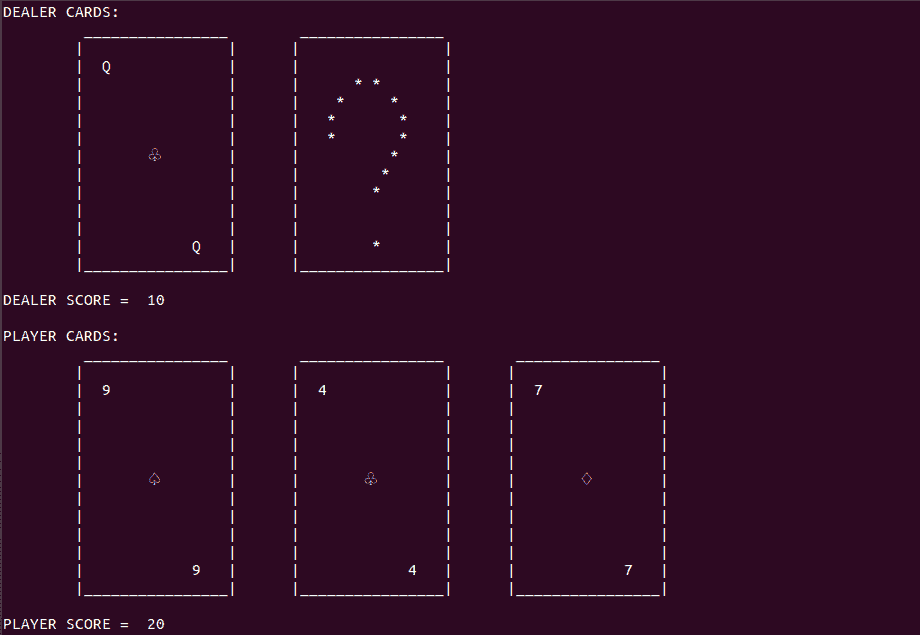

# 使用 Python 创建我们自己的 21 点游戏

> 原文：<https://www.askpython.com/python/examples/blackjack-game-using-python>

21 点是一种在赌场玩的纸牌游戏。这个游戏的参与者不是互相竞争，而是赌场指定的庄家。在本文中，我们将从头开始创建玩家和庄家之间的 21 点游戏，可以在终端上玩。

## 二十一点的规则

我们将为从未玩过 21 点的读者提供一套简单的规则。21 点的神奇数字是 21。将发给玩家的所有牌的值相加，如果总和超过 21，玩家将立即失败。

如果一个玩家得到一个精确的 21，这个玩家就赢了庄家。否则，为了赢，玩家的牌的总和必须大于庄家的牌的总和。

每张正面牌都有一个确定的值 10，而 a 可以根据玩家获胜的机会被计为 1 或 11。其余牌的价值由它们的号码决定。

**在 21 点游戏中发牌如下:**

*   给玩家发一张面朝上的牌(每个人都可以看到)。
*   庄家发一张牌给所有人都看得见的自己。
*   另一张牌面朝上发给玩家。
*   庄家为自己发一张面朝下的牌。
*   玩家必须决定是坚持当前的牌还是换一张牌。
*   如果玩家决定打，就发另一张牌。
*   如果玩家决定站着，那么发牌者展示他隐藏的牌。
*   庄家没有权力决定是打还是站。一般规则是，如果庄家的牌数总和小于 17，庄家需要继续打出更多的牌。
*   一旦庄家的牌数达到或超过 17 张，庄家就必须站起来。
*   根据最后的牌数，决定谁是赢家。

一旦理解了规则，21 点游戏的编程就变得简单了。从头开始创建基于终端的游戏需要三个主要组件:游戏设计、游戏逻辑和玩家交互管理。

* * *

## 21 点游戏演示

<https://www.askpython.com/wp-content/uploads/2020/09/blackjack_game.mp4>

* * *

## 用 Python 设计 21 点

首先，我们将致力于我们游戏的设计。我们的工作是在终端上有效地显示一系列卡片，如下图所示。



Game

我们需要一个打印卡片序列的函数，并且与卡片的数量无关。此外，如果需要，它必须提供打印隐藏卡片的功能。

下面的代码解决了我们的问题。

```py
# Function to print the cards
def print_cards(cards, hidden):

	s = ""
	for card in cards:
		s = s + "\t ________________"
	if hidden:
		s += "\t ________________"
	print(s)

	s = ""
	for card in cards:
		s = s + "\t|                |"
	if hidden:
		s += "\t|                |"		
	print(s)

	s = ""
	for card in cards:
		if card.value == '10':
			s = s + "\t|  {}            |".format(card.value)
		else:
			s = s + "\t|  {}             |".format(card.value)	
	if hidden:
		s += "\t|                |"		
	print(s)

	s = ""
	for card in cards:
		s = s + "\t|                |"
	if hidden:
		s += "\t|      * *       |"	
	print(s)	

	s = ""
	for card in cards:
		s = s + "\t|                |"
	if hidden:
		s += "\t|    *     *     |"	
	print(s)	

	s = ""
	for card in cards:
		s = s + "\t|                |"
	if hidden:
		s += "\t|   *       *    |"	
	print(s)	

	s = ""
	for card in cards:
		s = s + "\t|                |"
	if hidden:
		s += "\t|   *       *    |"	
	print(s)	

	s = ""
	for card in cards:
		s = s + "\t|       {}        |".format(card.suit)
	if hidden:
		s += "\t|          *     |"	
	print(s)	

	s = ""
	for card in cards:
		s = s + "\t|                |"
	if hidden:
		s += "\t|         *      |"	
	print(s)	

	s = ""
	for card in cards:
		s = s + "\t|                |"
	if hidden:
		s += "\t|        *       |"	
	print(s)

	s = ""
	for card in cards:
		s = s + "\t|                |"
	if hidden:
		s += "\t|                |"	
	print(s)

	s = ""
	for card in cards:
		s = s + "\t|                |"
	if hidden:
		s += "\t|                |"	
	print(s)	

	s = ""
	for card in cards:
		if card.value == '10':
			s = s + "\t|            {}  |".format(card.value)
		else:
			s = s + "\t|            {}   |".format(card.value)
	if hidden:
		s += "\t|        *       |"			
	print(s)	

	s = ""
	for card in cards:
		s = s + "\t|________________|"
	if hidden:
		s += "\t|________________|"	
	print(s)		

	print()

```

每张卡片的详细信息都存储为一个卡片对象。`print_cards()`函数的第二个参数是一个布尔值，表示是否要显示隐藏的卡片。

* * *

### 创建卡片

在类和对象的帮助下，我们可以创建一套花色和值来表示一张“扑克牌”。在 21 点中，一张牌有三个属性:花色、代表值和得分值。

所有上述属性都保留在下面的卡类中。

```py
# The Card Class definition
class Card:
	def __init__(self, suit, value, card_value):

		# Suit of the Card like Spades and Clubs
		self.suit = suit

		# Representing Value of the Card like A for Ace, K for King
		self.value = value

		# Score Value for the Card like 10 for King
		self.card_value = card_value

```

使用上面的类，我们可以创建一副包含 52 个卡片对象的卡片。

* * *

### 一些基本价值观

每种纸牌游戏都需要基本的价值，如花色、牌的类型以及每张牌的价值。

```py
# The type of suit
suits = ["Spades", "Hearts", "Clubs", "Diamonds"]

# The suit value 
suits_values = {"Spades":"\u2664", "Hearts":"\u2661", "Clubs": "\u2667", "Diamonds": "\u2662"}

# The type of card
cards = ["A", "2", "3", "4", "5", "6", "7", "8", "9", "10", "J", "Q", "K"]

# The card value
cards_values = {"A": 11, "2":2, "3":3, "4":4, "5":5, "6":6, "7":7, "8":8, "9":9, "10":10, "J":10, "Q":10, "K":10}

```

这里需要注意的一点是，a 最初被标记为 11 点的牌。这种策略背后的想法是，每当玩家/庄家的得分似乎超过 21 时，我们可以将 Ace(如果发牌)的得分减少到 1。

在本文的后面，我们将看到缩减的实现。

* * *

### 生成一副扑克牌

一副普通的扑克牌由 52 张牌组成，每张牌都有不同的花色和价值组合。使用上述基本值和卡片类，我们生成一副卡片。

```py
# The deck of cards
deck = []

# Loop for every type of suit
for suit in suits:

	# Loop for every type of card in a suit
	for card in cards:

		# Adding card to the deck
		deck.append(Card(suits_values[suit], card, cards_values[card]))

```

实际上，21 点游戏涉及多副牌，因此上述循环集可以重复用于填充多副牌。

新创建的卡片组被传递给执行游戏的函数。

```py
blackjack_game(deck)		

```

让我们学习玩家和基于计算机的庄家之间的 21 点游戏的单次迭代背后的游戏逻辑。

* * *

### 声明重要的游戏变量

在任何时刻，我们都需要以下游戏变量:

*   发给玩家和发牌者的牌的列表。
*   每一面的牌值总和。

```py
# Function for a single game of blackjack
def blackjack_game(deck):

	global cards_values

	# Cards for both dealer and player
	player_cards = []
	dealer_cards = []

	# Scores for both dealer and player
	player_score = 0
	dealer_score = 0

```

当我们设计游戏逻辑时，这些游戏变量开始发挥作用。

* * *

## Python 点游戏逻辑

整个游戏逻辑围绕着发牌和玩家选择击打或站立。一旦我们处理了以上两件事，我们就完成了这一天的工作。

### 发牌的第一阶段:强制牌

最初的发牌包括给玩家和发牌者两张牌。然而，庄家的第二张牌必须是未知的。

```py
# Initial dealing for player and dealer
while len(player_cards) < 2:

	# Randomly dealing a card
	player_card = random.choice(deck)
	player_cards.append(player_card)
	deck.remove(player_card)

	# Updating the player score
	player_score += player_card.card_value

	# In case both the cards are Ace, make the first ace value as 1 
	if len(player_cards) == 2:
		if player_cards[0].card_value == 11 and player_cards[1].card_value == 11:
			player_cards[0].card_value = 1
			player_score -= 10

	# Print player cards and score		
	print("PLAYER CARDS: ")
	print_cards(player_cards, False)
	print("PLAYER SCORE = ", player_score)

	input()

	# Randomly dealing a card
	dealer_card = random.choice(deck)
	dealer_cards.append(dealer_card)
	deck.remove(dealer_card)

	# Updating the dealer score
	dealer_score += dealer_card.card_value

	# Print dealer cards and score, keeping in mind to hide the second card and score
	print("DEALER CARDS: ")
	if len(dealer_cards) == 1:
		print_cards(dealer_cards, False)
		print("DEALER SCORE = ", dealer_score)
	else:
		print_cards(dealer_cards[:-1], True)	
		print("DEALER SCORE = ", dealer_score - dealer_cards[-1].card_value)

	# In case both the cards are Ace, make the second ace value as 1 
	if len(dealer_cards) == 2:
		if dealer_cards[0].card_value == 11 and dealer_cards[1].card_value == 11:
			dealer_cards[1].card_value = 1
			dealer_score -= 10

	input()

# Player gets a blackjack	
if player_score == 21:
	print("PLAYER HAS A BLACKJACK!!!!")
	print("PLAYER WINS!!!!")
	quit()

```

对于一笔看似简单的交易来说，可能需要喝很多酒。让我们理解一下上面代码中涉及的过程:

*   主循环运行，直到玩家和庄家各得到两张牌。
*   从这副牌中随机选择一张牌，在下一步中，这张牌被从这副牌中取出。
*   该卡的价值会添加到玩家的分数中。
*   类似地，为发牌者随机选择一张牌，并且其值被添加到发牌者的分数中。
*   玩家的牌正常显示在屏幕上。
*   庄家的牌被小心地展示，使得第二张牌和它的值不被暴露。
*   如果任何一个参与者得到两个 a，他们的分数会被调整，这样他们都不会失败。
*   以上事情全部顺利发生后，我们进入第二阶段的交易。

> **注:**对于玩家和庄家来说，分数的调整是有细微差别的。在前一种情况下，调整第一张卡的值，而在后一种情况下，调整第二张卡的值。
> 
> 调整第二张牌的值的原因是，如果我们调整了第一张牌，我们就会暴露隐藏的牌是 a 的身份。

这里需要做的最后一件事是检查玩家是否已经有了 21 点。如果他这样做，玩家获胜，游戏结束。

> **注意:**`input()`功能暂停节目，直到玩家按下“回车”。这防止了所有游戏事件的快速失败。
> 
> `clear()`功能负责清理终端，给游戏一个干净的美感。

* * *

### 发牌的第二阶段:玩家的选择

发牌的第二阶段取决于玩家的决定，要么想要另一张牌来增加分数，要么坚持当前的一套牌。

```py
# Print dealer and player cards
print("DEALER CARDS: ")
print_cards(dealer_cards[:-1], True)
print("DEALER SCORE = ", dealer_score - dealer_cards[-1].card_value)

print()	

print("PLAYER CARDS: ")
print_cards(player_cards, False)
print("PLAYER SCORE = ", player_score)

# Managing the player moves
while player_score < 21:
	choice = input("Enter H to Hit or S to Stand : ")

	# Sanity checks for player's choice
	if len(choice) != 1 or (choice.upper() != 'H' and choice.upper() != 'S'):
		clear()
		print("Wrong choice!! Try Again")

	# If player decides to HIT
	if choice.upper() == 'H':

		# Dealing a new card
		player_card = random.choice(deck)
		player_cards.append(player_card)
		deck.remove(player_card)

		# Updating player score
		player_score += player_card.card_value

		# Updating player score in case player's card have ace in them
		c = 0
		while player_score > 21 and c < len(player_cards):
			if player_cards[c].card_value == 11:
				player_cards[c].card_value = 1
				player_score -= 10
				c += 1
			else:
				c += 1	

		clear()		

		# Print player and dealer cards
		print("DEALER CARDS: ")
		print_cards(dealer_cards[:-1], True)
		print("DEALER SCORE = ", dealer_score - dealer_cards[-1].card_value)

		print()

		print("PLAYER CARDS: ")
		print_cards(player_cards, False)
		print("PLAYER SCORE = ", player_score)

	# If player decides to Stand
	if choice.upper() == 'S':
		break

# Check if player has a Blackjack
if player_score == 21:
	print("PLAYER HAS A BLACKJACK")
	quit()

# Check if player busts
if player_score > 21:
	print("PLAYER BUSTED!!! GAME OVER!!!")
	quit()

```

玩家决定是打还是站，直到分数超过 21 或者玩家决定站。发给玩家的牌的数量没有限制，只是在分数上。

每当玩家决定击中时，从该副牌中分发一张新牌，并且更新分数。如前所述，a 可以算作 1 或 11。一段特殊的代码将 Ace 的值从 11 转换为 1，以防分数超过 21。

当玩家对当前分数满意时，他就站了起来。当他这样做时，我们在进行一些强制性检查(如 21 点或破坏场景)后，进入交易的最后阶段。

* * *

### 发牌的最后阶段:庄家的牌

在发牌的最后阶段，庄家隐藏的牌被揭开，庄家的分数也被揭开。根据标准的 21 点规则，庄家必须给自己发更多的牌，直到其得分大于或等于 17。

```py
# Managing the dealer moves
while dealer_score < 17:
	clear()	

	print("DEALER DECIDES TO HIT.....")

	# Dealing card for dealer
	dealer_card = random.choice(deck)
	dealer_cards.append(dealer_card)
	deck.remove(dealer_card)

	# Updating the dealer's score
	dealer_score += dealer_card.card_value

	# Updating player score in case player's card have ace in them
	c = 0
	while dealer_score > 21 and c < len(dealer_cards):
		if dealer_cards[c].card_value == 11:
			dealer_cards[c].card_value = 1
			dealer_score -= 10
			c += 1
		else:
			c += 1

	# print player and dealer cards
	print("PLAYER CARDS: ")
	print_cards(player_cards, False)
	print("PLAYER SCORE = ", player_score)

	print()

	print("DEALER CARDS: ")
	print_cards(dealer_cards, False)
	print("DEALER SCORE = ", dealer_score)

	input()

```

庄家继续击球，直到得分超过 17 分。如果需要，我们有一个类似的实现，将 ace 的卡值从 11 转换为 1。

* * *

## 最终游戏

当庄家的分数达到或超过 17 分时，我们进入游戏的最后阶段，包括比较价值和提名游戏的赢家。可能有几种情况:

*   经销商破产–经销商的分数超过 21。
*   庄家有 21 点，庄家的精确分数是 21。
*   平局游戏-玩家和庄家得分相等。
*   玩家赢了–玩家的分数比庄家的分数多。
*   庄家赢–庄家的分数比玩家的分数多。

我们检查以上每一种可能性，并宣布获胜者。

```py
# Dealer busts
if dealer_score > 21:		
	print("DEALER BUSTED!!! YOU WIN!!!") 
	quit()	

# Dealer gets a blackjack
if dealer_score == 21:
	print("DEALER HAS A BLACKJACK!!! PLAYER LOSES")
	quit()

# TIE Game
if dealer_score == player_score:
	print("TIE GAME!!!!")

# Player Wins
elif player_score > dealer_score:
	print("PLAYER WINS!!!")					

# Dealer Wins
else:
	print("DEALER WINS!!!")					

```

这结束了玩家和庄家之间的 21 点游戏的单次迭代。

* * *

## 21 点游戏的完整 Python 代码

```py
import random
import os
import time

# The Card class definition
class Card:
	def __init__(self, suit, value, card_value):

		# Suit of the Card like Spades and Clubs
		self.suit = suit

		# Representing Value of the Card like A for Ace, K for King
		self.value = value

		# Score Value for the Card like 10 for King
		self.card_value = card_value

# Clear the terminal
def clear():
	os.system("clear")

# Function to print the cards
def print_cards(cards, hidden):

	s = ""
	for card in cards:
		s = s + "\t ________________"
	if hidden:
		s += "\t ________________"
	print(s)

	s = ""
	for card in cards:
		s = s + "\t|                |"
	if hidden:
		s += "\t|                |"		
	print(s)

	s = ""
	for card in cards:
		if card.value == '10':
			s = s + "\t|  {}            |".format(card.value)
		else:
			s = s + "\t|  {}             |".format(card.value)	
	if hidden:
		s += "\t|                |"		
	print(s)

	s = ""
	for card in cards:
		s = s + "\t|                |"
	if hidden:
		s += "\t|      * *       |"	
	print(s)	

	s = ""
	for card in cards:
		s = s + "\t|                |"
	if hidden:
		s += "\t|    *     *     |"	
	print(s)	

	s = ""
	for card in cards:
		s = s + "\t|                |"
	if hidden:
		s += "\t|   *       *    |"	
	print(s)	

	s = ""
	for card in cards:
		s = s + "\t|                |"
	if hidden:
		s += "\t|   *       *    |"	
	print(s)	

	s = ""
	for card in cards:
		s = s + "\t|       {}        |".format(card.suit)
	if hidden:
		s += "\t|          *     |"	
	print(s)	

	s = ""
	for card in cards:
		s = s + "\t|                |"
	if hidden:
		s += "\t|         *      |"	
	print(s)	

	s = ""
	for card in cards:
		s = s + "\t|                |"
	if hidden:
		s += "\t|        *       |"	
	print(s)

	s = ""
	for card in cards:
		s = s + "\t|                |"
	if hidden:
		s += "\t|                |"	
	print(s)

	s = ""
	for card in cards:
		s = s + "\t|                |"
	if hidden:
		s += "\t|                |"	
	print(s)	

	s = ""
	for card in cards:
		if card.value == '10':
			s = s + "\t|            {}  |".format(card.value)
		else:
			s = s + "\t|            {}   |".format(card.value)
	if hidden:
		s += "\t|        *       |"			
	print(s)	

	s = ""
	for card in cards:
		s = s + "\t|________________|"
	if hidden:
		s += "\t|________________|"	
	print(s)		

	print()

# Function for a single game of blackjack
def blackjack_game(deck):

	# Cards for both dealer and player
	player_cards = []
	dealer_cards = []

	# Scores for both dealer and player
	player_score = 0
	dealer_score = 0

	clear()

	# Initial dealing for player and dealer
	while len(player_cards) < 2:

		# Randomly dealing a card
		player_card = random.choice(deck)
		player_cards.append(player_card)
		deck.remove(player_card)

		# Updating the player score
		player_score += player_card.card_value

		# In case both the cards are Ace, make the first ace value as 1 
		if len(player_cards) == 2:
			if player_cards[0].card_value == 11 and player_cards[1].card_value == 11:
				player_cards[0].card_value = 1
				player_score -= 10

		# Print player cards and score		
		print("PLAYER CARDS: ")
		print_cards(player_cards, False)
		print("PLAYER SCORE = ", player_score)

		input()

		# Randomly dealing a card
		dealer_card = random.choice(deck)
		dealer_cards.append(dealer_card)
		deck.remove(dealer_card)

		# Updating the dealer score
		dealer_score += dealer_card.card_value

		# Print dealer cards and score, keeping in mind to hide the second card and score
		print("DEALER CARDS: ")
		if len(dealer_cards) == 1:
			print_cards(dealer_cards, False)
			print("DEALER SCORE = ", dealer_score)
		else:
			print_cards(dealer_cards[:-1], True)	
			print("DEALER SCORE = ", dealer_score - dealer_cards[-1].card_value)

		# In case both the cards are Ace, make the second ace value as 1 
		if len(dealer_cards) == 2:
			if dealer_cards[0].card_value == 11 and dealer_cards[1].card_value == 11:
				dealer_cards[1].card_value = 1
				dealer_score -= 10

		input()

	# Player gets a blackjack	
	if player_score == 21:
		print("PLAYER HAS A BLACKJACK!!!!")
		print("PLAYER WINS!!!!")
		quit()

	clear()

	# Print dealer and player cards
	print("DEALER CARDS: ")
	print_cards(dealer_cards[:-1], True)
	print("DEALER SCORE = ", dealer_score - dealer_cards[-1].card_value)

	print()	

	print("PLAYER CARDS: ")
	print_cards(player_cards, False)
	print("PLAYER SCORE = ", player_score)

	# Managing the player moves
	while player_score < 21:
		choice = input("Enter H to Hit or S to Stand : ")

		# Sanity checks for player's choice
		if len(choice) != 1 or (choice.upper() != 'H' and choice.upper() != 'S'):
			clear()
			print("Wrong choice!! Try Again")

		# If player decides to HIT
		if choice.upper() == 'H':

			# Dealing a new card
			player_card = random.choice(deck)
			player_cards.append(player_card)
			deck.remove(player_card)

			# Updating player score
			player_score += player_card.card_value

			# Updating player score in case player's card have ace in them
			c = 0
			while player_score > 21 and c < len(player_cards):
				if player_cards[c].card_value == 11:
					player_cards[c].card_value = 1
					player_score -= 10
					c += 1
				else:
					c += 1	

			clear()		

			# Print player and dealer cards
			print("DEALER CARDS: ")
			print_cards(dealer_cards[:-1], True)
			print("DEALER SCORE = ", dealer_score - dealer_cards[-1].card_value)

			print()

			print("PLAYER CARDS: ")
			print_cards(player_cards, False)
			print("PLAYER SCORE = ", player_score)

		# If player decides to Stand
		if choice.upper() == 'S':
			break

	clear()	

	# Print player and dealer cards
	print("PLAYER CARDS: ")
	print_cards(player_cards, False)
	print("PLAYER SCORE = ", player_score)

	print()
	print("DEALER IS REVEALING THE CARDS....")

	print("DEALER CARDS: ")
	print_cards(dealer_cards, False)
	print("DEALER SCORE = ", dealer_score)

	# Check if player has a Blackjack
	if player_score == 21:
		print("PLAYER HAS A BLACKJACK")
		quit()

	# Check if player busts
	if player_score > 21:
		print("PLAYER BUSTED!!! GAME OVER!!!")
		quit()

	input()	

	# Managing the dealer moves
	while dealer_score < 17:
		clear()	

		print("DEALER DECIDES TO HIT.....")

		# Dealing card for dealer
		dealer_card = random.choice(deck)
		dealer_cards.append(dealer_card)
		deck.remove(dealer_card)

		# Updating the dealer's score
		dealer_score += dealer_card.card_value

		# Updating player score in case player's card have ace in them
		c = 0
		while dealer_score > 21 and c < len(dealer_cards):
			if dealer_cards[c].card_value == 11:
				dealer_cards[c].card_value = 1
				dealer_score -= 10
				c += 1
			else:
				c += 1

		# print player and dealer cards
		print("PLAYER CARDS: ")
		print_cards(player_cards, False)
		print("PLAYER SCORE = ", player_score)

		print()

		print("DEALER CARDS: ")
		print_cards(dealer_cards, False)
		print("DEALER SCORE = ", dealer_score)		

		input()

	# Dealer busts
	if dealer_score > 21:		
		print("DEALER BUSTED!!! YOU WIN!!!") 
		quit()	

	# Dealer gets a blackjack
	if dealer_score == 21:
		print("DEALER HAS A BLACKJACK!!! PLAYER LOSES")
		quit()

	# TIE Game
	if dealer_score == player_score:
		print("TIE GAME!!!!")

	# Player Wins
	elif player_score > dealer_score:
		print("PLAYER WINS!!!")					

	# Dealer Wins
	else:
		print("DEALER WINS!!!")					

if __name__ == '__main__':

	# The type of suit
	suits = ["Spades", "Hearts", "Clubs", "Diamonds"]

	# The suit value 
	suits_values = {"Spades":"\u2664", "Hearts":"\u2661", "Clubs": "\u2667", "Diamonds": "\u2662"}

	# The type of card
	cards = ["A", "2", "3", "4", "5", "6", "7", "8", "9", "10", "J", "Q", "K"]

	# The card value
	cards_values = {"A": 11, "2":2, "3":3, "4":4, "5":5, "6":6, "7":7, "8":8, "9":9, "10":10, "J":10, "Q":10, "K":10}

	# The deck of cards
	deck = []

	# Loop for every type of suit
	for suit in suits:

		# Loop for every type of card in a suit
		for card in cards:

			# Adding card to the deck
			deck.append(Card(suits_values[suit], card, cards_values[card]))

	blackjack_game(deck)	

```

读者没有义务遵循整个编码序列。可以对上述代码进行各种修改，增加多个玩家对抗庄家的功能。

* * *

## 结论

一场 21 点的游戏起初看起来简单而随意，但只有当玩家遵循某些策略，如算牌，游戏才变得复杂。

世界各地流传着许多版本的 21 点，如瑞典酒吧 21 点和家庭游戏 21 点。好奇的读者可以了解这些变体，并尝试使用本文中获得的知识来实现它们。

感谢您的阅读。请随意查看如何用 Python 开发一个[智多星游戏。](https://www.askpython.com/python/examples/create-mastermind-game-in-python)