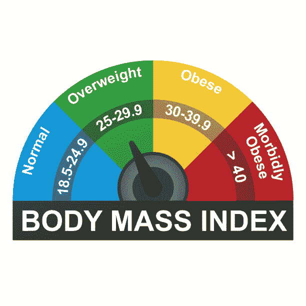
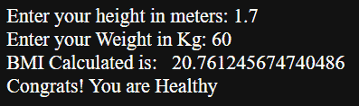
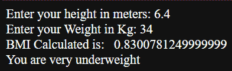

# Python 中的身体质量指数计算器——完整的分步教程

> 原文：<https://www.askpython.com/python/examples/bmi-calculator>

在本教程中，我们将了解什么是**身体质量指数或身体质量指数**，我们如何用 Python 编程语言创建身体质量指数计算器。

我们开始吧！

* * *

## 什么是身体质量指数(身体质量指数)？

**`BMI`** 取决于一个人的身高和体重。此外，人们根据他们的身体质量指数值被分为体重不足，超重，甚至肥胖。



BMI Or Body Mass Index Infographic Chart

**身体质量指数**可以作为精确测量**身体脂肪百分比**的替代品。此外，身体质量指数是一种低成本和简单的方法来检查那些可能因体重而有健康问题风险的人。

* * *

## 身体质量指数计算器的 Python 实现

身体质量指数是通过将一个人的体重(公斤)除以身高(米)的两倍来确定的，以下是用 Python 编写的身体质量指数计算器的代码:

```py
h=float(input("Enter your height in meters: "))
w=float(input("Enter your Weight in Kg: "))

BMI=w/(h*h)
print("BMI Calculated is:  ",BMI)

if(BMI>0):
	if(BMI<=16):
		print("You are very underweight")
	elif(BMI<=18.5):
		print("You are underweight")
	elif(BMI<=25):
		print("Congrats! You are Healthy")
	elif(BMI<=30):
		print("You are overweight")
	else: 
        print("You are very overweight")
else:
    print("enter valid details")

```

让我们逐行理解整个代码。

`Line 1`和`Line 2`–输入人的身高和体重

然后我们检查身体质量指数是否大于 0，因为体重和身高都不能为负，因此身体质量指数值不能小于 0。

现在，根据身体质量指数值，使用 if-else 条件语句将人分类为体重不足、健康和超重。

* * *

## 一些示例输出



Sample Output1 BMI



Sample Output2 BMI

* * *

## 结论

我希望你理解了身体质量指数以及如何用 python 实现和计算它。你自己试试！

编码快乐！😇

想了解更多？查看下面提到的教程:

1.  [Python 中如何计算点积？](https://www.askpython.com/python-modules/numpy/dot-product)
2.  [Python 中计算平方根的 4 种方法](https://www.askpython.com/python/examples/calculate-square-root)
3.  [Python 中如何计算汇总统计？](https://www.askpython.com/python/examples/calculate-summary-statistics)
4.  [Python 中如何计算距离？【简易分步指南】](https://www.askpython.com/python/examples/compute-distances-in-python)

* * *