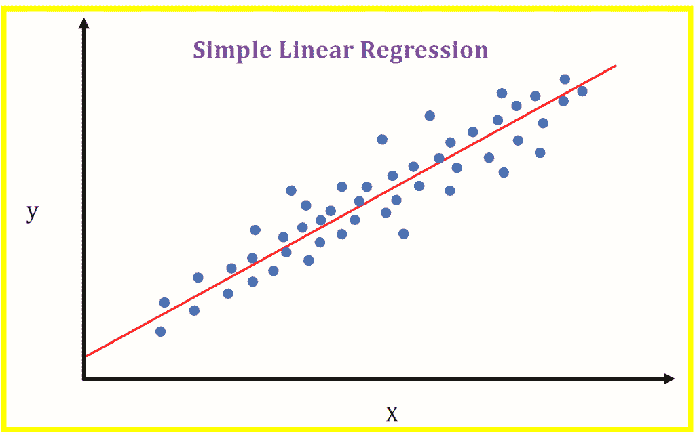
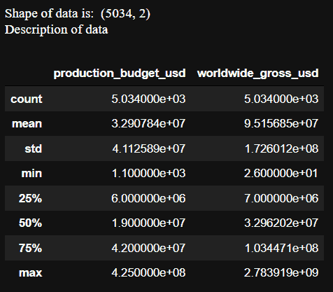
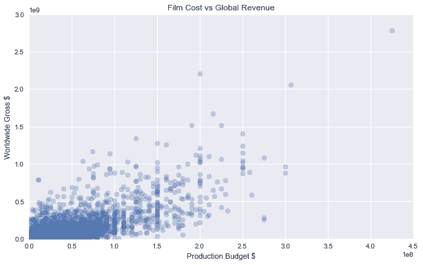
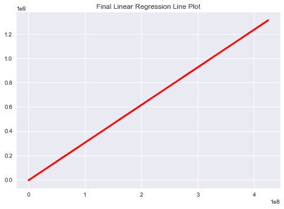
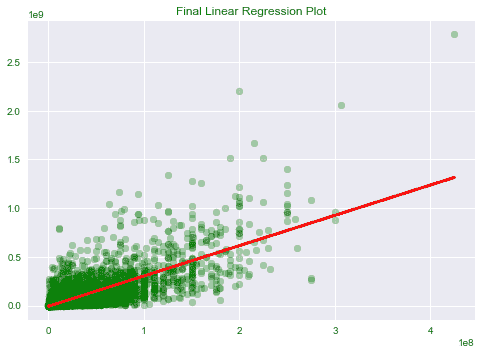
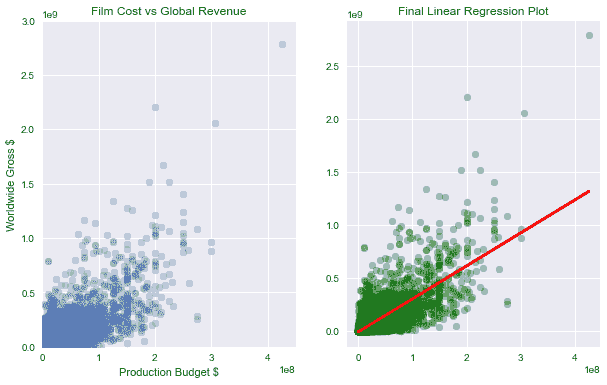

# Python 中的票房收入预测——一个简单的实现

> 原文：<https://www.askpython.com/python/examples/box-office-revenue-prediction>

你好。今天本教程结束时，我们将使用线性回归进行票房收入预测。我们开始吧！

* * *

## 分步票房收入预测

在这个机器学习项目中，我们将借助最流行的机器学习算法之一的[线性回归](https://www.askpython.com/python/examples/linear-regression-from-scratch)来预测票房收入。



Simple Linear Regression Example

IBM 表示

*线性回归分析用于根据一个变量的值预测另一个变量的值。你要预测的变量叫做因变量。用来预测另一个变量的值的变量称为自变量。*

* * *

### 1.导入模块

让我们从为我们的项目导入模块开始。我们将与熊猫和 T2 以及 sklearn 一起工作。

```py
import pandas
from pandas import DataFrame
import matplotlib.pyplot as plt
from sklearn.linear_model import LinearRegression

plt.style.use('seaborn')

```

* * *

### 2.加载数据

下一步是加载数据，可以在这里找到[。](https://www.codespeedy.com/wp-content/uploads/2021/09/cost_revenue_clean.csv)

为了加载数据，我们需要 read_csv 函数。让我们看看数据的形状以及数据的描述。

```py
data = pandas.read_csv('cost_revenue_clean.csv')
print("Shape of data is: ",data.shape)

print("Description of data")
data.describe()

```



Description Box Office Data

* * *

### 3.数据可视化

现在我们已经成功地加载了数据，是时候以 [`scatter`图](https://www.askpython.com/python-modules/data-visualization-using-python-bokeh)的形式可视化数据了。

首先，我们从最初加载的数据中制作两个数据框架，包括生产成本和产生的全球收入。我们将分别存储为 X 和 Y 数据点，并使用`plt.scatter`函数绘制这些点。

下面是上述步骤的代码。

```py
X = DataFrame(data, columns=['production_budget_usd'])
y = DataFrame(data, columns=['worldwide_gross_usd'])

plt.figure(figsize=(10,6))
plt.scatter(X, y, alpha=0.3)
plt.title('Film Cost vs Global Revenue')
plt.xlabel('Production Budget $')
plt.ylabel('Worldwide Gross $')
plt.ylim(0, 3000000000)
plt.xlim(0, 450000000)
plt.show()

```



Initial Box Office Visual

* * *

### 4.应用线性回归

该过程的最后一步是应用线性回归，包括以下主要步骤:

创建一个`LinearRegression`对象，并将 X 和 Y 数据点放入我们刚刚创建的模型对象中

```py
regression = LinearRegression()
regression.fit(X, y)

```

现在让我们看看我们刚刚生成的作为模型输出的线性点是如何以直线的形式出现的。下面提到的代码也是如此。

```py
plt.plot(X, regression.predict(X), color='red', linewidth=3)
plt.title("Final Linear Regression Line Plot")
plt.plot()

```



Final LR Box Office Plot

但是我们能够理解这个情节是否正确吗？让我们沿着数据的散点图绘制这条线。下面的代码将显示最终的情节。

```py
plt.scatter(X, y, alpha=0.3,color="green")
plt.plot(X, regression.predict(X), color='red', linewidth=3)
plt.title("Final Linear Regression Plot")
plt.plot()

```



Final Box Office Revenue Prod Visual

* * *

## 用 Python 实现的票房收入预测

现在让我们从顶部开始组合所有的代码片段，看看我们完整的代码是什么样子的。

```py
import pandas as pd
import matplotlib.pyplot as plt
from sklearn.linear_model import LinearRegression
plt.style.use('seaborn')

data = pd.read_csv('cost_revenue_clean.csv')

X = pd.DataFrame(data, columns=['production_budget_usd'])
y =pd.DataFrame(data, columns=['worldwide_gross_usd'])

plt.figure(figsize=(10,6))
plt.subplot(1,2,1)
plt.scatter(X, y, alpha=0.3)
plt.title('Film Cost vs Global Revenue')
plt.xlabel('Production Budget $')
plt.ylabel('Worldwide Gross $')
plt.ylim(0, 3000000000)
plt.xlim(0, 450000000)

plt.subplot(1,2,2)
plt.scatter(X, y, alpha=0.3,color="green")
plt.plot(X, regression.predict(X), color='red', linewidth=3)
plt.title("Final Linear Regression Plot")
plt.plot()

plt.show()

```



Final Output Box Office

* * *

## 结论

我希望你理解这个概念，并喜欢输出。在您的系统上尝试相同的数据。编码快乐！😇

想了解更多？查看下面提到的教程:

1.  [机器学习中的回归 vs 分类](https://www.askpython.com/python/regression-vs-classification)
2.  [Python 中从头开始的线性回归](https://www.askpython.com/python/examples/linear-regression-from-scratch)
3.  [简单线性回归:Python 中的实用实现](https://www.askpython.com/python/examples/linear-regression-in-python)

* * *