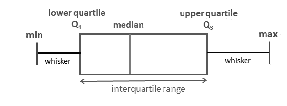
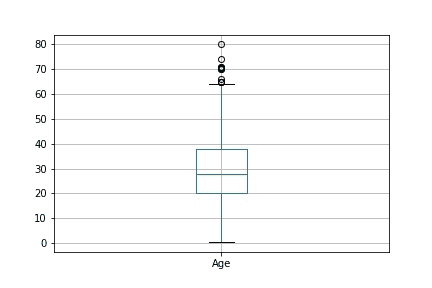
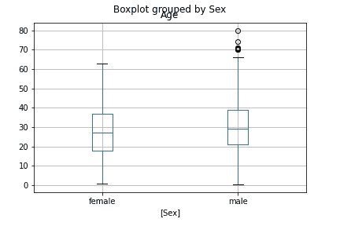
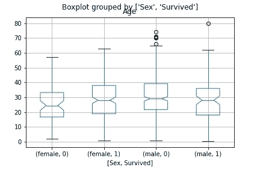
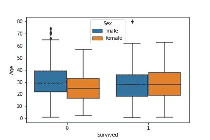
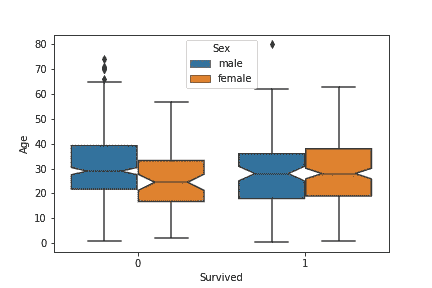
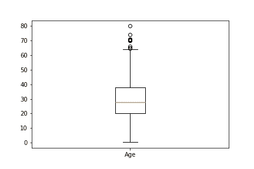
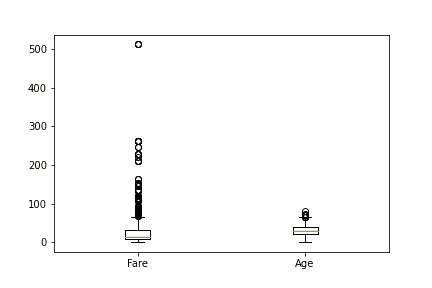

# 箱线图:你需要知道的一切

> 原文：<https://www.askpython.com/python/examples/boxplots>

**箱线图**使用四分位数来显示给定数据的分布情况。发现数据的分布是探索性数据分析(EDA)的重要部分。为此，我们有一些现有的工具，如[直方图](https://www.askpython.com/python-modules/pandas/plot-graph-for-a-dataframe)和[密度图](https://www.askpython.com/python/examples/density-plots-in-python)。

但是箱线图比这两者有一些主要的优势。

箱线图在一个非常小的平面上包含了更多的信息，当在一个图上比较两个或多个变量时会很有用。

在本文中，我们将了解盒图是什么，它们的用途，以及如何使用 Python 实现盒图。

## 解释箱线图

箱线图显示基于五个汇总统计数据的数据分布，即:

*   第一个四分位数(Q1)
*   第三个四分位数(Q3)
*   最低限度
*   最高的
*   中位数

它关注分布中的值的范围。



Box Plot Components

### 1.箱线图提供的摘要

*   *中位数:*中位数是中间两个数的平均值。它是数据集的中间值。
*   *第一个四分位数(Q1)* :第一个四分位数是中位数左边*的数据点的中位数。它也被称为 25 日*
*   **第三个四分位数(Q3):* 第三个四分位数是位于中位数*右侧*的数据点的中位数。*
*   **四分位范围(IQR):*Q3–Q1 或第 25 百分位到第 75 百分位之间的数据。*
*   **最小值:* Q1 -1.5 * IQR(不含离群值)*
*   *最大值:Q3 + 1.5 * IQR(不包括异常值)*

### *2.极端值*

*箱线图非常善于在提供的数据中发现异常值。用箱线图发现异常值最常用的方法是 **1.5 倍 IQR 法则**。*

*任何小于 Q1-1.5 倍的数据点和任何大于 Q3+1.5 倍的数据点都被视为异常值。*

## *用 Python 实现箱线图*

*可以使用许多绘图库绘制箱线图。让我们看看如何使用 python 创建箱线图。*

*我们将使用的数据集是 Titanic 数据集来演示绘图，你可以在这里下载数据集[。](https://github.com/Ash007-kali/Article-Datasets)*

### *1.使用熊猫*

*[Pandas](https://www.askpython.com/python-modules/pandas/python-pandas-module-tutorial) 在 [dataframe](https://www.askpython.com/python-modules/pandas/dataframes-in-python) 上有一个`boxplot`方法，它只需要我们需要绘制的列作为输入参数。*

```py
*#Import the required modules
import numpy as np
import pandas as pd

data = pd.read_csv('Titanic.csv')

#Plotting Boxplot of Age column
boxplot = data.boxplot(column=['Age'])* 
```

*

Pandas Boxplot Age Column* 

*如果我们的数据中有分类值，如性别等。然后熊猫可以根据每个类别创建箱线图。让我们看看如何做到这一点。*

```py
*boxplot = data.boxplot(column=['Age' ], by = ['Sex'])* 
```

*

Pandas Boxplot Age With Gender Columns* 

*我们还可以传递一个包含多个列的列表，根据提供的列对数据进行分组，然后创建箱线图。*

```py
*boxplot = data.boxplot(column=['Age' ] , by = ['Sex','Survived'] , notch = True)* 
```

*

Pandas Boxplot Grouped By Gender And Survived Columns* 

*当 notch 设置为 True 时，我们在箱线图上得到 notch，它显示了中值的置信区间，默认情况下，它被设置为 95%的置信区间。*

*在数据集上使用`boxplot`方法，可视化箱线图变得非常快。*

### *2.使用 Seaborn*

*有了 [Seaborn](https://www.askpython.com/python-modules/python-seaborn-tutorial) 我们可以绘制出一些真正高质量的方块图。让我们开始吧。*

```py
*#Importing required modules
import seaborn as sns
import pandas as ppd

data = pd.read_csv('Titanic.csv')

sns.boxplot(data = data , x = 'Survived' , y = 'Age' , hue = 'Sex')* 
```

*

Seaborn Boxplot Grouped By Gender* 

*假设现在我们想要关于幸存和死亡的人的年龄并根据性别分组的箱线图，seaborn boxplot 有`hue`的论点，这对于这个目的是有用的。*

```py
*sns.boxplot(data = data , x = 'Survived' , y = 'Age' , hue = 'Sex' , notch = True )* 
```

*

Seaborn Boxplot Grouped By Gender And Survived Columns* 

### *3.使用 Matplotlib*

*尽管我们可以使用 seaborn 库用更少的代码行创建更具美感的情节，但 seaborn 实际上是建立在 [Matplotlib](https://www.askpython.com/python-modules/matplotlib/python-matplotlib) 之上的。Matplotlib 有一个绘制箱线图的方法，方便地称为`boxplot`。*

*让我们使用 Matplotlib 创建箱线图。*

```py
*# importing required modules
import pandas as pd
import matplotlib.pyplot as plt

data = pd.read_csv('Titanic.csv')

plt.boxplot(data.Age.dropna() , labels = ['Age'])
plt.show()* 
```

*

Matplotlib Boxplot Age* 

*我们可以通过将多个变量作为一个列表传递来创建它们的箱线图。*

```py
*plt.boxplot([data.Fare , data.Age.dropna()] , labels = ['Fare' , 'Age'])
plt.show()* 
```

*

Matplotlib Boxplot On Fares And Age* 

## *结论*

*在本文中，我们探讨了箱线图、它们的重要性以及它们的用途。我们还分别使用 pandas、seaborn 和 matplotlib 库实现了代码来创建我们自己的箱线图。快乐学习！*