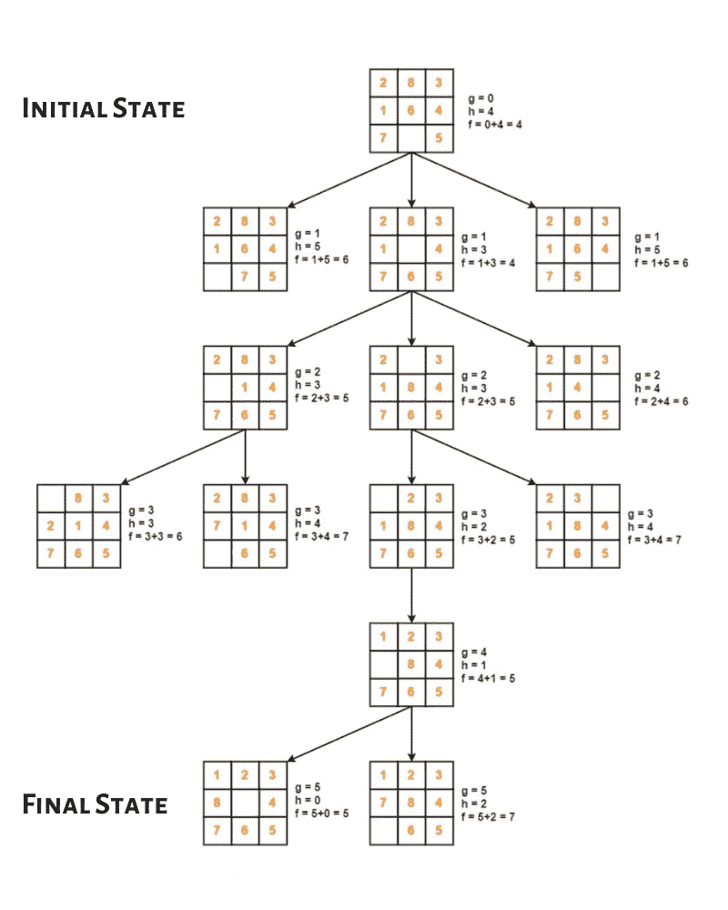
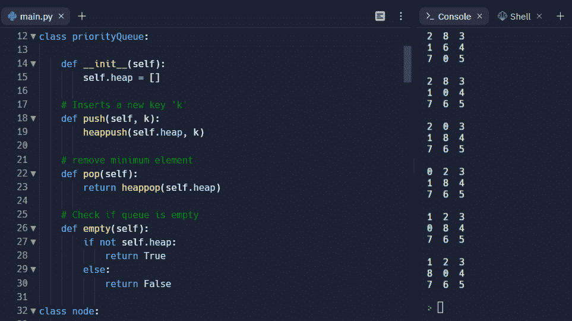

# 分支定界搜索，示例及 Python 实现

> 原文：<https://www.askpython.com/python/examples/branch-and-bound-search>

我们将尝试理解本文中的一种启发式搜索技术。启发式技术是一种标准，用于确定几个选择中哪一个对实现特定目标最有效。分支定界搜索也称为统一成本搜索。

## 什么是分支定界搜索算法？

分支定界是一种用于组合、离散和一般数学优化问题的搜索算法。它类似于回溯，因为它同样实现了一个状态空间流来表示问题的解决方案。

然而，它可能更适合尝试解决优化问题，并且只解决最小化问题，而不是最大化问题。从统计学上来说，分支和界限算法从整个搜索空间的可能性中为一个 NP-Hard 问题找到最佳解决方案。

## 分支和界限搜索是如何工作的？

在分支定界搜索策略中，生成成本函数(由 g(X)表示)，该成本函数通过使用一系列操作符，将累积成本分配给从开始节点到当前节点 X 的路径。已经发现的最便宜的价格路径在搜索空间生成过程的每一步都被扩展，直到我们到达目标状态。

分支限界搜索也称为统一成本搜索，因为它扩展了成本最低的部分路径。例如，在旅行推销员问题中，从起点到当前节点 X 行进的实际距离可以表示为 g(X)。

## 算法的步骤

```py
Input: START and GOAL states
Local Variable: OPEN, CLOSED, NODE, SUCCs, FOUND
Output: Yes or No

Method:
Initialise FOUND = false
while(OPEN is not NULL and FOUND = false) do
{
  remove the top element from OPEN list and call it NODE
  if NODE is the goal node then FOUND = true 
  else
  {
    put NODE in CLOSED list:
    find SUCCs of NODE. if any,and compute thier 'g' values and store them in OPEN list:
    sort all the nodes in the OPEN list based on their cost - function values.
 }
}end while loop
if FOUND = true then return Yes otherwise return No.

```

如果所有算子的 g(X) = 1，分支限界方法退化为直接的广度优先搜索。人工智能认为它与深度优先和广度优先一样有害。如果我们添加动态编程，我们可以通过消除冗余路径来做得更好。

我们注意到该方法通常需要创建一个解决方案并评估其功效。任何技术都可以用来得出答案，试探法也可以用于测试。以下是用于开发和测试策略的算法的基本结构。

```py
start
  Generate possible solutions
  Test if it is a goal
  If not go to start else quit
end

```

## 品牌和边界搜索算法的应用

为了更清楚地理解这个概念，让我们尝试使用分支定界算法来实现 8 难题。问题描述如下。

提供一个有 8 块瓷砖(每块瓷砖有 1 到 8 的数字)和一个空白空间的 3 x 3 板。目标是利用空白空间排列瓷砖上的数字，使它们与最终的排列相匹配。四个相邻的(左、右、上、下)牌可以滑入可用区域。

例如


Initial State

为了避免在不包括回答节点的子树中搜索，通常可以使用成本函数的近似来加速对回答节点的搜索。然而，它不使用回溯方法，而是进行 BFS 式的搜索。

基本上，分支和界限涉及三种不同的节点。

1.  活节点是生成的节点，其子节点尚未生成。
2.  现在正在检查 E 节点(一个活动节点)的子节点。或者换句话说，E 节点是当前正在扩展的节点。
3.  将不被进一步开发或检查的已创建节点被称为死节点。一个死节点已经扩展了它的所有子节点。

代价函数:在搜索树中，每个节点 X 都有相应的代价。使用成本函数可以找到下一个 E 节点。具有最低成本的 E 节点是下一个。成本函数的定义是

```py
C(X) = g(X) + h(X) 

where
   C(X) is also refered as 'f 'sometimes.
   g(X) = cost of reaching the current node from the root
   h(X) = cost of reaching an answer node from X.
```



Tree

## 用 Python 实现分支定界搜索算法

```py
import copy
from heapq import heappush, heappop

# we have defined 3 x 3 board therefore n = 3..
n = 3

# bottom, left, top, right
row = [ 1, 0, -1, 0 ]
col = [ 0, -1, 0, 1 ]

class priorityQueue:

    def __init__(self):
        self.heap = []

    # Inserts a new key 'k'
    def push(self, k):
        heappush(self.heap, k)

    # remove minimum element
    def pop(self):
        return heappop(self.heap)

    # Check if queue is empty
    def empty(self):
        if not self.heap:
            return True
        else:
            return False

class node:  
    def __init__(self, parent, mat, empty_tile_pos,
                 cost, level):

        # parent node of current node
        self.parent = parent

        # matrix
        self.mat = mat

        # position of empty tile
        self.empty_tile_pos = empty_tile_pos

        # Total Misplaced tiles
        self.cost = cost

        # Number of moves so far
        self.level = level

    def __lt__(self, nxt):
        return self.cost < nxt.cost

# Calculate number of non-blank tiles not in their goal position
def calculateCost(mat, final) -> int:

    count = 0
    for i in range(n):
        for j in range(n):
            if ((mat[i][j]) and
                (mat[i][j] != final[i][j])):
                count += 1                
    return count

def newNode(mat, empty_tile_pos, new_empty_tile_pos,
            level, parent, final) -> node:

    new_mat = copy.deepcopy(mat)
    x1 = empty_tile_pos[0]
    y1 = empty_tile_pos[1]
    x2 = new_empty_tile_pos[0]
    y2 = new_empty_tile_pos[1]
    new_mat[x1][y1], new_mat[x2][y2] = new_mat[x2][y2], new_mat[x1][y1]

    # Set number of misplaced tiles
    cost = calculateCost(new_mat, final)
    new_node = node(parent, new_mat, new_empty_tile_pos,
                    cost, level)
    return new_node

#print the N x N matrix
def printMatrix(mat):   
    for i in range(n):
        for j in range(n):
            print("%d " % (mat[i][j]), end = " ")   
        print()

def isSafe(x, y): 
    return x >= 0 and x < n and y >= 0 and y < n

def printPath(root):   
    if root == None:
        return

    printPath(root.parent)
    printMatrix(root.mat)
    print()

def solve(initial, empty_tile_pos, final):
    pq = priorityQueue()

    # Create the root node
    cost = calculateCost(initial, final)
    root = node(None, initial,
                empty_tile_pos, cost, 0)

    pq.push(root)

    while not pq.empty():
        minimum = pq.pop()

        # If minimum is the answer node
        if minimum.cost == 0:

            # Print the path from root to destination;
            printPath(minimum)
            return

        # Produce all possible children
        for i in range(4):
            new_tile_pos = [
                minimum.empty_tile_pos[0] + row[i],
                minimum.empty_tile_pos[1] + col[i], ]

            if isSafe(new_tile_pos[0], new_tile_pos[1]):

                # Create a child node
                child = newNode(minimum.mat,
                                minimum.empty_tile_pos,
                                new_tile_pos,
                                minimum.level + 1,
                                minimum, final,)

                # Add child to list of live nodes
                pq.push(child)

# Driver Code
# 0 represents the blank space
# Initial state
initial = [ [ 2, 8, 3 ],
            [ 1, 6, 4 ],
            [ 7, 0, 5 ] ]

# Final State
final = [ [ 1, 2, 3 ],
          [ 8, 0, 4 ],
          [ 7, 6, 5 ] ]

# Blank tile position during start state
empty_tile_pos = [ 2, 1 ]

# Function call 
solve(initial, empty_tile_pos, final)

```

## 输出



Output

## 摘要

在这篇文章中，我们学习了一种最有效的算法，叫做分支定界搜索。这种搜索算法有助于解决许多常见的问题，如 N 皇后问题，0-1 背包问题，旅行推销员问题等。在每种情况下，根据问题中提供的条件对算法进行比特修改，但是搜索方法的基本思想仍然与前面解释的相同。