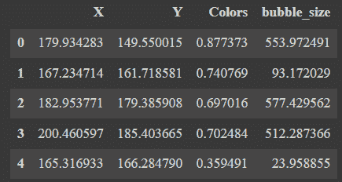
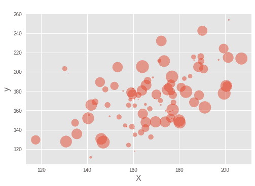
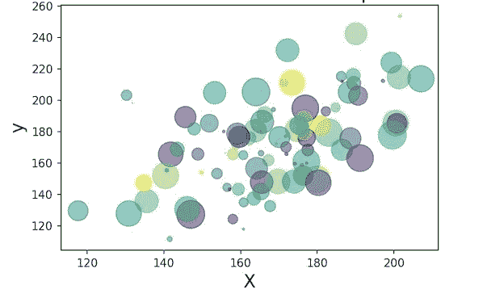

# Python 中的气泡图——初学者指南

> 原文：<https://www.askpython.com/python/examples/bubble-plots-in-python>

在本教程中，我们将学习如何使用 Matplotlib 在 Python 中创建气泡图。

气泡图是散点图，但散点图上数据点的大小由不同的变量编码。从本质上讲，如果第三个变量更大，你会得到一个更大的充满颜色的圆，即一个更大的气泡，一个更小的气泡代表一个更低的数值。

* * *

## 导入必要的模块/库

```py
import matplotlib.pyplot as plt
import pandas as pd
import numpy as np

```

## 在 PYthon 中为气泡图创建数据

为了创建气泡图，我们将使用 [NumPy random](https://www.askpython.com/python/examples/generate-random-colors) 函数模拟数据。

我们为散点图构造一个 x 和 y 变量，以及气泡图中气泡大小的第三个变量。在 Python 中，我们可以添加第四个变量来给气泡图着色。

```py
np.random.seed(42)
N = 100
x = np.random.normal(170, 20, N)
y = x + np.random.normal(5, 25, N)
colors = np.random.rand(N)
area = (25 * np.random.rand(N))**2

```

让我们将模拟数据放入熊猫数据框中。在这个例子中，我们通过使用 Pandas 的 data frame 方法并以字典的形式传递变量，从 NumPy 数组创建一个数据帧。

```py
df = pd.DataFrame({
    'X': x,
    'Y': y,
    'Colors': colors,
    "bubble_size":area})
df.head()

```



Bubble Plot Dataset

## 绘制气泡图

使用 [Matplotlib](https://www.askpython.com/python-modules/matplotlib/python-matplotlib) 和 scatter()方法，我们可以在 Python 中创建气泡图。要创建气泡图，我们必须使用大小选项“s”来确定数据点的大小。
在我们的例子中，使用了 s =‘气泡大小’。

```py
plt.style.use('ggplot')
plt.scatter('X', 'Y', s='bubble_size',alpha=0.5, data=df)
plt.xlabel("X", size=16)
plt.ylabel("y", size=16)

```



Bubble Plot 1

基于 size 变量的值，我们可以看到散点图中的点现在是气泡。默认情况下，Matplotlib 将气泡着色为蓝色。我们还使用 alpha=0.5 为气泡图中的气泡提供透明度。

## 获取彩色气泡图

让我们在泡泡图中使用另一个变量来给泡泡涂上不同的颜色。可以使用 scatter()函数的“c”选项来指定颜色。我们使用 c =“Colors”选项，用一个变量给气泡着色。颜色是我们在构建数据框时定义的定量变量。

```py
plt.scatter('X', 'Y',s='bubble_size',c='Colors',alpha=0.5, data=df)
plt.xlabel("X", size=16)
plt.ylabel("y", size=16)

```



Bubble Plot Colors

* * *

## 结论

恭喜你！您刚刚学习了如何用 Python 绘制气泡图。希望你喜欢它！😇

喜欢这个教程吗？无论如何，我建议你看一下下面提到的教程:

1.  [Boxplots:你需要知道的一切](https://www.askpython.com/python/examples/boxplots)
2.  [Matplotlib 子图–使用 Matplotlib 绘制多个图形](https://www.askpython.com/python-modules/matplotlib/matplotlib-subplots)
3.  [如何用 Python 绘制树形图？](https://www.askpython.com/python/examples/plot-a-treemap-in-python)
4.  [如何用 Python 绘制和自定义饼状图？](https://www.askpython.com/python/plot-customize-pie-chart-in-python)

感谢您抽出时间！希望你学到了新的东西！！😄

* * *