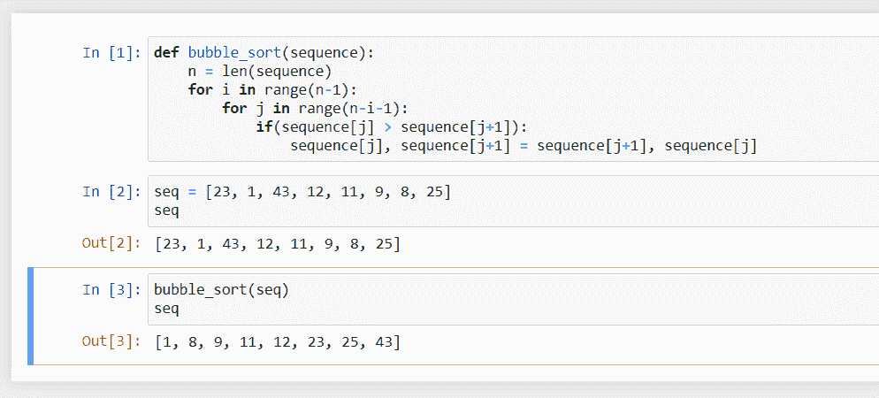

# Python 中的冒泡排序

> 原文：<https://www.askpython.com/python/examples/bubble-sort-in-python>

我们来研究一个最直观最易学的排序算法，用 Python 实现冒泡排序。我们将从理解排序本身开始，然后我们将通过冒泡排序进行排序，最后，我们将看到如何在 Python 中实现它。

## 排序算法的重要性

什么是排序？为什么它如此重要？这些是我们将在本节中尝试回答的问题。

从图书馆里的书和字典里的单词到数据库的条目和处理器中的指令，我们经历了无数次排序。

在计算机科学中，排序是将事物按有序的顺序排列的行为–[维基百科](https://en.wikipedia.org/wiki/Sorting_algorithm)

这意味着当我们对事物进行排序时，我们需要知道我们将根据什么标准来安排给我们的序列。出于本教程的目的，我们将假设标准是一个数字的值，我们将对一个给定的数字序列进行排序。

在计算机科学中，排序最重要的目的是产生高效的算法。[二分搜索法](https://www.askpython.com/python/examples/binary-search-tree)是一种异常快速的搜索算法，在无序的对象集合中是不可能的。

几乎所有的集合操作对排序后的数据都非常有效。

除了制造有效的算法，当一个程序的真正需求是对某样东西进行排序时，就要用到排序，就像一个处理一副卡片的程序。因此，排序算法是程序员必须知道的最基本的概念之一。

## 了解冒泡排序算法

想想在一杯苏打水里，里面的气泡是如何升起的。气泡代表给定序列中的最大/最小元素，气泡的上升运动代表最大/最小元素如何移动到序列的结尾/开头。

这就是冒泡排序的工作原理，也是它得名的原因。

*简单地说，我们遍历序列多次，每次，我们交换几对元素，使得序列中最大/最小的元素在序列的一端结束。*

出于本教程的考虑，我们将考虑给定的数组，我们将按照数字值的升序对其进行排序。

```py
12, 16, 11, 10, 14, 13

```

现在，冒泡排序算法的工作原理是这样的，按升序排序:

1.  **考虑两个变量 *i* 和 *j* 。** i 表示我们已经排序的元素的数量，或者我们遍历列表的次数，因为每次遍历列表，我们都会对一个项目进行排序。
    *j* 代表列表中的一个位置，所以如果我们说 *j* 是 3，那么我们说的就是列表中的第三个数字，也就是 11。
2.  将 *n* 视为列表中元素的数量。
3.  **设 *i* 等于 0。**因为我们没有浏览列表，也没有对元素进行排序。
4.  **设 *j* 等于 1。**所以我们从第一个位置的数字开始。
5.  **如果位置 *j* 的数字大于位置 *j+1* 的数字，那么我们需要交换位置 *j* 和 *j+1* 的数字。这是因为列表是按升序排列的，所以前面的数字不能大于后面的数字。**
6.  **将 *j* 增加 1。**那么现在，我们可以看下一对数字了。
7.  **如果 *j* 不是 *n-i* ，则进入步骤 5，否则，我们停止循环，进入下一步。**在这个循环中，每次交换发生时，较大的元素向列表的末尾移动。这是冒泡排序的行为，最大的元素在列表末尾冒泡。如果 *i* 表示已经排序的元素的数量，那么列表的最后 *i* 元素处于它们的正确位置(因为它们在我们遍历循环的 *i* 次数中冒泡通过)，所以我们不需要检查最后的 *i* 元素，因为这只会浪费时间，因此当 j 等于 *n-i* 时循环结束。
8.  **将 *i* 增加 1。**如果我们在 *j* 到达末尾时结束循环，那么我们又一次遍历了列表，又一个元素被排序。
9.  **如果 *i* 不是 *n-1* ，则转到步骤 4，否则，我们用 *i* 停止循环，转到下一步。**你可能已经注意到了，有两个循环，带有 *j* 的内部循环负责再排序一个元素，我们总共有 n 个元素要排序，这由运行在 *i* 上的外部循环处理。如果 *i* 变为 *n-1* ，这意味着 *n-1* 个元素被排序，这自动意味着最后一个元素也在其正确的位置，这意味着整个序列被排序，因此我们停止。
10.  **序列已排序。**

现在，你可能想在给定的序列上尝试一下，这就是我们现在要做的。

## 冒泡排序示例

给定顺序:12，16，11，10，14，13
元素个数( *n* ): 6
让我们开始-

*   **第一步:**变量 *i* 和 *j* 代表排序后的元素和位置。
*   **第二步:** *n* 为 6。 *n = 6*
*   **第三步:**设置 *i* 为 0。 *i = 0*
*   **第四步:**设置 *j* 为 1。 *j = 1*
*   **第五步:**比较位置 *j* 和 *j+1* ，位置 1 (12)的元素不大于位置 2 (16)的元素。
*   **第六步:**增量 *j* 。 *j = 2*
*   **第七步:** *j* (2)不是 *n-i* (6)，所以我们到第五步。
*   **第五步:**位置 2 (16)大于位置 3 (11)，所以我们互换。
*   *序列:12、 **11、** 、 **16、** 、10、14、13*
*   **第六步:**增量 *j* 。 *j = 3*
*   **第七步:** 3 不是 6，所以我们到第五步。
*   **第五步:** 16 大于 10，所以我们互换。*序列:12、**、 10、、**、 16、、**，14、13***
*   **第六步:**增量 *j* 。 *j = 4*
*   **第七步:** 4 不是 6，所以我们到第五步。
*   **第五步:** 16 大于 14，所以我们互换。*序列:12、11、10、**、14、**、 16、、**13、***
*   **第六步:**增量 *j* 。 *j = 5*
*   **第七步:** 5 不是 6，所以我们到第五步。
*   **第五步:** 16 大于 13，所以我们互换。*序列:12、11、10、14、**、、**、 16、、**、***
*   **第六步:**增量 *j* 。 *j = 6*
*   **第 7 步:** *j* (6)等于 *n-i* (6)，那么我们继续第 8 步。注意最大的元素(16)在最后，我们已经确定排序了一个元素。
*   **第八步:**增加*I .*I = 1
*   **第 9 步:** *i* (1)不是 *n-1* (5)，所以我们从第 4 步开始全部重复一遍，循环继续，得到的序列变化会是这样的:

**【11】**、**【12】**、10、14、13、【16】

【11】、 **16** ，**【11】**，， **【11】**、12】【13】、【14】、【16】
【10】、**【11】**

**在这之后， *i* 变成了 5，也就是 *n-1* ，于是循环结束，算法告诉我们列表已经排序。看起来在算法完成之前，列表可能已经被排序了，这仅仅意味着给定的序列在给算法之前已经被排序了。**

## **在 Python 中实现冒泡排序**

**现在我们已经准备好了算法，我们可以开始用 Python 实现每一步了。有一些事情需要注意:**

**该序列将由一个[列表](https://www.askpython.com/python/difference-between-python-list-vs-array)来表示，并且列表具有[索引](https://www.askpython.com/python/list/indexing-in-python)而不是位置，并且索引从 0 到大小-1 而不是 1 到大小，所以这将需要被调整，下面是该算法看起来的样子:**

```py
def bubble_sort(sequence):
    n = len(sequence)
    for i in range(n-1):
        for j in range(n-i-1):
            if(sequence[j] > sequence[j+1]):
                sequence[j], sequence[j+1] = sequence[j+1], sequence[j] 
```

**让我们用一个例子，并用这个算法对它进行排序:**

**

Binary Sort Example** 

**注意，这个算法就地对列表进行排序，但是很容易修改算法，使它返回一个排序后的列表。**

## **结论**

**在本教程中，我们学习了什么是排序以及在哪里使用排序，然后我们学习了冒泡排序是如何工作的，我们提出了一个算法并用 Python 实现了冒泡排序。**

**冒泡排序是众多排序算法中的一种，它远不是最好的，但却非常容易实现。不经常使用它的原因是它的复杂性为 O(n² ，这意味着如果列表中的元素数量增加一倍，使用该算法对它们进行排序所需的时间将增加四倍。**

**所以对于非常大的数据量，这个算法就变得低效了。然而，作为一名程序员，了解冒泡排序是很重要的，我希望你能学到一些东西。**