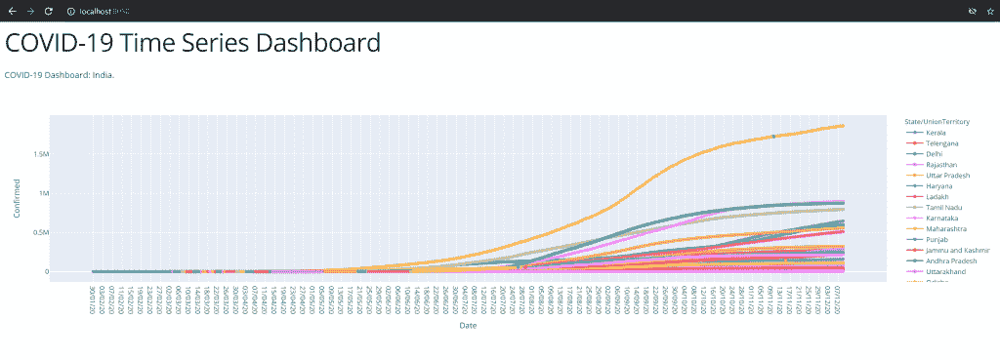

# 用 python 从 CSV 文件构建仪表板[简单步骤]

> 原文：<https://www.askpython.com/python/examples/build-a-dashboard-in-python>

读者你好！在本教程中，我们将了解如何使用 dash 从 CSV 文件中快速构建 Python 中的仪表板。

Dash 是一个 Python 框架，使得任何人都可以轻松地用 Python 构建仪表板，而不必直接处理所需的前端。

## 用 Python 构建仪表板的步骤

现在让我们开始使用 Python 构建一个仪表板，使用 dash 库显示 CSV 文件中的数据！

### 步骤 1:使用 Plotly 绘制数据

我们将使用一个简单的 CSV 文件作为数据源，即 COVID 时间序列数据集。

我正在使用来自 Kaggle 的这个新冠肺炎数据集。一旦你准备好了，我们就可以开始使用了。

为了渲染这些图，我们将使用 [Python plotly 库](https://www.askpython.com/python-modules/python-plotly-tutorial)。要安装此库，请使用:

```py
pip install plotly

```

现在让我们画出各种状态的时间序列数据。我们将使用 [Pandas read_csv()函数](https://www.askpython.com/python-modules/pandas/python-pandas-module-tutorial)从 csv 数据集中读取数据。这只是三行简单的代码！

```py
import plotly.express as px

df = pd.read_csv('covid_19_india.csv')

# Plot the scatterplot using Plotly. We ploy y vs x (#Confirmed vs Date)
fig = px.scatter(df, x='Date', y='Confirmed', color='State/UnionTerritory')
fig.update_traces(mode='markers+lines')
fig.show()

```

现在 plotly 应该给你一个很好的数据可视化。现在让我们在 Dash 应用程序中渲染它。

### 步骤 2:用破折号嵌入图形

为了呈现我们的仪表板应用程序，我们将使用[破折号](https://dash.plotly.com/)。使用以下方式安装此库:

```py
pip install dash

```

我们将使用 dash 在布局中呈现数据。

在此之前，让我们设置一些样式表(CSS)来使我们的页面看起来更好！我用的是[这个](https://dash.plotly.com/layout) dash 官方教程的默认数据。

```py
import dash
import dash_core_components as dcc
import dash_html_components as html
import plotly.express as px
import pandas as pd

external_stylesheets = ['https://codepen.io/chriddyp/pen/bWLwgP.css']

app = dash.Dash(__name__, external_stylesheets=external_stylesheets)

colors = {
    'background': '#F0F8FF',
    'text': '#00008B'
}

```

现在让我们在这个布局中配置我们的数据。

```py
# Our dataframe
df = pd.read_csv('covid_19_india.csv')

fig = px.scatter(df, x='Date', y='Confirmed', color='State/UnionTerritory')
fig.update_traces(mode='markers+lines')

app.layout = html.Div(children=[
    html.H1(children='COVID-19 Time Series Dashboard'),

    html.Div(children='''
        COVID-19 Dashboard: India.
    '''),

    dcc.Graph(
        id='example-graph',
        figure=fig
    )
])

```

### 步骤 3:用 Flask 运行应用服务器

现在，让我们最后运行应用服务器(通过 [Flask](https://www.askpython.com/python-modules/flask/create-hello-world-in-flask) ):

```py
if __name__ == '__main__':
    app.run_server(debug=True)

```

这将在本地端口 8050 上启动服务器。我们现在来看看输出，当我们到`http://localhost:8050`的时候



Dashboard Output

正如你所看到的，我们确实用几行 Python 代码就有了一个好看的交互式仪表板！

* * *

## 结论

在本教程中，我们学习了如何使用 Dash 从 CSV 文件构建 Python 中的仪表板。

* * *