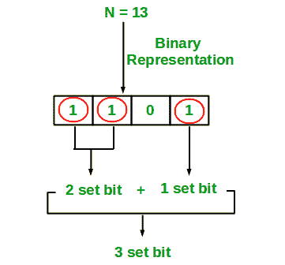

# 用 Python 计算整数中的设定位

> 原文：<https://www.askpython.com/python/examples/calculate-set-bits-integer>

嘿，勒纳！在本教程中，我们将使用 Python 编程语言来计算一个整数中设置位的总数。这个问题将展示位操作概念的重要性和威力。

* * *

## 什么是设置位–简介

在二进制数的世界中，集合位由 1 表示。所以，基本上，我们需要找出一个数的二进制形式中 1 的总数。



No Set Bits Demonstration

* * *

## 理解问题

**`N`** 给出一个数字。
返回数字 n 的二进制版本中存在的集合位的总数

例如，
如果给定的数(N) = 5。那么结果就是 2，因为 5 的二进制版本是 101。101 中 1 的总数是 2。因此，设置位的数量是 2。

* * *

## 方法 1:手动转换

将给定的十进制数转换为二进制数，然后计算转换后的二进制数中 1 的总数。然而，这不是解决问题的有效方法。

在这种情况下，时间复杂度将是线性的，但是我们可以使这种策略更有效。

* * *

## 方法 2:位操作

因此，在这种方法中，我们将看到一种位操作方法。通过使用这种方法，我们可以提高代码和方法的效率。

因此，我们将遵循以下步骤:

1.  检查 N 是否大于 0
2.  计算 A 和 A-1 的和
3.  不断重复步骤 2，直到 A！= 0
4.  我们将保持迭代次数的计数
5.  该计数等于数字 N 中的置位位数

* * *

## 使用 Python 计算设定位

```py
def countsetbits(A):
    count = 0        
    while(A!=0):
        A = A & (A-1)    
        count = count+1   
    return(count)       

n = int(input("Enter the Number: "))
print(countsetbits(n))

```

## 样本输出

```py
Enter the Number: 5
2

```

```py
Enter the Number: 100
3

```

* * *

我希望你能理解问题背后的概念以及问题的解决方案。

感谢您阅读教程！😇

* * *