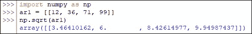
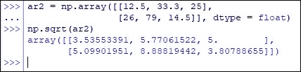
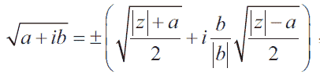
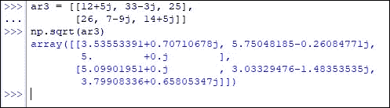
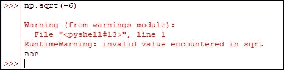

# Python 中如何使用 Numpy 计算平方根？

> 原文：<https://www.askpython.com/python-modules/numpy/calculate-square-root-using-numpy>

数学中有许多令人感兴趣的度量。其中一个度量就是平方根！当问题是找出这些数字的平方根时，我们可以很容易地大声说出这些数字，而这些数字是它们自身的乘积，当它们不再符合上述条件时，事情就变得很糟糕了。

***也读作:[RMSE——Python 中的均方根误差](https://www.askpython.com/python/examples/rmse-root-mean-square-error)***

在本文中，我们将探索使用 *numpy* 库中的内置函数来计算给定实体的平方根的不同方法—*sqrt()*函数！

重要的事情先来！在使用下面的代码部署 *sqrt( )* 函数之前，导入 [*numpy* 库](https://askpython.com/python-modules/numpy/)。

```py
import numpy as np

```

我们将在接下来的章节中介绍 *sqrt( )* 函数的各个方面。

*   ***sqrt()*函数**的语法
*   **计算一维数组的平方根**
*   **计算 N 维数组的平方根**
*   **计算复数的平方根**
*   **限制 *sqrt( )* 功能**

* * *

## sqrt()函数的语法

在深入了解如何使用 *sqrt( )* 函数的细节之前，让我们从理解它正常运行所需的基本组件开始。

```py
numpy.sqrt(x, out=None, where=True, dtype=None)

```

在哪里，

*   ***x—***要计算平方根的输入数组或标量实体
*   ***out—***一个可选的构造，默认情况下设置为 *none* ，但可用于将结果存储在所需的数组中，该数组的长度与输出的长度相同
*   ***其中—***一个可选构造，当设置为*真*(默认设置)时，用于计算给定位置的通用函数(ufunc ),当设置为*假*时，不计算
*   ***dtype—***可选结构，用于指定正在使用的数据类型

* * *

## 计算一维数组的平方根

在导入了 *numpy* 库之后，让我们用要计算平方根的元素构建一个一维数组，如下所示。

```py
ar1 = [[12, 36, 71, 99]]

```

现在让我们使用 *sqrt( )* 函数来推导上述数组的结果。

```py
np.sqrt(ar1)

```



Square Root Calculated For One-Dimensional Array

* * *

## 计算 N 维数组的平方根:

与一维数组类似，也可以计算 N 维数组中给定实体的平方根。下面是一个二维数组，使用如下所示的 *sqrt( )* 函数计算平方根。

```py
ar2 = np.array([[12.5, 33.3, 25],
                [26, 79, 14.5]], dtype = float)
np.sqrt(ar2)

```



Square Root Calculated For Two-Dimensional Array

* * *

## 计算复数的平方根

虽然简单的平方根推导可以让我们大赚一笔，但当我们冒险进入复数领域时，事情就变得更加棘手了。为了客观地看待问题，下面是用于计算复数平方根的公式！



Square Root Formula For Complex Numbers

为了将我们从痛苦中解救出来， *sqrt( )* 函数也能够推导出复数的平方根。它能够从给定的数组中直接推导出一个复数，但是这个特性的另一面是，这个函数继续将数组中的所有其他元素也视为一个复数。

```py
ar3 = [[12+5j, 33-3j, 25],
       [26, 7-9j, 14+5j]]
np.sqrt(ar3)

```



Square Root Calculated For Complex Numbers

* * *

## sqrt()函数的限制

虽然它将能力扩展到了复数，但这并不是说 *sqrt( )* 函数是万能的，而是说它也有其局限性。其中之一就是计算负数平方根的能力。

现在让我们试着找出'-6 '的平方根，并见证它的结果。



Warning & NaN Error Appears

* * *

## 结论

现在我们已经到了本文的结尾，希望它已经详细说明了如何使用来自 *numpy* 库的 *sqrt( )* 函数来寻找数组元素的平方根。这里有另一篇文章解释了如何使用 Python 中的 *numpy* 在一组数组元素中找到[的最大值。AskPython](https://www.askpython.com/python-modules/numpy/numpy-maximum-on-arrays) 中还有许多其他有趣的&内容丰富的文章，可能对那些希望提高 Python 水平的人有很大帮助。当你享受这些的时候，再见！