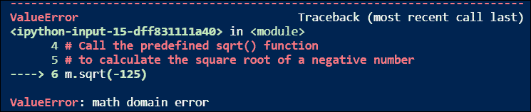
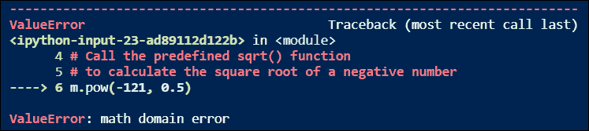

# Python 中计算平方根的 4 种方法

> 原文：<https://www.askpython.com/python/examples/calculate-square-root>

在本教程中，我们将讨论在 Python 中计算平方根的不同方法。

* * *

## 什么是平方根？

在数学中，一个数' *p* 的平方根是一个数' *q* ，它遵循条件**p = q²。在 Python 中，我们有那么多计算数字平方根的方法。我们来讨论一下 Python 中一些比较知名的计算数字平方根的方法。**

## 1.使用指数运算符计算平方根

在这个方法中，我们将定义自己的函数来求一个数的平方根。为了计算一个数的平方根，我们将在 Python 中使用指数运算符(`**`)。

定义的函数将一个数字作为参数，如果它是正的，返回这个数字的平方根，否则它将打印一个警告。让我们用 Python 代码实现它。

```py
# Define the user defined sqrt() function
# to calculate the square root of a number
def sqrt(N):
    if N < 0:
        print('Square root of negative number does not exist!')
        return
    else:
        print(f'Square root of number {N}: {N**0.5}')
        return

# Call the above defined sqrt() function
# to calculate the square root of a number
sqrt(441)
sqrt(0.81)
sqrt(6.25)
sqrt(634)
sqrt(-121)

```

**输出:**

```py
Square root of number 441: 21.0 
Square root of number 0.81: 0.9 
Square root of number 6.25: 2.5 
Square root of number 634: 25.179356624028344
Square root of negative number does not exist!

```

## 2.使用 sqrt()函数

在 Python 中，`sqrt()`函数是在[数学模块](https://www.askpython.com/python-modules/python-math-module)中定义的预定义函数。`sqrt()`函数返回作为参数传递的数字的平方根。让我们看看如何在 Python 程序中使用内置的`sqrt()`函数。

```py
# Import Python math module
import math as m

# Call the predefined sqrt() function
# to calculate the square root of a number
print(f'Square root of number 121: {m.sqrt(121)}')
print(f'Square root of number 0.49: {m.sqrt(0.49)}')
print(f'Square root of number 4.41: {m.sqrt(4.41)}')
print(f'Square root of number 265: {m.sqrt(265)}')

```

**输出:**

```py
Square root of number 121: 11.0 
Square root of number 0.49: 0.7 
Square root of number 4.41: 2.1
Square root of number 265: 16.278820596099706

```

**注意:**如果一个负数作为参数传递给内置的 sqrt()函数，那么它将抛出一个**数学域错误**。让我们看一个例子。

```py
# Import Python math module
import math as m

# Call the predefined sqrt() function
# to calculate the square root of a negative number
m.sqrt(-125)

```

**输出:**



math domain error: sqrt()

## 3.使用 pow()函数

在这个计算平方根的方法中，我们将使用内置的 [pow()函数](https://www.askpython.com/python/built-in-methods/python-pow)。在 Python 中，`pow()`函数是在`math`模块中定义的预定义函数。`pow()`函数接受两个参数，一个是基数，另一个是指数/幂，并返回作为第一个参数传递的数字的平方根(**基数**)。为了计算平方根，指数/幂参数固定为 **0.5** 。让我们看看如何在 Python 程序中使用内置的`pow()`函数。

```py
# Import Python math module
import math as m

# Call the predefined pow() function
# to calculate the square root of a number
print(f'Square root of number 625: {m.pow(625, 0.5)}')
print(f'Square root of number 0.64: {m.pow(0.64, 0.5)}')
print(f'Square root of number 1.21: {m.pow(1.21, 0.5)}')
print(f'Square root of number 7: {m.pow(7, 0.5)}')

```

**输出:**

```py
Square root of number 625: 25.0 
Square root of number 0.64: 0.8 
Square root of number 1.21: 1.1 
Square root of number 7: 2.6457513110645907

```

**注意:**同样，如果一个负数作为参数传递给内置的`pow()`函数，那么它将抛出一个**数学域错误**。让我们看一个例子。

```py
# Import Python math module
import math as m

# Call the predefined pow() function
# to calculate the square root of a negative number
m.pow(-121, 0.5)

```

**输出:**



math domain error: pow()

## 4.使用内置的 np.sqrt()函数

在这种求平方根的方法中，我们将使用内置的`np.sqrt()`函数。在 Python 中，`np.sqrt()`函数是在 [numpy 模块](https://www.askpython.com/python-modules/numpy/python-numpy-module)中定义的预定义函数。`np.sqrt()`函数返回一个 **numpy 数组**，其中每个元素是作为参数传递的 numpy 数组中相应元素的平方根。让我们看看如何在 Python 程序中使用内置的`np.sqrt()`函数。

```py
# Import Python numpy module
import numpy as np

# Define a numpy array
arr = np.array([0, 225, 0.36, 6.25, 10, -15])
print('NumPy array:')
print(arr)

# Call the predefined np.sqrt() function
# to calculate the square root of each element
# in the numpy array
print('Returned NumPy array with Square roots:')
print(np.sqrt(arr))

```

**输出:**

```py
NumPy array: 
[  0\.   225\.     6.25  10\.   -15\.  ]
Returned NumPy array with Square roots: 
[ 0\.         15\.          2.5         3.16227766         nan] 
<ipython-input-29-541b85f9361a>:13: RuntimeWarning: invalid value encountered in sqrt   print(np.sqrt(arr))

```

**注意:**如果在 **numpy 数组**中有一个负数，并且它被传递给内置的`np.sqrt()`函数，那么它将抛出一个 **RuntimeWarning** 表示在 sqrt 中遇到一个无效值。并在返回的 numpy 数组中负元素的平方根处设置一个 **nan** 值。

## 结论

在本教程中，我们学习了用 Python 计算数字平方根的不同方法。我们还学习了如何使用 Python 函数，如`math.sqrt()`、`math.pow()`和`numpy.sqrt()`。希望你已经很好地理解了这些事情，并很高兴探索和学习更多。