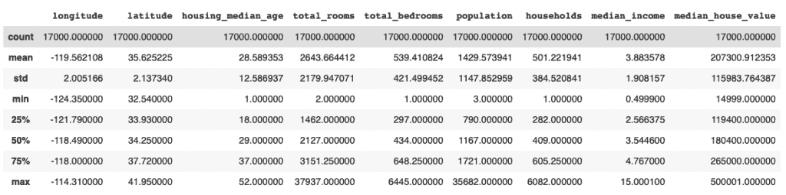

# Python 中如何计算汇总统计？

> 原文：<https://www.askpython.com/python/examples/calculate-summary-statistics>

要在 Python 中计算汇总统计数据，您需要使用**。描述[熊猫](https://www.askpython.com/python-modules/pandas/python-pandas-module-tutorial)下的** () **法**。**。describe()方法**既处理数字数据，也处理[对象](https://www.askpython.com/python/oops/python-classes-objects)数据，比如字符串或时间戳。

两者的输出将包含不同的字段。对于数字数据，结果将包括:

*   数数
*   [表示](https://www.askpython.com/python/examples/mean-and-standard-deviation-python)
*   [标准偏差](https://www.askpython.com/python/examples/standard-deviation)
*   最低限度
*   最高的
*   25 个百分点
*   50 个百分点
*   75 个百分点

对于对象数据，结果将包括:

*   数数
*   独一无二的
*   顶端
*   频率

## 使用 describe()方法在 Python 中计算汇总统计数据

在本教程中，我们将看到如何使用？用数字和对象数据描述()方法。

我们还将看到如何使用？描述方法。

让我们开始吧。

### 1.数字数据的汇总统计

让我们用从 1 到 6 的数字定义一个列表，并尝试获取该列表的汇总统计信息。

我们将从进口熊猫开始。

```py
import pandas as pd

```

现在我们可以将一个系列定义为:

```py
s = pd.Series([1, 2, 3, 4, 5, 6])

```

要显示汇总统计信息，请使用:

```py
s.describe()

```

完整的代码和输出如下:

```py
import pandas as pd
s = pd.Series([1, 2, 3, 4, 5, 6])
s.describe()

```

输出:

```py
count    6.000000
mean     3.500000
std      1.870829
min      1.000000
25%      2.250000
50%      3.500000
75%      4.750000
max      6.000000
dtype: float64

```

让我们了解每个值的含义。

| 数数 | 条目总数 |
| 意思是 | 所有条目的平均值 |
| 标准 | 标准偏差 |
| 部 | 最小值 |
| 25% | 25%标志 |
| 50% | 50%标志(中间值) |
| 75% | 75%标志 |
| 最大 | 最大值 |

### 2.Python 对象数据的汇总统计数据

让我们将一个系列定义为一组字符，并使用。描述在其上计算汇总统计的方法。

我们可以将该系列定义为:

```py
s = pd.Series(['a', 'a', 'b', 'c'])

```

要获取汇总统计信息，请使用:

```py
s.describe()

```

完整的代码和输出如下:

```py
import pandas
s = pd.Series(['a', 'a', 'b', 'c'])
s.describe()

```

**输出:**

```py
count     4
unique    3
top       a
freq      2
dtype: object

```

让我们了解以下各项的含义:

| 数数 | 条目总数 |
| 独一无二的 | 唯一条目的总数 |
| 顶端 | 最频繁进入 |
| 频率 | 最频繁条目的频率 |

### 3.大型数据集的汇总统计信息

您也可以使用 pandas 从大型数据集中获取汇总统计数据。您只需要将数据集导入到 pandas 数据框中，然后使用。描述方法。

在本教程中，我们将使用[加州住房](https://developers.google.com/machine-learning/crash-course/california-housing-data-description)数据集作为样本数据集。

让我们从[导入 CSV 数据集](https://www.askpython.com/python-modules/python-csv-module)开始，然后调用。描述它的方法。

```py
import pandas as pd
housing = pd.read_csv("/content/sample_data/california_housing.csv")
housing.describe()

```

**输出:**



我们可以看到结果包含了数据集中所有列的汇总统计信息。

### 4.时间戳系列的汇总统计信息

你可以用。描述如何获取时间戳系列的汇总统计信息。让我们从定义一个时间戳序列开始。

```py
import datetime
import numpy as np
 s = pd.Series([np.datetime64("2000-01-01"),np.datetime64("2010-01-01"),np.datetime64("2010-01-01"),np.datetime64("2002-05-08")])

```

现在你可以打电话了。描述这个时间戳系列。

```py
 s.describe()

```

完整的代码和输出如下:

```py
import datetime
import numpy as np
 s = pd.Series([np.datetime64("2000-01-01"),np.datetime64("2010-01-01"),np.datetime64("2010-01-01"),np.datetime64("2002-05-08")])
s.describe()

```

**输出:**

```py
count                       4
unique                      3
top       2010-01-01 00:00:00
freq                        2
first     2000-01-01 00:00:00
last      2010-01-01 00:00:00
dtype: object

```

也可以指导。描述如何将**日期时间视为数值**。这将以类似于数字数据的方式显示结果。您可以用日期时间格式获得平均值、中间值、25%和 75%的值。

这可以通过以下方式实现:

```py
s.describe(datetime_is_numeric=True)

```

输出如下所示:

```py
count                      4
mean     2005-08-03 00:00:00
min      2000-01-01 00:00:00
25%      2001-10-05 12:00:00
50%      2006-03-05 12:00:00
75%      2010-01-01 00:00:00
max      2010-01-01 00:00:00

```

可以看到，结果包含了平均值、中值、25%和 75%的日期时间格式。

## 结论

本教程是关于用 Python 计算汇总统计数据的。我们查看数字数据、对象数据、大型数据集和时间戳系列来计算汇总统计数据。