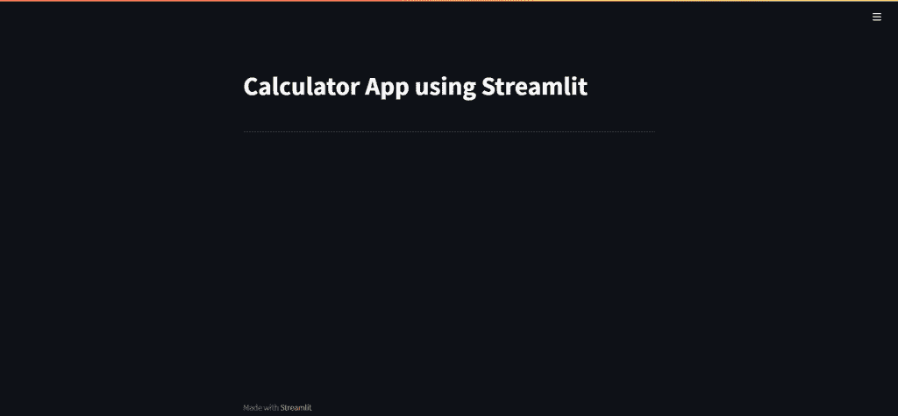
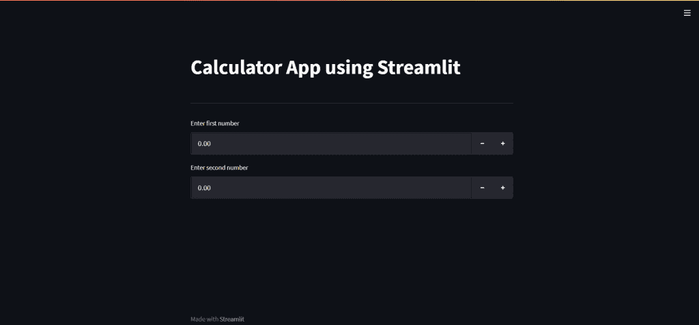
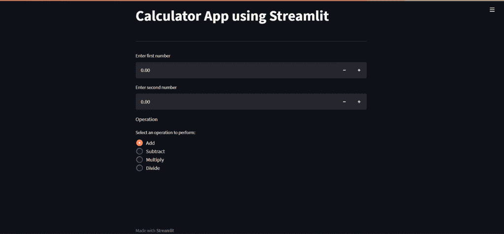
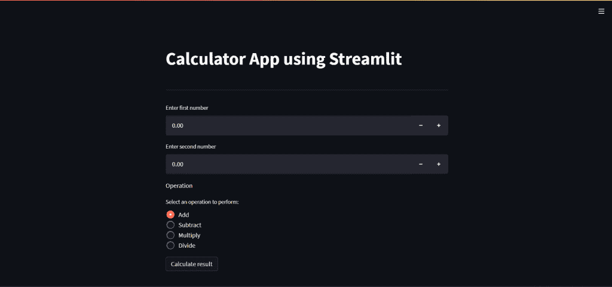
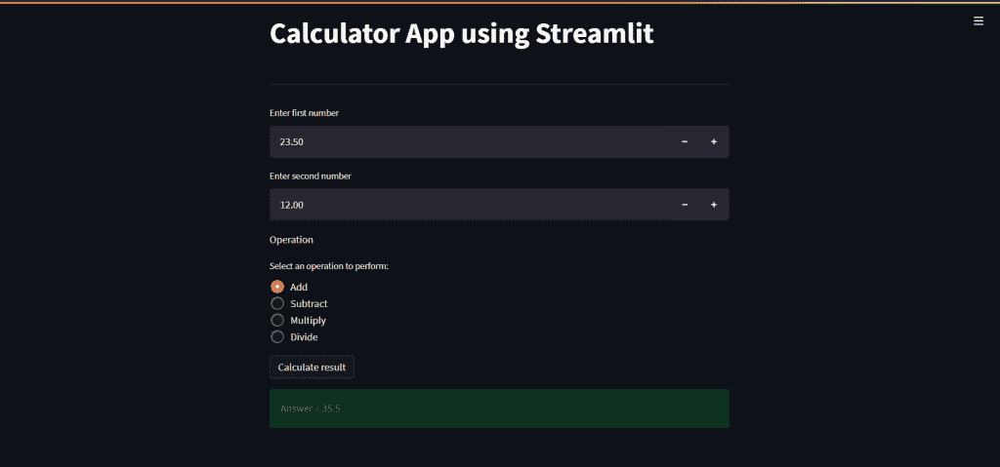
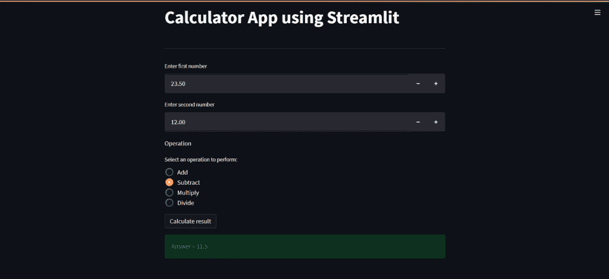
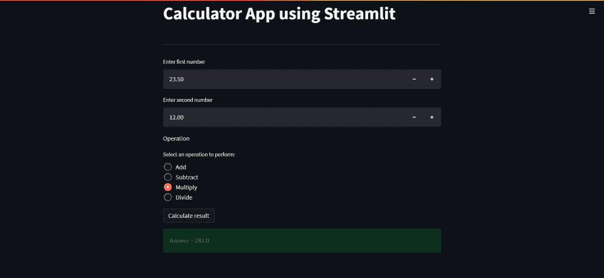
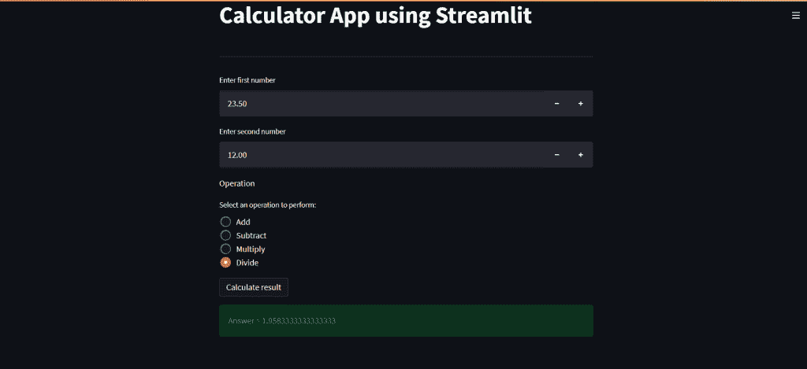
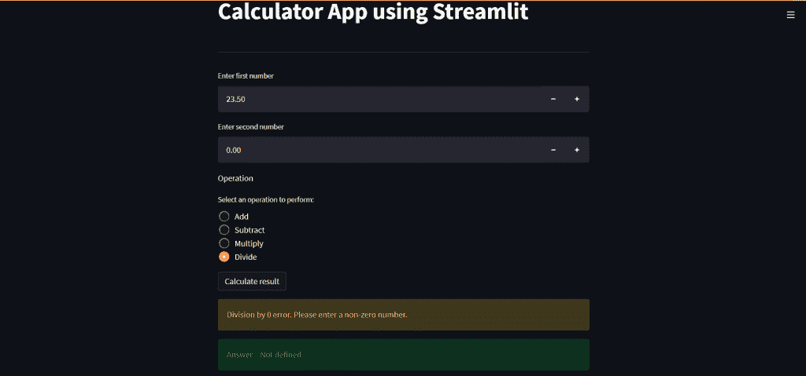

# 使用 Streamlit 的计算器应用程序–简单的分步方法

> 原文：<https://www.askpython.com/python-modules/calculator-app-using-streamlit>

你好，欢迎来到本教程！这是 Streamlit 教程系列的第三篇教程。到目前为止，在前两个教程中，我们已经对 Streamlit 进行了介绍，并学习了如何安装 Streamlit 、创建“Hello World”应用程序、 **Streamlit** 中可用的文本元素和小部件，以及如何通过使用 Streamlit 中的 **[主题来设计我们的应用程序。](https://www.askpython.com/python-modules/streamlit-theming)**

如果您还没有完成以下教程，我们强烈建议您完成:

*   [Streamlit 简介](https://www.askpython.com/python-modules/introduction-to-streamlit)
*   [Streamlit 中的主题化](https://www.askpython.com/python-modules/streamlit-theming)

## 使用细流创建计算器应用程序

现在我们知道了所有这些，我们必须在前进之前实践我们所学的。因此，在本教程中，我们将应用我们现在所学的概念知识来开发一个简单的计算器应用程序。让我们开始吧！

* * *

### 步骤 1:创建基本应用程序

在您喜欢的 IDE 中创建一个文件 Python 文件。你可以给它起任何名字。这里，文件名是`calculator.py`。

```py
import streamlit as st

st.title("Calculator App using Streamlit")

# creates a horizontal line
st.write("---")

```

在这里，我们首先导入了 Streamlit，并为我们的应用程序添加了一个标题。此外，在标题下面，我们添加了一条水平线，以便将标题与下面的部分分开。
记住，我们可以使用以下命令运行应用程序:

```py
streamlit run calculator.py

```

基本应用程序如下所示:



Streamlit Calculator Step 1

### 步骤 2:接受用户输入

由于我们正在构建一个计算器，我们希望我们的用户能够输入数字来执行操作。我们开始吧。

```py
# input 1
num1 = st.number_input(label="Enter first number")

# input 2
num2 = st.number_input(label="Enter second number")

```



Streamlit Calculator Step 2

因为我们想要对数字执行操作，所以我们使用了`numeric_input()`输入小部件。你可以在这里了解更多。因此，我们创建了两个输入字段`num1`和`num2`，我们将使用它们。

### 步骤 3:添加数学运算

现在我们有了输入，让我们添加用户可以对其执行的操作。由于我们希望在输入上一次只执行一个操作，我们将单选按钮来提供选项，因为单选按钮一次只允许一个选择。

```py
st.write("Operation")

operation = st.radio("Select an operation to perform:",
                    ("Add", "Subtract", "Multiply", "Divide"))

```

单选按钮有一个标签和一个选项列表，列出了我们可能允许用户执行的所有操作。此列表并不详尽，可以根据您的要求进行定制。



Streamlit Calculator Step 3

### 步骤 4:向计算器添加功能

我们有投入，也有运营。现在我们需要定义这两者如何一起工作。我们将创建一个名为`calculate`的函数，它根据用户选择的输入和操作来执行操作。

```py
ans = 0

def calculate():
    if operation == "Add":
        ans = num1 + num2
    elif operation == "Subtract":
        ans = num1 - num2
    elif operation == "Multiply":
        ans = num1 * num2
    elif operation=="Divide" and num2!=0:
        ans = num1 / num2
    else:
        st.warning("Division by 0 error. Please enter a non-zero number.")
        ans = "Not defined"

    st.success(f"Answer = {ans}")

```

我们首先创建了一个变量`ans`来存储结果。`calculate`功能只是检查用户从选项列表中选择了哪个操作，并相应地执行操作。

有一点要注意，被零除是没有定义的。所以当选择**除法**操作时，我们需要先检查第二个输入是否为 0。如果是，给出一个警告信息，这表示该操作是不可能的，否则只执行除法。

成功完成操作后，我们使用 Streamlit 中的 success status 元素显示结果。

### 步骤 5:添加计算按钮

要查看上面步骤中编写的逻辑，我们需要一个 calculate 按钮。所以让我们补充一下。

```py
if st.button("Calculate result"):
    calculate()

```

当点击按钮时，答案将被计算并显示在屏幕上。



Streamlit Calculator Step 5

* * *

## 在细流中构建计算器的完整代码

```py
import streamlit as st

st.title("Calculator App using Streamlit")

# creates a horizontal line
st.write("---")

# input 1
num1 = st.number_input(label="Enter first number")

# input 2
num2 = st.number_input(label="Enter second number")

st.write("Operation")

operation = st.radio("Select an operation to perform:",
                    ("Add", "Subtract", "Multiply", "Divide"))

ans = 0

def calculate():
    if operation == "Add":
        ans = num1 + num2
    elif operation == "Subtract":
        ans = num1 - num2
    elif operation == "Multiply":
        ans = num1 * num2
    elif operation=="Divide" and num2!=0:
        ans = num1 / num2
    else:
        st.warning("Division by 0 error. Please enter a non-zero number.")
        ans = "Not defined"

    st.success(f"Answer = {ans}")

if st.button("Calculate result"):
    calculate()

```

* * *

## 玩我们的计算器应用程序

现在让我们输入一些信息，看看结果。

### 添加数字



Streamlit Calculator Add

### 减去数字



Streamlit Calculator Subtract

### 乘法数字



Streamlit Calculator Multiply

### 除法数字



Streamlit Calculator Divide

### 除以零



Streamlit Calculator Divide By Zero

* * *

## 结论

耶！因此，我们已经成功地使用 **Streamlit** 完成了我们的第一个计算器。这是一个基本的计算器。你可以试着按照你的意愿来定制它。请点击这里查看本系列的更多教程和 Python 相关概念[。](http://askpython.com/)