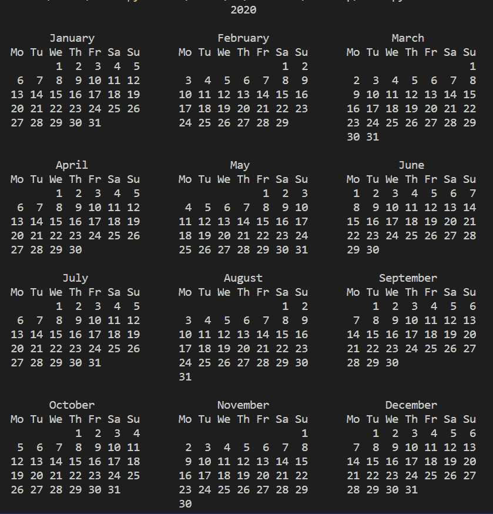

# Python 日历模块–需要了解的 6 个 IMP 函数！

> 原文：<https://www.askpython.com/python-modules/calendar-module-2>

读者朋友们，你们好！在本文中，我们将详细关注 **Python 日历模块**。所以，让我们开始吧！！

* * *

## 一、什么是日历模块？

Python 为我们提供了各种模块来处理数据，进行操作和修改，并以格式化的方式呈现出来。

使用 Python 中的日历模块，我们可以很容易地以类似日历的格式表示与日期相关的数据。此外，它为我们提供了许多功能来处理与日期戳相关的数据，进行操作并从中获得所需的数据。

日历模块帮助我们按照日期、年、月、日和其他属性(如月份中的星期、闰年等)来操作和表示数据。

## Python 中日历模块的功能

我们将介绍 Python 日历模块提供的以下功能:

1.  **calendar.month()函数**
2.  **calendar.calendar()函数**
3.  **monthdatescalendar()函数**
4.  **formatmonth()函数**
5.  **isleap()函数**
6.  **leapdays()函数**

现在，让我们在接下来的部分中逐一了解一下！

* * *

### 1。函数的作用是

使用日历模块，我们可以很容易地以可读的日历格式表示整个月份的日历。 **calendar.month()函数**使我们能够表示所需月份的日历。同样，我们需要将月份和年份值传递给 month()函数。

看看下面的语法！

```py
calendar.month(year, month)

```

**举例:**

在本例中，我们已经过了 2020 年和 8 月，即 8 月。因此，month()函数返回 2020 年 8 月的日历。

```py
import calendar
year = 2020
month = 8  
print(calendar.month(year, month)) 

```

**输出:**

```py
     August 2020
Mo Tu We Th Fr Sa Su
                1  2
 3  4  5  6  7  8  9
10 11 12 13 14 15 16
17 18 19 20 21 22 23
24 25 26 27 28 29 30
31

```

* * *

### 2。calendar.calendar()函数

除了表示月份的日历之外，使用 Python 中的日历模块，我们甚至可以以定制的方式表示全年的日历。

**语法:**

```py
calendar.calendar(year)

```

**举例:**

在本例中，我们使用 calendar.calendar()函数表示了 2020 年的整个日历。

```py
import calendar
year = 2020
print(calendar.calendar(year))

```

**输出:**



**Python Calendar Module**

* * *

### 3。以 HTML 格式表示月份

日历模块也可以用 HTML 格式表示特定月份或年份的数据。因此，一年中想要的月份用 HTML 格式[和与之相关的标签来表示。](https://www.askpython.com/python-modules/htmlparser-in-python)

**语法:**

```py
calendar.HTMLCalendar(firstweekday = 0)

```

**举例:**

带**日历。HTMLCalendar()函数**，我们可以生成 HTML 日历的实例。此外，formatmonth()函数使我们能够生成一年中所需月份的 HTML 日历。设置 withyear = TRUE，允许我们在 HTML 格式的标题中包含年份值。

```py
import calendar 

cal = calendar.HTMLCalendar(firstweekday = 0) 

print(cal.formatmonth(2020, 9, withyear = True)) 

```

**输出:**

```py
<table border="0" cellpadding="0" cellspacing="0" class="month">
<tr><th colspan="7" class="month">September 2020</th></tr>
<tr><th class="mon">Mon</th><th class="tue">Tue</th><th class="wed">Wed</th><th class="thu">Thu</th><th class="fri">Fri</th><th class="sat">Sat</th><th class="sun">Sun</th></tr>
<tr><td class="noday"> </td><td class="tue">1</td><td class="wed">2</td><td class="thu">3</td><td class="fri">4</td><td class="sat">5</td><td class="sun">6</td></tr>
<tr><td class="mon">7</td><td class="tue">8</td><td class="wed">9</td><td class="thu">10</td><td class="fri">11</td><td class="sat">12</td><td class="sun">13</td></tr>
<tr><td class="mon">14</td><td class="tue">15</td><td class="wed">16</td><td class="thu">17</td><td class="fri">18</td><td class="sat">19</td><td class="sun">20</td></tr>
<tr><td class="mon">21</td><td class="tue">22</td><td class="wed">23</td><td class="thu">24</td><td class="fri">25</td><td class="sat">26</td><td class="sun">27</td></tr>
<tr><td class="mon">28</td><td class="tue">29</td><td class="wed">30</td><td class="noday"> </td><td class="noday"> </td><td class="noday"> </td><td class="noday"> </td></tr>
</table>

```

* * *

### 4。calendar.isleap()函数

使用 **calendar.isleap()函数**，我们可以检查某一年是否是闰年。

**语法:**

```py
calendar.isleap(year)

```

**举例:**

在下面的例子中，我们检查了 2020 年和 2002 年是否是闰年。由于 isleap()是一个[布尔函数](https://www.askpython.com/python/built-in-methods/python-bool-method)，如果年份是闰年，则返回 TRUE，否则返回 FALSE。

```py
import calendar 

print(calendar.isleap(2020)) 
print(calendar.isleap(2002)) 

```

**输出:**

```py
True
False

```

* * *

### 5。calendar.leapdays()函数

使用 **leapdays()函数，**我们可以很容易地计算并表示传递给该函数的年份之间的闰日数。

**语法:**

```py
calendar.leapdays(year1, year2)

```

**举例:**

在这里，我们试图计算 2016 年和 2020 年以及 2002 年和 2003 年之间的闰日数。它计算这些年之间的闰日数，并返回整数值。

```py
import calendar 

print(calendar.leapdays(2016, 2020)) 
print(calendar.leapdays(2002, 2003)) 

```

**输出:**

```py
1
0

```

* * *

## 结论

如果你遇到任何问题，欢迎在下面评论。更多与 Python 编程相关的帖子，请继续关注我们。在那之前，学习愉快！！🙂