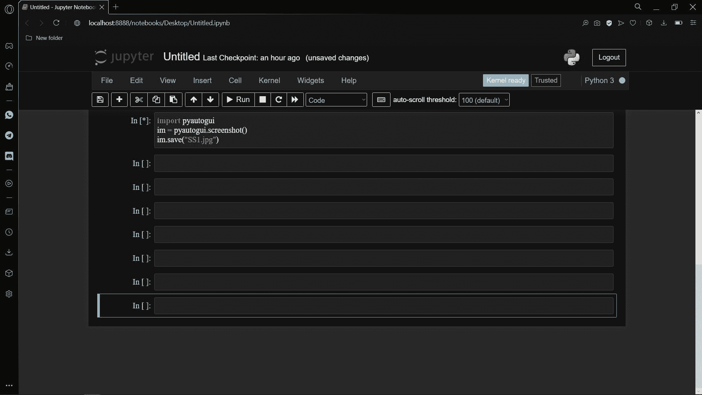
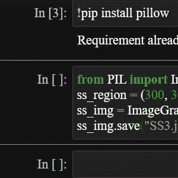

# 使用 Python 捕捉屏幕截图的两种方法

> 原文：<https://www.askpython.com/python/examples/capture-screenshots>

在本教程中，我们将学习如何使用 Python 编程语言截屏。有多种方法可以实现这一点，我们将在接下来的章节中讨论其中的一些方法。

## 如何使用 Python 捕捉屏幕截图

Python 提供了各种库来捕捉截图。我们今天将探索其中的一些库，并了解如何用 Python 实现代码来捕捉屏幕。

## 方法 1:使用 pyautogui 模块

`pyautogui`模块使用`screenshot`函数，该函数负责截取整个计算机屏幕的截图。然后使用`save`功能将截图保存到我们的设备上。

```py
import pyautogui
im = pyautogui.screenshot()
im.save("SS1.jpg")

```

保存的图像如下所示。



Screenshot Python 1

如果想在截屏前有所延迟，程序员可以使用`time`模块和`sleep`函数。

## 方法 2:使用枕头模块

[枕形模块](https://www.askpython.com/python-modules/pillow-module)利用了`ImageGrab`子模块。这种方法需要一个需要被捕获的区域，这意味着设置该区域的对角线坐标。

然后我们使用`grab`函数，该函数将获取区域参数来捕捉屏幕截图。最后，使用`save`功能保存捕获的图像。

```py
from PIL import ImageGrab
ss_region = (300, 300, 600, 600)
ss_img = ImageGrab.grab(ss_region)
ss_img.save("SS3.jpg")

```

捕获的区域如下所示。我们也可以利用`time`模块来延迟截图的捕捉。



Screenshot Python 2

## 结论

所以现在你知道了两种捕捉电脑屏幕截图的方法。是的，还有其他方法，python 是一种非常高级的语言。希望你喜欢阅读它！

感谢您的阅读！