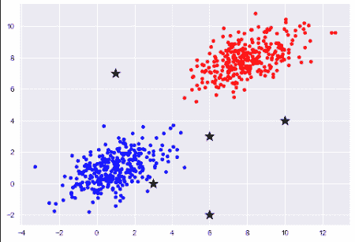
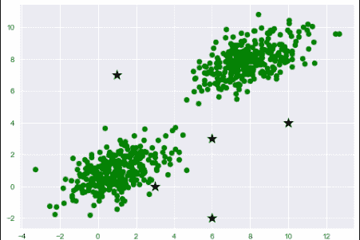

# Python catboost 模块:catboost 分类器简介

> 原文：<https://www.askpython.com/python-modules/catboost-module>

你好，初学者！在本教程中，我们将学习 catboost 模块和一个更复杂的概念`CatboostClassifier`。所以让我们开始吧！

## 什么是 catboost 模块？

CatBoost 模块是一个快速、可扩展的开源库，是决策树和其他机器学习任务上的一个非常高性能的[梯度提升](https://www.askpython.com/python/examples/gradient-boosting-model-in-python)系统。它还提供 GPU 支持来加速训练

Catboost 可以用于一系列的回归和分类问题，kaggle 上也有。

## 实现 Catboost 分类器

### 1.导入模块

对于 catboost 模块的简单实现，我们将导入三个模块。用于数据可视化的`catboost`模块和 [matplotlib](https://www.askpython.com/python-modules/matplotlib/python-matplotlib) 与`numpy`模块一起生成数据集。

如果任何模块导入出错，确保使用`pip`命令安装模块。导入正确模块和正确函数的代码如下所示。

```py
from catboost import CatBoostClassifier
import matplotlib.pyplot as plt
import numpy as np

```

### 2.培训和测试数据准备

下一步是创建用于训练 catboost 模块的[测试数据，然后创建测试数据来检查随机点。](https://www.askpython.com/python/examples/split-data-training-and-testing-set)

#### 培训用数据

为了创建样本训练数据，我们需要两个矩阵，一个用于均值，另一个用于协方差，其中均值描述点的中心，协方差描述点的扩散。

随后，我们创建了一个多元正态分布，它通过了[平均值](https://www.askpython.com/python/examples/mean-and-standard-deviation-python)和[协方差矩阵](https://www.askpython.com/python/examples/principal-component-analysis)以及点数。

为两个不同的类创建数据的代码如下所示。

```py
mean1=[8,8]
covar1=[[2,0.7],[0.7,1]]
d2=np.random.multivariate_normal(mean1,covar1,200)

mean2=[1,1]
covar2=[[2,0.7],[0.7,1]]
d2=np.random.multivariate_normal(mean2,covar2,200)

```

#### 测试数据

为了获得训练点，我们将导入[随机模块](https://www.askpython.com/python-modules/python-random-module-generate-random-numbers-sequences)并生成 10 个随机 x 和 y 坐标，稍后传递给训练好的模型。下一步是使用循环的[将 x 和 y 坐标放在一个列表中。](https://www.askpython.com/python/python-for-loop)

相同的代码如下所示。

```py
import random
x_cord_test = [random.randint(-2,10) for i in range(5)]
y_cord_test = [random.randint(-2,10) for i in range(5)]
test_data = []
for i in range(len(x_cord_test)):
    test_data.append([x_cord_test[i],y_cord_test[i]])

```

#### 数据可视化–1

我们将使用 matplotlib 库可视化数据，并绘制训练数据以及测试点。

相同的代码如下所示。

```py
plt.style.use('seaborn')
plt.scatter(d1[:,0],d1[:,1],color="Red",s=20)
plt.scatter(d2[:,0],d2[:,1],color="Blue",s=20)
for i in test_data:
    plt.scatter(i[0],i[1],marker="*",s=200,color="black")
plt.show()

```

结果图如下所示。



Binary Data Plot Catboost

#### 模型准备的最终训练数据

最后一步是通过将两个类的数据合并到一个数据框中来创建最终的训练数据。

结果数据中的行数将等于两个类中数据点数量的总和。列的数量将等于 3，其中列存储点的 x 和 y 坐标以及标签。

我们创建了一个所有值都为 0 的虚拟数据帧。然后，我们将两个类的数据和标签放入数据帧中的正确位置。最后一步涉及数据的混洗。

```py
df_rows=d1.shape[0]+d2.shape[0]
df_columns=d1.shape[1]+1

df=np.zeros((df_rows,df_columns))

df[0:d1.shape[0],0:2]=d1
df[d1.shape[0]:,0:2]=d2
df[0:d1.shape[0],2]=0
df[d1.shape[0]:,2]=1

np.random.shuffle(df)

```

#### 数据可视化–2

现在让我们使用下面的代码来可视化我们的最终数据。

```py
plt.scatter(df[:,0],df[:,1],color="Green")
for i in test_data:
    plt.scatter(i[0],i[1],marker="*",s=200,color="black")
plt.show()

```

最终的图表如下所示。现在数据准备好进入`CatBoostClassifier`。



Train Test Data Plot Catboost

### 3.使用 catboost 模块–catboost 分类器

为了实现 CatBoostClassifier，我们为其创建了模型对象，该对象将迭代次数作为参数。我们还将为模型使用`GPU`，因此我们将`tak_type`作为参数传递。

下一步是使用`fit`函数拟合训练数据点和标签来训练模型。我们还会将每个测试点传入`predict`函数并得到结果。

```py
model = CatBoostClassifier(iterations=100,task_type="GPU")
model.fit(df[:,0:2],df[:,2],verbose=False)

```

结果如下。你可以从图表中反复核对，结果相当准确。

```py
(6,3) ==> 0.0
(10,4) ==> 0.0
(6,-2) ==> 0.0
(1,7) ==> 1.0
(3,0) ==> 1.0

```

## 结论

恭喜你！今天，您已经成功地了解了一种称为 CatBoost 的快速而神奇的分类器。您可以在自己的各种数据集上尝试同样的方法！编码快乐！

感谢您的阅读！