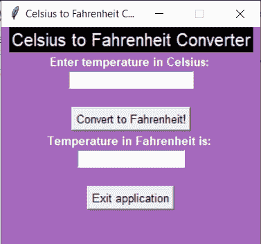

# Python Tkinter:摄氏到华氏转换器

> 原文：<https://www.askpython.com/python-modules/tkinter/celsius-to-fahrenheit-converter>

程序员朋友你好！今天我们将构建自己的应用程序，使用 [Python tkinter](https://www.askpython.com/python-modules/tkinter/tkinter-buttons) 将摄氏温度转换为华氏温度。

## 使用 Tkinter 构建摄氏到华氏的转换器

这个主题是不言自明的，因此我们直接进入实现部分。

### 步骤 1:创建窗口

在我们开始项目的主要部分之前，我们必须创建一个空白的自定义窗口。相同的代码如下所示:

```py
import tkinter as tk
window = tk.Tk()
window.geometry("300x250")
window.config(bg="#A569BD")
window.resizable(width=False,height=False)
window.title('Celsius to Fahrenheit Converter!')

```

我们确保在此步骤中完成以下工作:

1.  导入`tkinter`模块
2.  创建窗口对象并设置窗口的尺寸和背景颜色
3.  将 resizable 属性设置为 false，以确保提到的维度保持固定。
4.  设置应用程序的标题

上面提到的代码的结果如下:


Blank Screen Tkinter

### 步骤 2:向屏幕添加基本元素

应用程序使用的基本元素如下所列:

1.  两个标签:关于应用程序的信息
2.  输入框:输入温度值
3.  按钮 1:将温度转换为华氏温度
4.  文本框:显示转换温度的结果
5.  按钮 2:退出应用程序

添加所有元素的代码如下所示:

```py
l1 = tk.Label(window,text="Celsius to Fahrenheit Converter",font=("Arial", 15),fg="white",bg="black")
l2= tk.Label(window,text="Enter temperature in Celsius: ",font=("Arial", 10,"bold"),fg="white",bg="#A569BD")
l3= tk.Label(window,text="Temperature in Fahrenheit is: ",font=("Arial", 10,"bold"),fg="white",bg="#A569BD")

empty_l1 = tk.Label(window,bg="#A569BD")
empty_l2 = tk.Label(window,bg="#A569BD")

e1= tk.Entry(window,font=('Arial',10))

btn1 = tk.Button(window,text="Convert to Fahrenheit!",font=("Arial", 10))
btn2 = tk.Button(window,text="Exit application",font=("Arial", 10))

t1=tk.Text(window,state="disabled",width=15,height=0)

```

除了所有提到的元素，我们确保我们有一些空标签来在两个元素之间添加新的行。

为了在屏幕上添加元素，我们使用了`pack`函数，并将所有元素按特定顺序打包。包装代码如下所示:

```py
l1.pack()
l2.pack()
e1.pack()
empty_l1.pack()
btn1.pack()
l3.pack()
t1.pack()
empty_l2.pack()
btn2.pack()

```

输出如下所示:



Initial Image

### 步骤 3:向按钮添加功能

#### 按钮 1:退出应用程序按钮

让我们先创建一个更简单的按钮**来退出应用程序**。我们需要做的就是创建一个破坏窗口的函数。相同的代码如下所示:

```py
def exit():
    window.destroy()

```

为了执行按钮 click 上的功能，我们向退出应用程序按钮添加了`command`属性。并添加命令作为退出函数。

#### 按钮 2:转换温度按钮

第二个按钮将温度转换为**‘华氏’**，同样包括以下步骤:

1.  从输入框中获取摄氏温度
2.  使用公式将获得的温度转换为华氏温度
3.  清除文本框
4.  将计算出的温度值插入文本框

相同的代码如下所示:

```py
def convert():
    c = int(e1.get())
    f = ((c*9)/(5))+32
    t1.config(state='normal')
    t1.delete('1.0', tk.END)
    t1.insert(tk.END,f)
    t1.config(state='disabled')

```

要使该功能可在按钮上执行，单击将命令属性添加到 convert 按钮。

## 摄氏温度至法亨海特温度转换器的完整代码

```py
def exit():
    window.destroy()

def convert():
    c = int(e1.get())
    f = ((c*9)/(5))+32
    t1.config(state='normal')
    t1.delete('1.0', tk.END)
    t1.insert(tk.END,f)
    t1.config(state='disabled')

import tkinter as tk
window = tk.Tk()
window.geometry("300x250")
window.config(bg="#A569BD")
window.resizable(width=False,height=False)
window.title('Celsius to Fahrenheit Converter!')

l1 = tk.Label(window,text="Celsius to Fahrenheit Converter",font=("Arial", 15),fg="white",bg="black")
l2= tk.Label(window,text="Enter temperature in Celsius: ",font=("Arial", 10,"bold"),fg="white",bg="#A569BD")
l3= tk.Label(window,text="Temperature in Fahrenheit is: ",font=("Arial", 10,"bold"),fg="white",bg="#A569BD")

empty_l1 = tk.Label(window,bg="#A569BD")
empty_l2 = tk.Label(window,bg="#A569BD")

e1= tk.Entry(window,font=('Arial',10))

btn1 = tk.Button(window,text="Convert to Fahrenheit!",font=("Arial", 10),command=convert)
btn2 = tk.Button(window,text="Exit application",font=("Arial", 10),command=exit)

t1=tk.Text(window,state="disabled",width=15,height=0)

l1.pack()
l2.pack()
e1.pack()
empty_l1.pack()
btn1.pack()
l3.pack()
t1.pack()
empty_l2.pack()
btn2.pack()

window.mainloop()

```

## 样本输出

上面的应用程序测试了两个测试样本，结果是完美的！两种输入的输出屏幕如下所示:


Output1 C2F


Output2 C2F

## 结论

恭喜你！您已经成功构建了一个将摄氏温度转换为华氏温度的应用程序。

希望你喜欢这个项目！继续编码！