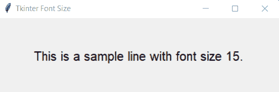
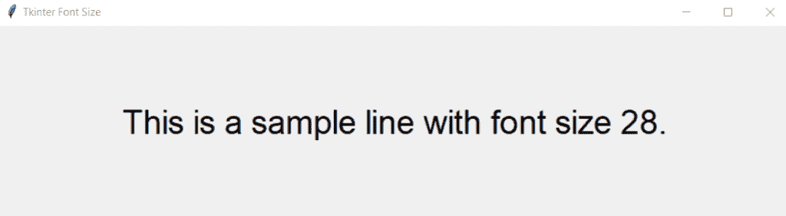
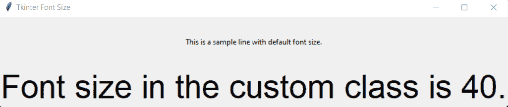

# 如何在 Tkinter 中设置字体大小？

> 原文：<https://www.askpython.com/python-modules/tkinter/change-font-size-tkinter>

在这篇文章中，我们将学习如何在 Tkinter 中改变文本的字体大小。字体大小是指屏幕上显示的字符有多大。为了在任何需要的地方吸引读者的注意力，使用合适的字体大小是至关重要的。让我们来看看使用 Tkinter 改变文本字体大小的不同方法。

* * *

### 方法 1:使用字体作为元组来更改 Tkinter 字体大小

```py
import tkinter as tk
from tkinter import *

#main window
root = Tk()
#title of the window
root.title("Tkinter Font Size")

#adding a label
l = Label(root, text="This is a sample line with font size 15.", width=40,
            height=5, font=('Times New Roman', 15, 'bold'))
l.pack()

root.mainloop()

```

**输出:**



Font Size Tuple Output

在上面的代码中，我们创建了一个非常基本的 GUI，并为它添加了一个标签。标签部件有一个内置的字体属性(“字体系列”，大小，“字体样式”)。在上面的代码中，字体作为一个参数。如果没有明确提到，参数将有它们的默认值。在上面的代码中，我们只使用了 size 属性，并将大小设置为 15。

* * *

### 方法 2:使用字体作为对象来更改 tkinter 字体大小

***推荐阅读: [Tkinter 字体类教程](https://www.askpython.com/python-modules/tkinter/tkinter-font-class)***

```py
import tkinter as tk
from tkinter import *
import tkinter.font as tkFont

#main window
root = tk.Tk()
#title of the window
root.title("Tkinter Font Size")

#creating a font object
fontObj = tkFont.Font(size=28)

#adding a label
l = Label(root, text="This is a sample line with font size 28.",
            width=40, height=5, font=fontObj)
l.pack()

root.mainloop()

```

**输出:**



Font Size Object Output

这里，我们创建了一个名为 **fontObj** 的字体类对象，并将字体大小设置为 **28** 。后来，在标签中，我们将字体的参数值指定为等于 font 对象(fontObj ),因此，在输出中，字体大小为 28。除了大小，我们还可以根据需要提到字体家族和风格。

* * *

### 方法 3:使用自定义类更改字体

```py
import tkinter as tk
from tkinter import *
from tkinter.font import Font

#creating a custom class
class cl:
    def __init__(self, master) -> None:
        self.master = master
        #setting the font size to be 40
        self.customFont = Font(size=40)
        Label(self.master, text="Font size in the custom class is 40.",
                font=self.customFont).pack()
#end of custom class

if __name__ == "__main__":
    #main window
    root = tk.Tk()
    #title of the window
    root.title("Tkinter Font Size")
    #adding a label
    l = Label(root, text="This is a sample line with default font size.",
                width=40, height=5)
    l.pack()
    #calling our class object
    customSize = cl(root)

    root.mainloop()

```

**输出:**



Font Size Custom Class Output

在上面的例子中，我们定义了一个自定义类( **cl** )，在这个类中我们有一个构造函数，我们将字体大小指定为 40。还创建了一个标签，其字体参数等于**自定义字体**。

在 main 函数中，我们首先创建了一个没有明确提及文本大小的标签。因此，它具有默认大小。之后，我们通过创建对象 **customSize** 来调用 **cl** 类。创建新的实例或对象时，字体大小为 40 的标签也会与默认大小标签一起显示在输出中。

每次创建该类的新实例时，将显示字体大小为 40 的标签，因为它是该类构造函数的一部分。我们还可以在类内部设置字体系列和样式。

* * *

## 摘要

这样，我们已经了解了如何通过多种方式在 Tkinter 中更改字体大小。这是一个容易理解和实现的主题。请点击查看我们的其他 Tkinter 教程[。](https://www.askpython.com/python-modules/tkinter)