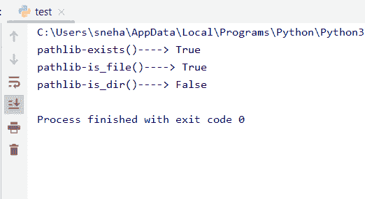
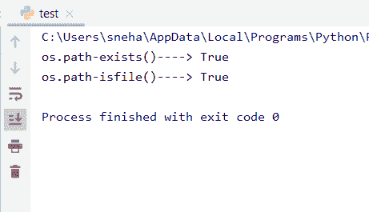
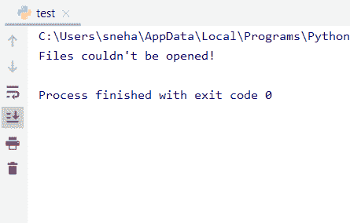
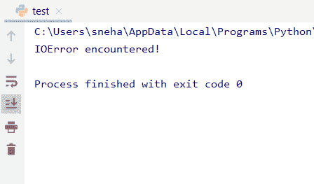

# 检查 Python 中是否存在文件

> 原文：<https://www.askpython.com/python-modules/check-if-file-exists-in-python>

## 介绍

如何在 Python 中检查文件是否存在？我们已经在之前的**文件处理**教程中学习了对文件执行各种操作，包括[读](https://www.askpython.com/python/built-in-methods/python-read-file)、[写](https://www.askpython.com/python/built-in-methods/python-write-file)、[删除](https://www.askpython.com/python/delete-files-in-python)以及[用 Python 复制](https://www.askpython.com/python/copy-a-file-in-python)一个文件。但是，在我们对文件执行任何这些操作之前，检查文件是否已经存在是必要的。

如果一个文件不存在，那么我们既不能读取它，也不能复制或删除它。即使在写的时候，用户也可能想要检查文件的存在以避免覆盖信息。

让我们进入主题，看看检查文件是否存在的一些方法。

## 方法来检查文件是否存在于 Python 中

我们可以使用下面提到的不同方法来检查一个文件是否存在于 Python 中。

### 1.使用 pathlib 模块

Python 中的`pathlib`模块附带了一些有趣的方法，如`is_file()`、`is_dir()`、`exists()`等。让我们逐一看一些例子:

```py
import pathlib
path = pathlib.Path('file.txt')
print("pathlib-exists()---->",path.exists())
print("pathlib-is_file()---->",path.is_file())
print("pathlib-is_dir()---->",path.is_dir())

```

**输出:**



pathlib Output

*   `**pathlib.Path()**`返回指向指定文件名的 path 对象，保存在变量 **'** path **'** 中，
*   方法检查所提供的路径是否指向一个有效的文件。在我们的例子中，由于 file.txt 的路径存在，结果为真。
*   另一方面，`**is_file()**`方法检查路径对象是否是文件。这在我们的例子中是正确的，正如我们在输出中看到的。
*   方法检查提供的路径是否是任何目录。这里，因为我们的 file.txt 路径不是一个目录，所以我们得到上面的输出。

### 2.使用操作系统模块

广泛使用的检查文件存在的方法之一是来自标准 python 库的 **os.path 模块**。它带有一些基本方法，如`isfile()`和`exists()`，类似于 **pathlib** 模块的方法。让我们仔细看看一个例子:

```py
import os.path
print("os.path-exists()---->",os.path.exists('file.txt'))
print("os.path-isfile()---->",os.path.isfile('file.txt'))

```

**输出:**



os.path Output

*   与 **pathlib** 模块`exists()`和`is_file()`方法类似，`os.exists()`和`os.isfile()`也分别做类似的检查。
*   唯一的区别是 pathlib 模块引入了一些很棒的面向对象的方法，并将路径视为路径对象而不是字符串(对于 os 模块)。

### 3.使用异常处理

现在让我们看看几种不同的方法，使用异常来检查 Python 中的文件是否存在。

这一次我们将使用内置的`open()`函数打开一个文件，并检查是否有**异常**，如果出现，将确认该文件不存在或不可访问。例如:

```py
My_file=open('file.txt')
try:
    My_file.close()
    print("File found!")
except FileNotFoundError:
    print("Files couldn't be opened!")

```

**输出:**

```py
File found!

```

*   在上面给出的代码中，由于 **file.txt** 存在于我们的系统中，`FileNotFoundError`没有被引发，文件被成功关闭。

同样，当 **no-file.txt** 在我们的机器上不存在时:

```py
try:
    My_file=open('no-file.txt')
    My_file.close()
    print("File found!")
except FileNotFoundError:
    print("Files couldn't be opened!")

```

**输出:**



FileNotFoundError Exception

*   所以我们可以清楚地看到，当文件没有找到时，异常`FileNotFoundError`被抛出。

此外，同样的任务可以通过`IOError`来完成，它检查程序是否可以读取和访问正在打开的文件。例如，考虑下面的代码片段:

```py
try:
    My_file = open('no-file.txt')
    My_file.close()
    print('File is found!')
except IOError:
    print('IOError encountered!')

```

**输出:**



IOError

## 参考

*   [https://stack overflow . com/questions/82831/how-do-I-check-if-a-file-exists-without-exceptions](https://stackoverflow.com/questions/82831/how-do-i-check-whether-a-file-exists-without-exceptions)
*   [https://docs.python.org/3/library/pathlib.html](https://docs.python.org/3/library/pathlib.html)
*   [https://docs.python.org/3/library/os.html](https://docs.python.org/3/library/os.html)