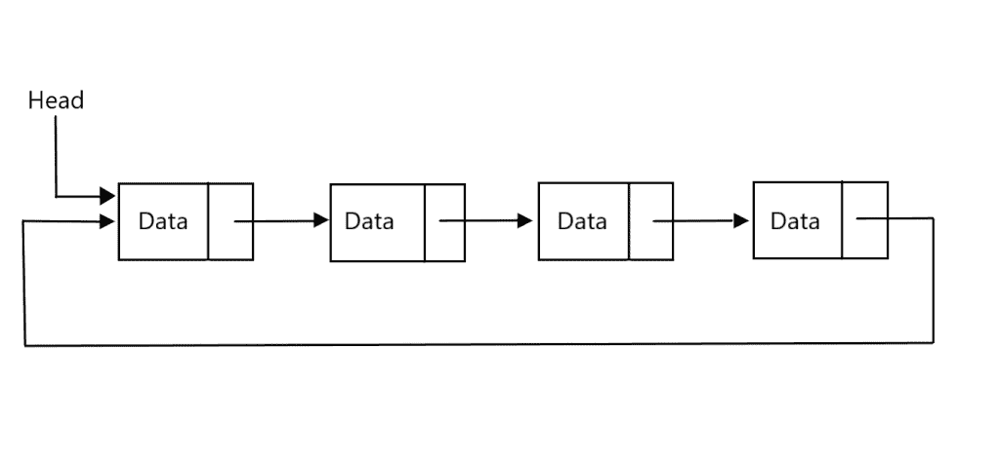
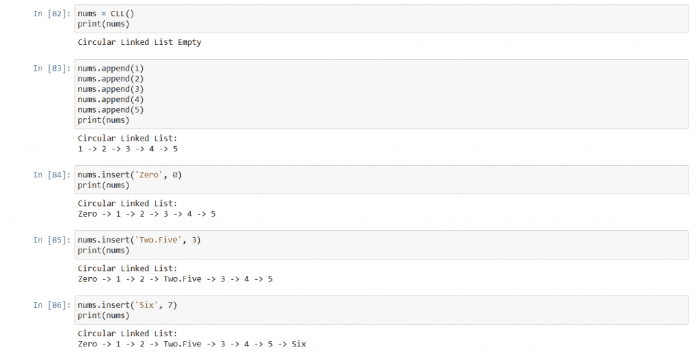
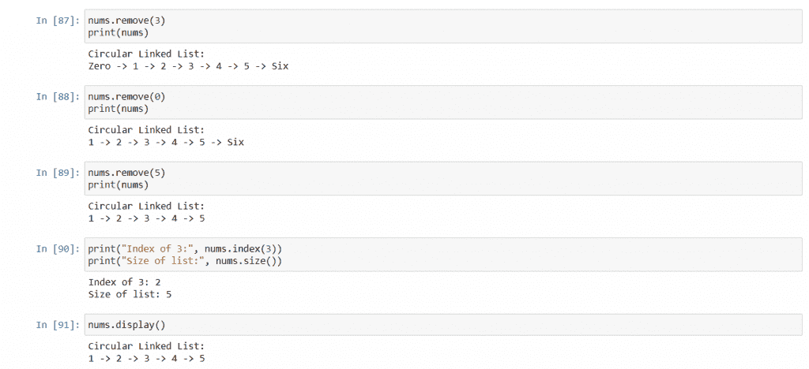

# Python 中的循环链表

> 原文：<https://www.askpython.com/python/examples/circular-linked-lists>

循环链表是用来存储列表的数据结构。它非常类似于[链表](https://www.askpython.com/python/examples/linked-lists-in-python)，但是有一些额外的特性。在本教程中，我们将讨论什么是循环链表，我们将在 python 中实现它，并查看它的输出。

## 先决条件:理解链表

在讨论循环链表之前，我们必须首先定义链表。

链表是一种列表，其中的列表项以特定的方式链接到其他列表项。不同形式的链表有不同的链接对象的方式。

“单向链表”或简称为“链表”是最流行的链表，其中每个项目链接到列表中的下一个项目。因此，为了讨论第十个项目，我们必须首先讨论第九个项目，它与第十个项目相联系。一旦我们访问了第十项，我们就可以通过第十项的连接访问第十一项。

节点是链表中每个对象的名称。单链表中的每个节点都有两个部分。第一部分包含节点的数据，而第二部分包含到下一个节点的链接。

现在让我们来看看循环链表。

## Python 中的循环链表

循环链表与链表的相似之处在于节点通过链接连接，但是最后一个节点也链接到第一个节点，而不仅仅是链接到空。因此，在我们访问了最后一个节点之后，我们可以通过最后一个节点访问第一个节点。

这样做的方法只是不把最后一个节点的链接保持为`None`，而是让它指向第一个节点。

这样做的好处是，可以更容易地实现具有循环出现的项目列表的算法。例如，循环调度算法，或者多人游戏中的玩家循环本质上是循环的。

为了形象化，循环链表看起来像这样:



Circular Linked List Representation

在上面的例子中，您可以看到列表中有四个节点。每个节点都有一些数据，并且除了链接到列表第一个节点的最后一个节点之外，每个节点都链接到列表的下一个节点。

有一个头指向列表的开始，用来进入列表并遍历循环链表。

***推荐阅读——***

## 在 Python 中实现循环链表

为了创建循环链表，我们创建两个类:第一个类用于节点，第二个类用于将使用节点的链表。

### 类:节点

对于节点类，我们有两个成员。一个用于存储数据，另一个用于存储到下一个节点的链接。类别定义将是:

```py
class Node:
    def __init__(self, data = None):
        self.data = data
        self.next = self

```

因此，最初，每个新创建的节点要么有数据值，要么没有数据值，这取决于它是如何创建的，但默认情况下，它会指向自身，因此它就像一个单项循环链表。

### 类:循环链表

这个类将使用前一个类创建的节点来实现一个循环链表。它将包含一个头节点、一个计数成员和用于特定任务的多个方法。

```py
class CLL:
    def __init__(self):
        self.head = None
        self.count = 0

    def __repr__(self):
        string = ""

        if(self.head == None):
            string += "Circular Linked List Empty"
            return string

        string += f"Circular Linked List:\n{self.head.data}"       
        temp = self.head.next
        while(temp != self.head):
            string += f" -> {temp.data}"
            temp = temp.next
        return string

    def append(self, data):
        self.insert(data, self.count)
        return

    def insert(self, data, index):
        if (index > self.count) | (index < 0):
            raise ValueError(f"Index out of range: {index}, size: {self.count}")

        if self.head == None:
            self.head = Node(data)
            self.count += 1
            return

        temp = self.head
        for _ in range(self.count - 1 if index - 1 == -1 else index - 1):
            temp = temp.next

        aftertemp = temp.next #New node goes between temp and aftertemp
        temp.next = Node(data)
        temp.next.next = aftertemp
        if(index == 0):
            self.head = temp.next
        self.count += 1
        return

    def remove(self, index):
        if (index >= self.count) | (index < 0):
            raise ValueError(f"Index out of range: {index}, size: {self.count}")

        if self.count == 1:
            self.head = None
            self.count = 0
            return

        before = self.head
        for _ in range(self.count - 1 if index - 1 == -1 else index - 1):
            before = before.next
        after = before.next.next

        before.next = after
        if(index == 0):
            self.head = after
        self.count -= 1
        return

    def index(self, data):
        temp = self.head
        for i in range(self.count):
            if(temp.data == data):
                return i
            temp = temp.next
        return None

    def size(self):
        return self.count

    def display(self):
        print(self)

```

我们来讨论一下上面写的方法。

**`__init__`法**

在构造函数中，我们初始化两个成员，我们将`head`设置为`None`,因为列表中没有节点，出于同样的原因，我们将`count`设置为`0`。

**`__repr__`法**

打印链表的字符串将由`__repr__`进程返回。所以要么列表是空的，在这种情况下我们打印它，要么列表不是空的，在这种情况下我们逐个打印每个节点的数据。

**`append``insert`法**

在这个实现中，可以在指定位置附加或插入节点。要追加，我们只需调用`insert`方法，并将列表的大小作为`index`发送。

在`insert`方法中，我们首先检查指定的索引是否有效，如果无效，我们抛出一个`ValueError`。通过检查后，如果列表为空，我们只需将新节点分配给`head`，递增`count`，并从方法返回。

如果列表不为空，我们首先到达指定索引之前的节点。例如，如果给定的索引是 5，那么我们到达第 4 个索引处的节点，因为列表是循环的，如果给定的索引是 0，那么我们到达列表的最后一个节点。

现在，我们将新节点分配给指定索引之前的节点的`next`，并使新节点的`next`链接到指定索引处的节点。这将确保新节点被插入到位于指定索引处的节点之前，从而获取其索引并将其向前推。

现在，如果给定的索引是 0，我们已经在列表的最后一个节点后插入了一个节点，所以我们简单地让`head`指向新的节点，使它成为列表的新头部。

**`remove`法**

要移除一个项目，我们必须指定要从哪里移除该项目。如果指定的索引超出范围，我们就抛出一个`ValueError`。如果列表上只有一项，我们只需创建`head` `None`和`count` `0`，并从方法返回。

否则，我们必须到达指定索引之前的节点和指定索引之后的节点。例如，如果指定的索引是 4，那么我们需要到达第 3 个节点和第 5 个节点，并且因为如果指定的索引是 0，列表是循环的，所以我们需要到达最后一个节点(在它之前)和第 1 个节点(在它之后)。

在此之后，我们只需将指定索引之后的节点赋给指定索引之前的节点的`next`。这将跳过指定索引处的节点，从而将其从列表中删除。如果指定的索引为 0，那么`head`已经从列表中删除，所以我们只需将指定索引之后的节点分配给`head`，列表将被恢复。别忘了递减列表的`count`。

**指标、尺寸和显示方法**

方法在列表中搜索一个条目。如果找到，它返回它的索引，否则，它返回`None`。`size`方法返回列表中的节点数，`display`方法打印列表。

## 输出



Example illustrating initialization, appending, and insertion.



Example illustrating removal, searching, the size method, and printing.

## 结论

我们学习了循环链表以及如何在 Python 中使用它们。我们从单链表的工作方式开始，然后转向循环链表的不同之处。我们用 Python 编写了数据结构代码，讨论了每个方法的工作原理，然后查看了代码的结果。

我希望你在学习中过得愉快，下次教程再见。