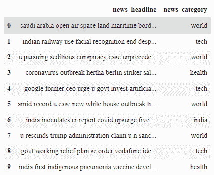
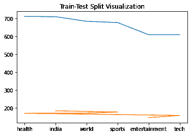

# 用 Python 分类新闻标题——机器学习

> 原文：<https://www.askpython.com/python/examples/classify-news-headlines-in-python>

我们生活在一个数据驱动的社会，随着我们收集越来越多的数据，对事物进行分类变得越来越重要。因此，在本帖中，我们将根据新闻的类型对新闻标题进行分类。比如体育新闻，科技新闻，等等。

在本教程中，我们将处理包含新闻标题及其类别的数据。我们的目标是利用 Python 编程语言中的机器学习概念对新闻标题进行分类。

* * *

## **介绍数据集**

我们将使用包含新闻标题及其类别的数据集。在本教程中，我们不会深入细节，如如何抓取网页。您可以从 [**这里**](https://github.com/kumar-mahendra/ML-Projects/blob/main/newsfile.csv) 下载数据集，然后放入您的工作目录。

* * *

## **用 Python 分类新闻标题的步骤**

让我们进入用 Python 对新闻标题进行分类的步骤。按照本教程来理解整个过程。

### **1。导入模块/库**

我们将从导入我们将使用的不同模块开始。复制粘贴下面的代码片段并继续。

```py
import tensorflow as tf 
from tensorflow.keras import layers
from tensorflow.keras.models import Sequential
from tensorflow.keras.preprocessing.text import Tokenizer
from tensorflow.keras.preprocessing.sequence import pad_sequences
from sklearn.model_selection import train_test_split
import numpy as np
import pandas as pd

```

* * *

### **2。加载数据集**

```py
df = pd.read_csv('news_headlines.csv')
df.head(n=10)

```



First 10 Rows News Headlines

* * *

### **3。列车测试分割**

现在，我们将使用 80:20 规则进行[训练-测试分割](https://www.askpython.com/python/examples/split-data-training-and-testing-set)，其中 80%的数据用于训练，其余 20%用于测试。

```py
training_data,testing_data =  train_test_split(df.iloc[:5000,:],test_size=0.2)  
# 80% training data

```

为了形象化，我们可以借助下面提到的代码分别绘制训练和测试。

```py
import matplotlib.pyplot as plt
# plotting distribution of each news_category in training& testing data
plt.plot(training_data['news_category'].value_counts())
plt.plot(testing_data['news_category'].value_counts())
plt.title('Train-Test Split Visualization')
plt.show()

```



Train Test Split News Headlines

* * *

### **4。标记化功能**

这个函数非常简单，它发生在新闻标题数据的训练和测试过程中，并返回与之相关的序列。

你可以参考 [**这篇**](https://www.askpython.com/python-modules/tokenization-in-python-using-nltk) 教程来了解更多关于标记化的过程。

```py
def tokenization_(training_headings, testing_headings, max_length=20,vocab_size = 5000):
    tokenizer = Tokenizer(num_words = vocab_size, oov_token= '<oov>')
    #Tokenization and padding

    tokenizer.fit_on_texts(training_headings)
    word_index = tokenizer.word_index
    training_sequences = tokenizer.texts_to_sequences(training_headings)
    training_padded = pad_sequences(training_sequences,padding= 'post',maxlen = max_length, truncating='post')

    testing_sequences = tokenizer.texts_to_sequences(testing_headings)
    testing_padded = pad_sequences(testing_sequences,padding= 'post',maxlen = max_length, truncating='post')

    return tokenizer,training_padded,testing_padded

```

为了将 tokenizer 函数应用于训练和测试数据集，我们需要运行下面提到的代码片段。

```py
tokenizer,X_train,X_test = tokenization_(training_data['news_headline'],
                                         testing_data['news_headline'])

labels = {'sports':[0,1,0],'tech':[1,0,0],'world':[0,0,1],}
Y_train = np.array([labels[y] for y in training_data['news_category']])
Y_test = np.array([labels[y]  for y in testing_data['news_category'] ])

```

我们还会将 news_headline 和它们的标签分离到不同的列表中，因为它们将在模型中分别用于训练和测试目的。

* * *

### **5。构建神经网络**

```py
def build_model( n, vocab_size, embedding_size):
    model = tf.keras.models.Sequential()
    model.add(tf.keras.layers.Embedding(vocab_size,
              embedding_size,input_length=n))
    model.add(tf.keras.layers.GlobalAveragePooling1D()) 
    model.add(tf.keras.layers.Dense(3,activation = 'softmax'))       
    model.compile(loss='categorical_crossentropy',optimizer='adam',
                   metrics='accuracy')
    print(model.summary())
    return model

```

上面的代码执行以下操作:

1.  创建顺序模型
2.  向顺序模型添加输入和输出图层
3.  编译模型并在训练后显示模型的摘要
4.  最后，返回训练好的模型

在这个模型中，我们将利用两层，其中第一层是嵌入层，第二层是输出层。

* * *

### **6。训练神经模型**

```py
epochs = 25
history = model.fit(X_train,Y_train,
                    validation_data = (X_test,Y_test),
                    epochs = epochs)

```

最初，我们将设置一个纪元值。你可以把它设置成你喜欢的任何值，因为这个模型有 25 个纪元就足够了。接下来，我们将把我们的训练和测试数据拟合到神经模型中。

* * *

该模型在训练数据集上给出了 97% 的准确率**，在验证/测试数据集上给出了 94%** 的准确率**，这是相当好的，因此该模型工作得相当好。**

* * *

## **结论**

恭喜你！您刚刚学习了如何制作一个分类神经模型，以便预测新闻标题的类别。希望你喜欢它！😇

喜欢这个教程吗？无论如何，我建议你看一下下面提到的教程:

1.  [用 Python 分类服装图像——完全指南](https://www.askpython.com/python/examples/classifying-clothing-images)
2.  [使用 Python 进行葡萄酒分类——简单易懂](https://www.askpython.com/python/wine-classification)
3.  [Python 中的垃圾邮件分类](https://www.askpython.com/python/examples/email-spam-classification)
4.  [如何用 Python 创建假新闻检测器？](https://www.askpython.com/python/examples/fake-news-detector)

感谢您抽出时间！希望你学到了新的东西！！😄