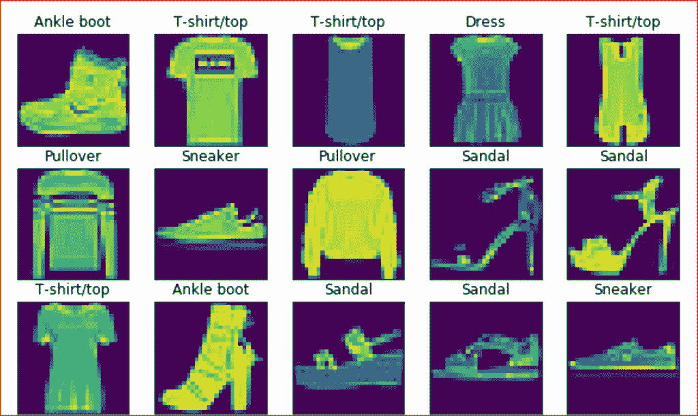
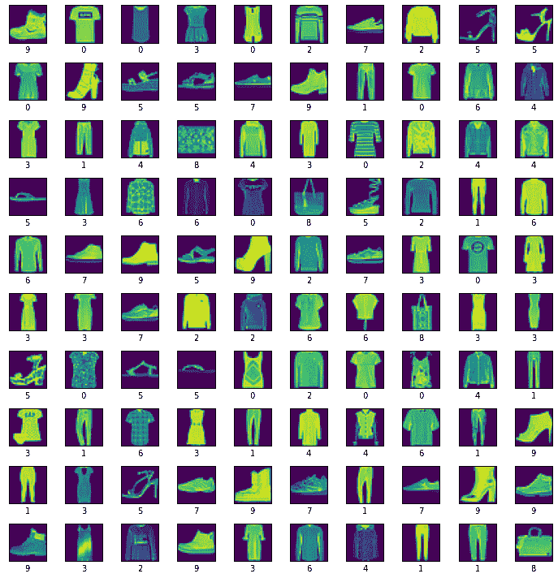
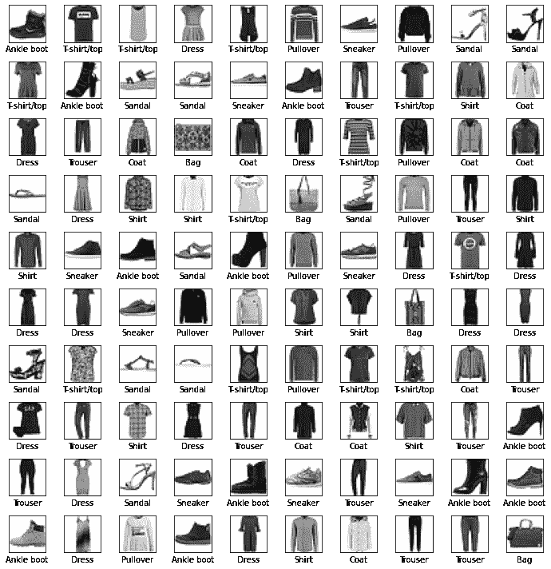
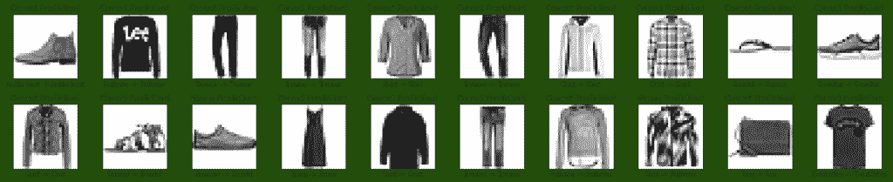

# 用 Python 对服装图像进行分类——完全指南

> 原文：<https://www.askpython.com/python/examples/classifying-clothing-images>

大家好！在本教程中，我们将看看如何使用 Python 编程语言在 TensorFlow 的帮助下对各种服装图像进行分类。

社交媒体平台 Instagram、YouTube 和 Twitter 已经接管了我们的日常生活。模特和名人尤其需要知道如何**将服装分成几类**，如果他们想看起来最好的话。

***也读作:[用 Python 加密价格预测](https://www.askpython.com/python/examples/crypto-price-prediction)***



Classify Images Sample Demonstration

照片中时尚物品的分类包括个体服装的识别。这同样适用于社交网络、电子商务和刑法。

* * *

## 步骤 1:导入模块

每个项目的第一步是导入所有需要的模块。我们将与 Tensorflow 以及 numpy 和 matplotlib 一起工作。

```py
import tensorflow as tf
import numpy as np
import matplotlib.pyplot as plt

```

## 步骤 2:数据的加载和预处理

我们将要加载到程序中的数据集可以在这里看到[。](https://www.tensorflow.org/api_docs/python/tf/keras/datasets/fashion_mnist/load_data)

这个数据集包括来自十个不同时尚类别的`60,000`张灰度照片，每张照片的尺寸为`28x28 pixels`，外加一组虚拟的`10,000` 图像。

可以使用该数据集替换 MNIST。下面的代码行实现了数据的加载。

```py
fashion_data=tf.keras.datasets.fashion_mnist

```

* * *

## 步骤 3:训练和测试数据分割

任何机器学习模型的主要部分都包括基于 80-20 规则将数据分成两部分。

80-20 规则规定，80%的数据发送给[训练数据，20%发送给](https://www.askpython.com/python/examples/split-data-training-and-testing-set)测试数据。下面的代码将数据分为训练和测试。

```py
(inp_train,out_train),(inp_test,out_test)=fashion_data.load_data()
inp_train = inp_train/255.0
inp_test = inp_test/255.0
print("Shape of Input Training Data: ", inp_train.shape)
print("Shape of Output Training Data: ", out_train.shape)
print("Shape of Input Testing Data: ", inp_test.shape)
print("Shape of Output Testing Data: ", out_test.shape)

```

代码还对加载的数据集进行标准化。

```py
Shape of Input Training Data:  (60000, 28, 28)
Shape of Output Training Data:  (60000,)
Shape of Input Testing Data:  (10000, 28, 28)
Shape of Output Testing Data:  (10000,)

```

* * *

## 步骤 4:数据可视化

将初始数据可视化的代码如下:

```py
plt.figure(figsize=(10,10))
for i in range(100):
    plt.subplot(10,10,i+1)
    plt.imshow(inp_train[i])
    plt.xticks([])
    plt.yticks([])
    plt.xlabel(out_train[i])
    plt.tight_layout()
plt.show()

```



MNIST Clothes Data Visualize

* * *

## 步骤 5:将标签更改为实际名称

我们已经看到了可视化，但我们也希望标签有明确定义的名称。下面提到的代码将达到目的。

```py
Labels=['T-shirt/top', 'Trouser', 'Pullover', 'Dress', 'Coat','Sandal', 'Shirt', 'Sneaker', 'Bag', 'Ankle boot']
plt.figure(figsize=(10,10))
for i in range(100):
    plt.subplot(10,10,i+1)
    plt.xticks([])
    plt.yticks([])
    plt.imshow(inp_train[i], cmap=plt.cm.binary)
    plt.xlabel(Labels[out_train[i]])
    plt.tight_layout()
plt.show()

```



MNIST Clothes Data Visualize With Labels

你现在可以看到，可视化现在更容易理解了。

* * *

## 步骤 6:构建、编译和训练模型

TensorFlow 和 Keras 模型的构建、编译和定型代码如下所示:

```py
my_model = tf.keras.Sequential([
    tf.keras.layers.Flatten(input_shape=(28, 28)),
    tf.keras.layers.Dense(128, activation='relu'),
    tf.keras.layers.Dense(10)
])
my_model.compile(optimizer='adam',
              loss=tf.keras.losses.SparseCategoricalCrossentropy(from_logits=True),
              metrics=['accuracy'])
my_model.fit(inp_train, out_train, epochs=20)

```

* * *

## 步骤 7:检查最终损失和准确性

既然我们的模型已经训练成功，现在就轮到计算损失并找到所创建和训练的模型的最终精度了。

```py
loss, accuracy = my_model.evaluate(inp_test,out_test,verbose=2)
print('\nAccuracy:',accuracy*100)

```

整个模型处理后得到的最终精度为*88.8%，相当不错。*

* * *

## *第八步:做预测*

*我们已经到了程序的最后一步，使用我们刚刚创建和训练的模型进行预测。*

```py
*prob=tf.keras.Sequential([my_model,tf.keras.layers.Softmax()])
pred=prob.predict(inp_test)* 
```

* * *

## *步骤 9:可视化最终预测*

*对任何分类模型来说，重要的是我们做出最终的可视化。为了简单起见，我们将可视化数据集的前 20 幅图像。*

```py
*plt.figure(figsize=(20,20))
for i in range(20):
    true_label,image = out_test[i],inp_test[i]
    pred_label = np.argmax(pred[i])
    plt.subplot(10,10,i+1)
    plt.xticks([])
    plt.yticks([])
    plt.imshow(image, cmap=plt.cm.binary)
    if pred_label == true_label:
        color = 'green'
        label="Correct Prediction!"
    else:
        color = 'red'
        label="Wrong Prediction!"
    plt.tight_layout()
    plt.title(label,color=color)
    plt.xlabel(" {} -> {} ".format(Labels[true_label],Labels[pred_label]))* 
```

*

Final Visual Clothes Classification* 

* * *

*感谢您阅读教程。我希望你通过它学到了很多。*

*快乐学习！继续阅读，了解更多。*

1.  *[Python 中的计算精度—分类误差度量](https://www.askpython.com/python/examples/calculating-precision)*
2.  *[采用多种 ML 算法的虹膜数据集分类](https://www.askpython.com/python/examples/iris-dataset-classification)*
3.  *[Python 推荐系统的理论介绍](https://www.askpython.com/python/examples/theory-intro-recommendation-systems)*

* * *