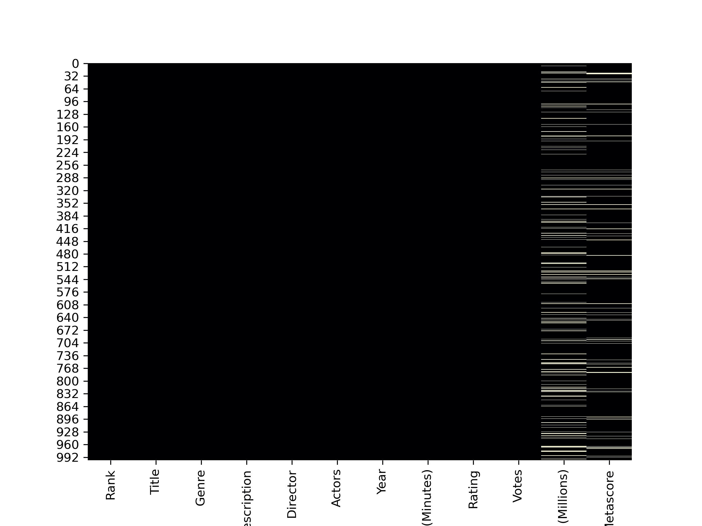
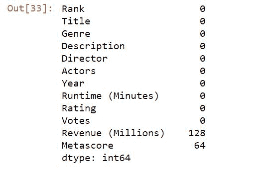
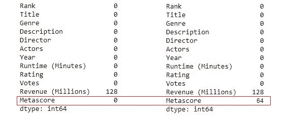

# Python 中如何清理 CSV 数据？

> 原文：<https://www.askpython.com/python/examples/clean-csv-data-python>

机器学习算法的有效实现，甚至在数据集上做一些数据分析时，我们都需要干净的数据。

关于用数据进行数值建模，有一个众所周知的说法，“垃圾进垃圾出”，当我们的数据不干净时，我们就不能指望得到像样的结果。

在本文中，我们将探索使用 [python pandas 库](https://www.askpython.com/python-modules/pandas/python-pandas-module-tutorial)清理 CSV 数据的常用技术。

## CSV 数据清理检查

我们将根据以下内容清理数据:

*   缺少值
*   极端值
*   重复值

## 1.清除 CSV 文件中丢失的值

在 Pandas 中，缺少的值通常用`NaN`表示，因为它是基于 [NumPy 包](https://www.askpython.com/python-modules/numpy/python-numpy-module)的，它是 NumPy 特有的特殊浮点 NaN 值。

你可以在这里找到本文使用的数据集[。](https://datasets.imdbws.com/)

### 查找缺失值

让我们先看看如何发现数据中是否有缺失值。

**#方法 1:目测**

```py
import pandas as pd
import seaborn as sb
import matplotlib.pyplot as plt

#importing Dataset
df = pd.read_csv('IMDB-Movie-Data.csv')

#Creating the heatmap
plt.figure(figsize = (8,6))
sb.heatmap(df.isnull(), cbar=False , cmap = 'magma')

```



Missing Values Using the Heatmap

`isnull()`方法返回布尔值，表明数据中是否有缺失值。

然而，这一过程可能仅限于中小型数据集。

**#接近 2**

我们可以在应用`.isnull()`后使用`.sum()`方法，这将返回数据帧中每一列内缺失值的总和。

```py
import pandas as pd

#importing dataset
df = pd.read_csv('IMDB-Movie-Data.csv')

df.isnull().sum()

```



Finding Sum Of Missing Values

### 从数据中清除缺失值

我们发现我们的数据集确实有一些缺失值，接下来我们应该做什么来获得干净的数据？

我们可以删除其中包含缺失值的行和列，或者用适当的值(即平均值、中值或众数)替换缺失值。

1.  **删除缺失值:**

```py
#imporing pandas
import pandas as pd

#Importing dataset
df = pd.read_csv('IMDB-Movie-Data.csv')

#Size of original dataset
print(df.shape)

#Dropping the missing rows.
df_dropped = df.dropna(how = 'any')

```

上述代码将从数据帧中删除缺少值的行。

我们来详细看看`.dropna()`的方法:

*   df . dropna()–删除所有具有 NaN 值的行
*   df . dropna(how = ' ALL ')–仅当所有列都是 NaN 时删除
*   df . dropna(thresh = 2)-如果没有至少两个值是 **not** NaN，则删除行
*   df . dropna(subset =[1])–仅在特定列中有 NaN 时删除

考虑删除缺失值时必须小心，因为这可能会影响数据集的质量。

2.**替换缺失值**

```py
import pandas as pd

#importing the dataset
df = pd.read_csv('IMDB-Movie-Data.csv')

#Creating a copy of dataframe
df_new = df

df_new['Metascore'] = df_new['Metascore'].fillna((df_new['Metascore'].mean()))

#printing the dataframes after replacing null values
print(df_new.isna().sum())
print(df.isna().sum())

```



Before And After Filling Null Values

熊猫模块有。fillna()方法，它接受一个我们想要替换 NaN 值的值。我们只是计算列的平均值，并将其作为输入参数传递给`fillna()`方法。

## 2.处理异常值

离群值可能会改变整个预测的过程，因此我们有必要[检测并移除离群值](https://www.askpython.com/python/examples/detection-removal-outliers-in-python)。

### **使用 Z 分数**

让我们检测数据集中投票列的异常值，并使用 z 分数过滤异常值。

这种方法背后的思想在于，距离平均值 3 [标准差](https://www.askpython.com/python/examples/mean-and-standard-deviation-python)的值将被称为异常值。

```py
#importing required modules
import pandas as pd
import numpy as np
from scipy import stats

#importing dataset
df = pd.read_csv('IMDB-Movie-Data.csv')

#filtering outliers
df_new = df[(np.abs(stats.zscore(df.Votes)) < 3)]

```

应用此方法的列应该是数字变量，而不是分类变量。

### **使用分位数**

通过这种方法，序列中低于 0.01 分位数和高于 0.99 分位数的值将被过滤掉。

```py
#importing required modules
import pandas as pd
import numpy as np
from scipy import stats

#importing dataset
df = pd.read_csv('IMDB-Movie-Data.csv')

#Selecting limits
q_low = df["Votes"].quantile(0.01)
q_hi  = df["Votes"].quantile(0.99)

#filtering outliers
df_filtered = df[(df["Votes"] < q_hi) & (df["Votes"] > q_low)]

```

## 3.处理重复条目

我们可以使用 **`.duplicated()`** 方法检查数据帧中的任何重复项。这将返回熊猫系列，而不是 DataFrame。

为了检查特定列中的重复值，我们可以将列名作为输入参数提供给`.duplicated( )`方法。

让我们来看看实际情况。

幸运的是，我们的数据框中没有重复值，因此我们将从数据框本身追加一些值来创建重复值。

```py
#Import the required modules
import pandas as pd
import numpy as np

#importing and appending similar rows to of the dataframe
df = pd.read_csv('IMDB-Movie-Data.csv')
df1 = df.append(df.iloc[20:30,:])

df1.duplicated().sum()

```

```py
Output:
10
```

现在，`.drop_duplicates()`方法用于从数据帧中删除重复值。

```py
#Importing the required modules
#Import the required modules
import pandas as pd
import numpy as np

#importing and appending similar rows to of the dataframe
df = pd.read_csv('IMDB-Movie-Data.csv')
df1 = df.append(df.iloc[20:30,:])

#dropping the duplicates
df1 = df1.drop_duplicates()

#checking the duplicates 
df1.duplicated().sum()

```

```py
output:
0
```

## 摘要

使用 pandas 和 NumPy 模块，Python 中的 CSV 数据清理很容易。在对数据进行分析之前，一定要进行数据清理，以确保分析是正确的。

## 下一步是什么？

*   [Python 数据分析](https://www.askpython.com/python/examples/data-analysis-in-python)
*   [NumPy 模块](https://www.askpython.com/python-modules/numpy/python-numpy-module)
*   [数据分析 vs 数据科学](https://www.askpython.com/python/data-analytics-vs-data-science)

## 资源

*   [熊猫官方网站](https://pandas.pydata.org/)
*   [Numpy.org 文档](https://numpy.org/doc/stable/)