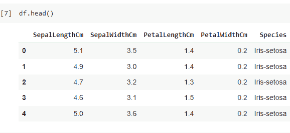
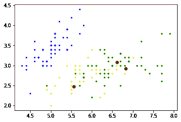
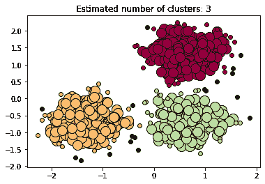
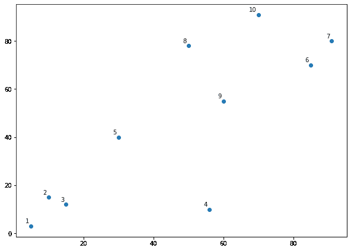
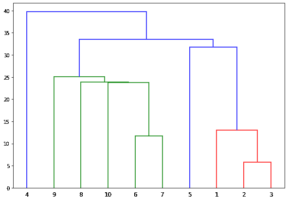

# Python 中的聚类分析——快速指南

> 原文：<https://www.askpython.com/python/examples/cluster-analysis-in-python>

有时，我们需要对我们没有太多信息的数据进行聚类或分离，以获得更好的可视化效果或更好地理解数据。有三种主要的算法来执行这些功能，在本文中，我们将了解三种不同的数据聚类方法。我们开始吧！

## 什么是数据的聚类和聚类分析？

数据聚类是指根据属性或特性将数据分组为小的聚类。聚类分析被用于多种应用中，例如医学成像、异常检测大脑等。

聚类分析是一种无监督的机器学习算法。它用于没有任何正确标签的数据。对于这类数据，聚类很方便。

## 聚类算法的类型

以下是一些最流行的聚类算法:

1.  亲和传播
2.  层次凝聚聚类
3.  桦树
4.  基于密度的噪声应用空间聚类
5.  [K-表示](https://www.askpython.com/python/examples/k-means-clustering-from-scratch)
6.  小批量 K 均值
7.  均值漂移
8.  光学
9.  谱聚类
10.  高斯混合

在本文中，我们将讨论其中最流行的三种算法:K-Means 聚类、DBSCAN 和 HAC。

## 1.k-均值聚类算法

在这种类型的算法中，数据将数据划分或隔离成“K 个不相交的簇”。你需要根据你的数据选择聚类数(K)。聚类中心或质心代表每个聚类。

算法是这样工作的:

*   **第一步:**首先选择聚类中心或聚类个数。
*   **步骤 2** :通过计算欧几里德距离，将每个点委派到其最近的聚类中心。
*   **步骤 3** :聚类质心将根据分配给该聚类的点的平均值进行优化。
*   **步骤 4** :一旦我们看到聚类质心没有做很多移动或移动很小的距离，我们就可以有把握地说 K-means 聚类已经收敛。

让我们看看如何在 Python 中实现 K-means 聚类。我们使用著名的 Iris 数据集来实现我们的 K-Means 算法。

```py
from copy import deepcopy
import numpy as np 
import pandas as pd 
from matplotlib import pyplot as plt

```

**现在让我们导入一个 CSV 文件并创建一个数据帧。**

```py
df = pd.read_csv("/content/Iris.csv") 
df.drop('Id',axis=1,inplace=True)

```

```py
df.head()

```



```py
df["Species"] = pd.Categorical(df["Species"])
df["Species"] = df["Species"].cat.codes

# Changing dataframe to numpy matrix
data = df.values[:, 0:4]
category = df.values[:, 4]

```

**创建 K 均值聚类的时间。为了使事情更简单，我们将使用 [matplotlib 模块](https://www.askpython.com/python-modules/matplotlib/python-matplotlib)创建一个绘图。**

```py
k = 3

# Training data
n = data.shape[0]

# Number of features in the data
c = data.shape[1]

# Generating random centers
mean = np.mean(data, axis = 0)
std = np.std(data, axis = 0)
centers = np.random.randn(k,c)*std + mean

# Plotting data 
colors=['blue', 'yellow', 'green']
for i in range(n):
    plt.scatter(data[i, 0], data[i,1], s=7, color = colors[int(category[i])])
plt.scatter(centers[:,0], centers[:,1], marker='.', c='r', s=150)

```



尽管 K-均值聚类是一种健壮的算法，但它可能不会收敛于局部最优最小值。

## 基于密度的噪声应用空间聚类(DBSCAN)

基于密度的聚类算法基于这样的思想:空间中的聚类是由低点密度区域与其他聚类分隔开的高密度点。这种聚类算法非常适合含有大量噪音和异常值的数据。该算法采用两个参数 minPts 和 minPts 是密集区域中聚集在一起的点的最小数量，eps 用于测量点之间的距离。

让我们来理解算法是如何工作的。

*   **第一步**:第一步，在数据集中拾取任意一点，然后遍历数据集中所有点。
*   **步骤 2:** 如果算法发现在距离所选点 EPS(ε)的距离内有“minpts”，则算法认为所有这些点都是同一聚类的一部分。
*   **步骤 3** :然后对邻近点重复该算法，从而扩展聚类。

让我们看看如何用 python 实现 DBSCAN。

首先，我们将导入必要的库。

```py
import numpy as np
from sklearn.cluster import DBSCAN
from sklearn import metrics
from sklearn.datasets import make_blobs
from sklearn.preprocessing import StandardScaler

```

现在我们将生成随机数据。

```py
centers = [[1, 1], [-1, -1], [1, -1]]
X, labels_true = make_blobs(n_samples=750, centers=centers, cluster_std=0.4,
                            random_state=0)

X = StandardScaler().fit_transform(X)

```

在下一步中，我们将执行 DBSCAN。

```py
db = DBSCAN(eps=0.3, min_samples=10).fit(X)
core_samples_mask = np.zeros_like(db.labels_, dtype=bool)
core_samples_mask[db.core_sample_indices_] = True
labels = db.labels_
n_clusters_ = len(set(labels)) - (1 if -1 in labels else 0)
n_noise_ = list(labels).count(-1)

print('Estimated number of clusters: %d' % n_clusters_)
print('Estimated number of noise points: %d' % n_noise_)
print("Homogeneity: %0.3f" % metrics.homogeneity_score(labels_true, labels))
print("Completeness: %0.3f" % metrics.completeness_score(labels_true, labels))
print("V-measure: %0.3f" % metrics.v_measure_score(labels_true, labels))
print("Adjusted Rand Index: %0.3f"
      % metrics.adjusted_rand_score(labels_true, labels))
print("Adjusted Mutual Information: %0.3f"
      % metrics.adjusted_mutual_info_score(labels_true, labels))
print("Silhouette Coefficient: %0.3f"
      % metrics.silhouette_score(X, labels))

```

**输出:**

```py
Estimated number of clusters : 3
Estimated number of noise points : 18
Homogeneity : 0.953
Completeness : 0.883
V-measure : 0.917
Adjusted Rand Index : 0.952
Adjusted Mutual Information : 0.916
Silhouette Coefficient : 0.626

```

现在，让我们画出我们在上面的输出中看到的结果。

```py
import matplotlib.pyplot as plt
%matplotlib inline
unique_labels = set(labels)
colors = [plt.cm.Spectral(each)
          for each in np.linspace(0, 1, len(unique_labels))]
for k, col in zip(unique_labels, colors):
    if k == -1:
        # Black used for noise.
        col = [0, 0, 0, 1]

    class_member_mask = (labels == k)

    xy = X[class_member_mask & core_samples_mask]
    plt.plot(xy[:, 0], xy[:, 1], 'o', markerfacecolor=tuple(col),
             markeredgecolor='k', markersize=14)

    xy = X[class_member_mask & ~core_samples_mask]
    plt.plot(xy[:, 0], xy[:, 1], 'o', markerfacecolor=tuple(col),
             markeredgecolor='k', markersize=6)

plt.title('Estimated number of clusters: %d' % n_clusters_)
plt.show()

```



DBSCAN 算法的最佳运行时复杂度是 0 (nlogn)。

## 层次凝聚聚类

这种类型的聚类方法遵循自底向上的方法。每个对象首先被视为单个元素或集群。在每次迭代中，两个最可能的聚类被组合成一个大的聚类。重复这个过程，直到每个点都归入一个大簇。

让我们看看算法是如何工作的。

*   **第一步**:第一步，估计数据集中每两个对象之间的相似程度。
*   **第二步**:现在，在链接功能的帮助下，开始根据距离将对象分组到一个层次聚类树中。因此，使用链接功能来组合或链接靠近的对象。
*   **第三步:**将层次树划分成簇。

**我们来看看如何用 Python 实现算法。我们将使用 numpy 数组生成数据点。**

```py
import numpy as np

X = np.array([[5,3],
    [10,15],
    [15,12],
    [56,10],
    [30,40],
    [85,70],
    [91,80],
    [50,78],
    [60,55],
    [70,91],])

```

现在，我们将绘制已经生成的数据点。在这里，我们从 1 到 10 标记数据点。

```py
import matplotlib.pyplot as plt

labels = range(1, 11)
plt.figure(figsize=(10, 7))
plt.subplots_adjust(bottom=0.1)
plt.scatter(X[:,0],X[:,1], label='True Position')

for label, x, y in zip(labels, X[:, 0], X[:, 1]):
    plt.annotate(
        label,
        xy=(x, y), xytext=(-3, 3),
        textcoords='offset points', ha='right', va='bottom')
plt.show()

```

**输出:**



您可能会注意到数据点形成了三个集群。一个有 1，2，3，另一个有 4 和 5，还有一个从 6 到 10。但是在多维数据的情况下，用肉眼指出这样的簇是非常困难的。

让我们为这些数据点绘制树状图。

```py
from scipy.cluster.hierarchy import dendrogram, linkage
from matplotlib import pyplot as plt

linked = linkage(X, 'single')

labelList = range(1, 11)

plt.figure(figsize=(10, 7))
dendrogram(linked,
            orientation='top',
            labels=labelList,
            distance_sort='descending',
            show_leaf_counts=True)
plt.show()

```

输出:



该算法将首先通过计算欧几里德距离或曼哈顿距离来找到彼此最接近的点。从前面的图中可以看出，2 和 3 以及 6 和 7 彼此最接近，因此在树状图中它们被连接在一起。

树状图的垂直高度表示两点之间的欧几里德距离。在下一步中，该算法将继续将一个聚类加入到其最近的聚类中，依此类推。重复这个步骤，直到形成一个大的集群，并且所有的点都被连接。

## 结论

总之，我们学习了三种流行的聚类算法，以及如何在 python 中使用它们。这三种算法有非常不同的聚类方法。您必须根据您的数据集选择聚类算法。当我们想要在没有关于数据的任何先验信息的情况下对数据进行分组时，我们使用聚类，这意味着以无监督的方式！