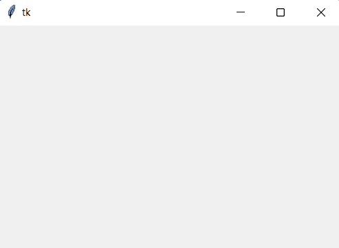
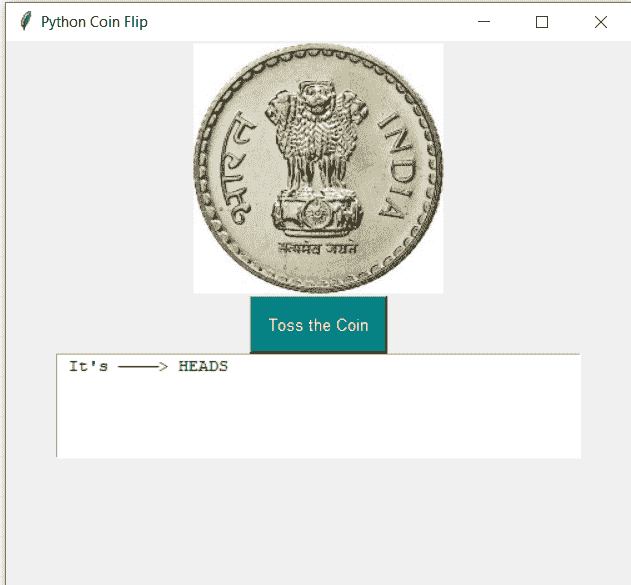
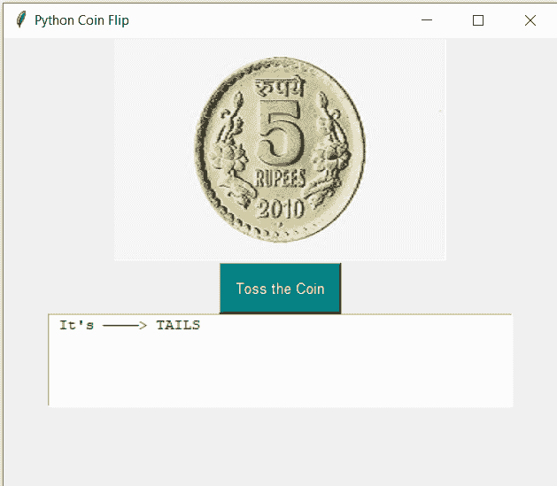

# 使用 Python Tkinter 的硬币翻转 GUI

> 原文：<https://www.askpython.com/python-modules/tkinter/coin-flip-gui>

在本教程中，我们将使用 Python Tkinter 编写一个具有图形用户界面(GUI)的硬币投掷程序。本教程旨在向您传授 Tkinter 模块的基础知识，这是一个用 Python 开发基于 GUI 的程序的优秀模块。

***也读: [Tkinter 教程——使用 Tkinter 按键](https://www.askpython.com/python-modules/tkinter/tkinter-buttons)***

## 用 Python Tkinter 实现硬币翻转 GUI 应用程序

Tkinter 是 python 的标准 GUI 库，用于开发基于界面的应用程序。Tkinter 与 Python 结合使用，使得基于 GUI 的应用程序变得非常容易。

### 1.安装模块

对于这个程序，我们需要 Python [NumPy](https://www.askpython.com/python-modules/numpy/numpy-universal-functions) 、 [Pillow](https://www.askpython.com/python-modules/pillow-module) 和 Tkinter 库，我们可以使用 **pip** 轻松下载这些库。

```py
pip install numpy
pip install pillow
pip install tk

```

### 2.导入模块

安装模块后，我们可以通过导入程序中的所有模块来开始编写程序。

```py
import numpy as np
from tkinter import *
from PIL import Image, ImageTk

```

注意:-在上面的代码中，' * '意味着我们从模块 Tkinter 导入所有内容。

### 3.为我们的应用程序创建主窗口

首先，我们将使用 Tk()对象初始化 Tkinter 类，并将其赋给“root”变量。所以现在通过使用 root，我们可以访问 Tkinter 模块的所有方法。

在第二行代码中，我们指定了输出 GUI 屏幕的**窗口大小**，就像这里我们给了它 400*400 的值(对于 widthxheight)。

现在我们使用 mainloop 方法使窗口**持久化**意味着窗口不会关闭，除非我们自己想关闭它。如果我们跳过这一行代码，输出屏幕会出现一次并立即关闭。

```py
root = Tk()
root.geometry("500*500")
root.mainloop()

```

运行上述代码后，我们将得到如下所示的窗口。如果你有一个这样的窗口，你就很好，可以继续下去。



Output GUI Screen Tkinter

### 4.加载图像

我们将根据我们程序的结果显示一个硬币的图像。如果输出是**正面**，那么它将显示硬币的正面，当它是**反面**时，显示硬币的反面。

正面和反面两个图像都保存在与我们的程序文件相同的目录中。如果没有，那么您需要传递图像文件名及其位置。

```py
#load heads image
load = Image.open("heads.jpg")
heads = ImageTk.PhotoImage(load)

#load tails image
load = Image.open("tails.jpg")
tails = ImageTk.PhotoImage(load)

```

为了您的方便，我们已经将图像文件添加到硬币的正面和背面。

*   [硬币头像](https://www.askpython.com/wp-content/uploads/2022/01/head.png)
*   [硬币尾部图像](https://www.askpython.com/wp-content/uploads/2022/01/tail.jpg)

### 5.添加按钮

现在我们的主窗口已经准备好了，我们需要一个**按钮**，我们可以按下这个按钮**来投掷**硬币。

按下这个按钮，我们就调用了一个 **tossTheCoin** 函数。我们可以使用 tkinter 中的**按钮**类来创建按钮。

```py
b1=Button(root, text="Toss the Coin", font=("Arial", 10), command=tossTheCoin, bg='teal', fg='white', activebackground="lightblue", padx=10, pady=10)
b1.pack()

```

上面的代码将在我们的主窗口中呈现一个按钮，文本为 **Toss the Coin。**在**命令中，**我们将传递我们的函数名。

**注意**:我们使用 **pack()** 方法在我们的主窗口上渲染每一个元素。

### 6.结果的文本字段

现在，我们以文本格式为掷硬币的结果创建一个文本字段。为此，我们使用代码:

```py
tfield = Text(root, width=52, height=5)
tfield.pack()

```

要在该文本字段中插入文本，我们使用 insert 函数，如下所示:

```py
tfield.insert(INSERT, "Click on the Button.. To Flip the Coin and get the result")

```

现在，每次结果发生变化时，我们都需要删除之前插入的文本，所以我们将 **delete** text 方法与按钮 click–

```py
tfield.delete("1.0", "end")

```

### 7.实现 tossTheCoin()函数

当我们扔硬币时，它有 50%的机会正面或反面落地。我们希望在我们的程序中有这种公平的性质，这样它就可以接近真实的抛硬币场景。为此，我们将使用 NumPy 模块的二项式方法。

```py
np.random.binomial(1,0.5)

```

这将返回 1 或 0。因此，我们可以编写 if 条件语句来检查它是 1 还是 0，并使用 **config** 方法相应地呈现头部或尾部图像。

完整的代码看起来像这样-

```py
import numpy as np
from tkinter import *
from PIL import Image, ImageTk

def coinFlip():
    result = np.random.binomial(1,0.5)
    tfield.delete("1.0", "end")

    if(result == 1):
        tfield.insert(INSERT, " It's ————> HEADS")
        i.config(image = heads)

    else:
        tfield.insert(INSERT, " It's ————> TAILS")
        i.config(image = tails)

root = Tk()
root.title("Python Coin Flip")

#load heads image
load = Image.open("head.png")
heads = ImageTk.PhotoImage(load)

#load tails image
load = Image.open("tail.png")
tails = ImageTk.PhotoImage(load)

i = Label(root, image=heads)
i.pack()

root.geometry("500x500")
b1 = Button(root, text="Toss the Coin", font=("Arial", 10), command=coinFlip, bg='teal', fg='white', activebackground="lightblue", padx=10, pady=10)
b1.pack()

#Text Field for Result
tfield = Text(root, width=52, height=5)
tfield.pack()
tfield.insert(INSERT, "Click on the Button.. To Flip the Coin and get the result")

root.mainloop()

```

程序的最终输出:-



Output For Heads 1



Output For Tails 1

The output of our code – on button click for Coin Flip

## 结论

就是这样！对于教程。希望你已经学得很好，并使用 Python Tkinter 轻松地编写了一个基于 GUI 的代码。